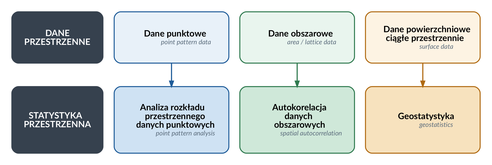
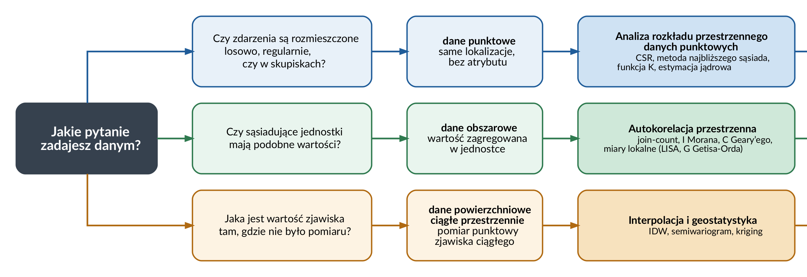

# WSTĘP {#sec-wstep}

::: {.callout-note}
## Czego się nauczysz

**Po tym rozdziale potrafisz:**

-   wyjaśnić, czym zajmuje się statystyka przestrzenna i co odróżnia ją od statystyki
    stosowanej do danych pozbawionych lokalizacji,
-   rozróżnić trzy rodzaje danych przestrzennych i wskazać nurt metodologiczny właściwy dla
    każdego z nich,
-   dobrać grupę metod do pytania badawczego i rodzaju danych,
-   umiejscowić statystykę przestrzenną względem analiz przestrzennych i GIS oraz względem
    ekonometrii przestrzennej,
-   wskazać prace, które wyznaczyły kolejne etapy rozwoju metod statystyki przestrzennej.

**Rozumiesz i umiesz zinterpretować:**

-   zależność przestrzenną oraz pierwsze prawo geografii,
-   autokorelację przestrzenną jako konsekwencję zależności przestrzennej,
-   co jest przedmiotem analizy dla danych punktowych, obszarowych i powierzchniowych ciągłych
    przestrzennie,
-   skutek niespełnienia założenia o niezależności obserwacji,
-   odpowiedniki metod statystyki klasycznej w statystyce przestrzennej,
-   co przedstawia mapa klastrów przestrzennych i do której grupy metod należy.

**Część praktyczna:** @sec-dane-przestrzenne. **Słownik pojęć:** @sec-slownik.
**Pakiety:** @sec-pakiety. **Funkcje:** @sec-funkcje.
:::

Termin ***statystyka przestrzenna*** odnosi się do stosowania pojęć i metod statystycznych do danych, które mają wyraźną strukturę przestrzenną, *która jest ważna dla zrozumienia tych danych* [@spatialanalysisonline]. Statystyka przestrzenna dostarcza narzędzi badawczych oraz podstaw teoretycznych związanych ze zbieraniem danych, analizą danych oraz wnioskowaniem statystycznym **dla danych przestrzennych** [@suchecka2014].

Ze względu na możliwości zastosowania metod statystycznych można wyróżnić **trzy rodzaje danych przestrzennych** [@cressie1993]:

-   **dane punktowe** (*point pattern data*) - bezatrybutowe; przedmiotem analizy jest samo rozmieszczenie zdarzeń, a zbiór ich lokalizacji jest realizacją pola losowego;
-   **dane obszarowe** (*area data*) - powstają poprzez podzielenie obszaru badań na jednostki przestrzenne, w których agregowane są wyniki, np. podział na jednostki administracyjne;
-   **dane powierzchniowe ciągłe przestrzennie** (*surface data, spatially continous data*) - określane poprzez ciągłą zmienność na podstawie funkcji odległości (np. temperatura powietrza, opady atmosferyczne, występowanie złóż surowców naturalnych).

Dane punktowe i pomiary zjawiska ciągłego wyglądają na mapie tak samo — jako zbiór punktów —
a należą do różnych nurtów. Rozstrzyga przedmiot analizy: dla danych punktowych jest nim
**rozmieszczenie** zdarzeń, dla danych obszarowych **wartość przypisana jednostce**, a dla
danych powierzchniowych ciągłych — **wartość w każdym miejscu** obszaru, szacowana na podstawie
pomiarów wykonanych w wybranych punktach.

Ze względu na rodzaj analizowanych danych w statystyce przestrzennej można wyróżnić **trzy główne nurty** [@suchecka2014]:

-   **analizę danych punktowych** (ang. *point pattern analysis*) - stosuje się do określenia, w jaki sposób dane obiekty (zdarzenia) są rozmieszczone w przestrzeni (losowo, regularnie, skupione w klastry).

-   **metody analizy danych obszarowych i punktowych atrybutowych** - stosuje się do oceny autokorelacji przestrzennej i sprawdzenia, czy obszary bliskie mają podobne, czy różne wartości.

-   **geostatystykę** - stosuje się do zrozumienia zmienności przestrzennej lub czasowej zjawisk ciągłych przestrzennie (np. rozkład opadów atmosferycznych, zanieczyszczeń powietrza).

W kolejnych rozdziałach omówione zostaną metody wchodzące w skład wymienionych wyżej nurtów statystyki przestrzennej.

## Podstawowe pojęcia

### Statystyka przestrzenna

-   Termin ***statystyka przestrzenna*** odnosi się do stosowania pojęć i metod statystycznych do danych, które mają wyraźną strukturę przestrzenną, *która jest ważna dla zrozumienia tych danych* [@spatialanalysisonline]

-   Statystyka przestrzenna dostarcza narzędzi badawczych oraz podstaw teoretycznych związanych ze zbieraniem danych, analizą danych oraz wnioskowaniem statystycznym **dla danych przestrzennych** [@suchecka2014].

### Zależność przestrzenna

-   podstawowa koncepcja analiz przestrzennych

-   pojęcie zależności przestrzennej (ang. *spatial dependence*) zostało ujęte przez Toblera [@tobler1970]: **"Wszystkie rzeczy są ze sobą powiązane, ale rzeczy bliskie są bardziej powiązane niż rzeczy odległe".**

-   sformułowanie Toblera jest znane jako "Pierwsze prawo geografii" (ang. *First Law of Geography*)

-   "wielkość" zależności przestrzenej może być mierzona za pomocą statystyk autokorelacji przestrzennej.

-   zależność przestrzenna stanowi także podstawę metod stosowanych w ramach geostatystyki, która opisuje zmienność przestrzenną za pomocą funkcji pokazującej, jak autokorelacja przestrzenna maleje wraz ze wzrostem odległości.

Lokalizacje i zbiór wartości są w obu układach te same; różni je wyłącznie przyporządkowanie
wartości do lokalizacji. W układzie rzeczywistym średnia bezwzględna różnica temperatury rośnie
z 2,1 °C dla par punktów oddalonych średnio o 0,7 km do 9,0 °C dla par oddalonych o 12,5 km.
Po losowym przestawieniu wartości ta sama miara utrzymuje się na poziomie około 4,5 °C na
niemal całym zakresie odległości. Zależność przestrzenna jest więc własnością układu wartości,
a nie samego zbioru lokalizacji.

<!-- https://www.spatialanalysisonline.com/HTML/index.html?spatial_dependence.htm-->

<!-- https://www.spatialanalysisonline.com/HTML/index.html?spatial_relationships.htm-->

### Autokorelacja przestrzenna

Zwróć uwagę na zmianę układu wartości: od skupienia wartości podobnych, przez brak widocznej
struktury, po układ naprzemienny.

*Źródło:* <https://mgimond.github.io/Spatial/spatial-autocorrelation.html>

-   określana jako sytuacja, w której **występowanie jednego zjawiska w jednej jednostce przestrzennej powoduje zmniejszenie lub zwiększenie się tego zjawiska w jednostkach sąsiednich** [@bivand1980]

-   może być obserwowana jako klastry podobnych wartości lub systematyczny wzorzec przestrzenny (spatial pattern)

-   jest to konsekwencja występowania zależności przestrzennych - oznacza, że bliskie geograficznie obserwacje są bardziej do siebie podobne niż te odległe

-   sam termin *autokorelacja przestrzenna* wprowadzili w 1968 roku Cliff i Ord; do tego czasu używano pojęć: zależność przestrzenna (*spatial dependency*), interakcje przestrzenne (*spatial interactions*), związek przestrzenny (*spatial association*) [@suchecka2014]

-   pierwsze miary autokorelacji przestrzennej wprowadzone zostały w latach 50. XX w. w pracach @moran1950 oraz @geary1954, a następnie rozszerzone o miary lokalne w latach 90.

## Rozwój metod statystyki przestrzennej

 (3200 × 1016
pikseli).](figs/wstep_historia_maly.png)

Rycina porządkuje rozwój dyscypliny w trzech pasmach — po jednym na każdy nurt — oraz w paśmie
wspólnym dla całej dyscypliny. Nurty rozwijały się przez kilkadziesiąt lat równolegle i w dużej
mierze niezależnie od siebie: geostatystyka w kręgu francuskojęzycznym, statystyka
autokorelacji przestrzennej w anglojęzycznym; kontakt obu środowisk zaczął się w latach 70.
[@chun2013]. W paśmie geostatystycznym rycina wskazuje także prace D. Krige'a z początku lat
50. nad szacowaniem zasobów złota, które poprzedziły formalizację Matherona [@krige1951].
Ostatnia kolumna wymienia pakiety R, w których metody każdego z nurtów są dziś dostępne — to
one są narzędziem pracy w dalszej części skryptu.

-   **lata 30. XX w.**

    -   zastosowanie teorii procesów punktowych w ramach analiz przestrzennych do analizy przestrzennego rozmieszczenia zjawisk (pierwsze zastosowanie: ekologia - badanie rozkładu gatunków drzew w przestrzeni)

    -   praca @stephan1934: *dane geograficzne są ze sobą powiązane jak kiście winogron, a nie oddzielne jak kule w urnie*

    -   eksperyment Fishera [@fisher1935]: wyniki eksperymentu pokazały zbliżone poziomy wydajności z upraw pól leżących obok siebie.

<!-- -->

-   **lata 50. XX w.** [@moran1950; @geary1954]

    -   opracowanie obecnie stosowanych testów statystycznych do weryfikacji istotności autokorelacji przestrzennej wartości atrybutów dla regularnych obiektów obszarowych (regular lattice system). Testy te służą do weryfikacji hipotezy zerowej o braku autokorelacji przestrzennej (braku struktury przestrzennej), wobec nieokreślonej hipotezy alternatywnej

    -   wyprowadzone statystyki autokorelacji przestrzennej były określane miernikami sąsiedztwa

<!-- -->

-   **lata 70. XX w.**

    -   dynamiczny rozwój metod statystyki przestrzennej
    -   dwa kierunki badań:
        -   rozwój podstaw teorii statystyki dla danych przestrzennych
        -   rozwój nowych metod i technik badawczych związanych głównie z pojawieniem się nowych technik komputerowych
    -   monografia *Spatial Autocorrelation* [@cliff1973], w której Cliff i Ord dostarczyli teorii rozkładów dla statystyk autokorelacji — termin wprowadzili pięć lat wcześniej (patrz wyżej)

<!-- -->

-   **lata 90. XX w**

    -   poszerzenie globalnych miar autokorelacji przestrzennej o miary lokalne które wyznacza się oddzielnie dla każdego obszaru — statystykę G Getisa i Orda [@getis1992], statystykę LISA (*local indicators of spatial association*) [@anselin1995] oraz lokalną statystykę $C_i$ Geary'ego

## Statystyka przestrzenna a inne dyscypliny

Statystyka przestrzenna jest odrębną dyscypliną wywodzącą się z analiz przestrzennych oraz ściśle związaną z tradycyjnymi metodami statystycznymi i nowocześniejszą statystyką obliczeniową (ang. *computational statistics*).

Statystyka przestrzenna dostarcza formalnych narzędzi statystycznych w ramach szerszego procesu badania danych przestrzennych.

Metody statystyki przestrzennej są także implementowane w ramach oprogramowania GIS:

-   QGIS: <https://docs.qgis.org/3.34/en/docs/training_manual/vector_analysis/spatial_statistics.html>

-   ArcGIS: <https://pro.arcgis.com/en/pro-app/latest/tool-reference/spatial-statistics/an-overview-of-the-spatial-statistics-toolbox.htm>

### Statystyka przestrzenna a analizy przestrzenne i GIS

Zakresy są zagnieżdżone: statystyka przestrzenna jest wyspecjalizowanym podzbiorem analiz
przestrzennych, a te prowadzone są na danych i w środowisku dostarczanym przez GIS.

+----------------------------------------+-----------------------------------------------------------------------------------------------------------------------------------------------------------------------------------------------------------------------------------------------------------------------------------+
|                                        | Opis                                                                                                                                                                                                                                                                              |
+========================================+===================================================================================================================================================================================================================================================================================+
| Systemy Informacji Geograficznej (GIS) | -   System/platforma do tworzenia, gromadzenia, zarządzania, analizowania i wizualizacji różnych typów danych                                                                                                                                                                     |
|                                        |                                                                                                                                                                                                                                                                                   |
|                                        | -   Dostarcza podstawowych narzędzi i technologii do pracy z danymi przestrzennymi, w tym do ich tworzenia, edycji i przechowywania.                                                                                                                                              |
+----------------------------------------+-----------------------------------------------------------------------------------------------------------------------------------------------------------------------------------------------------------------------------------------------------------------------------------+
| Analizy przestrzenne                   | -   Dziedzina obejmująca szeroki zestaw technik wykorzystywanych do wizualizacji, przetwarzania i analizy danych przestrzennych.                                                                                                                                                  |
|                                        |                                                                                                                                                                                                                                                                                   |
|                                        | -   Proces wykorzystywania narzędzi i technologii GIS do rozwiązywania problemów przestrzennych i zrozumienia danych przestrzennych.                                                                                                                                              |
|                                        |                                                                                                                                                                                                                                                                                   |
|                                        | -   Obejmuje wiele metod i narzędzi, takich jak nakładanie, selekcja obiektów na podstawie atrybutów, buforowanie, agregacja danych, obliczanie odległości, algebra map.                                                                                                          |
|                                        |                                                                                                                                                                                                                                                                                   |
|                                        | Zastosowanie:                                                                                                                                                                                                                                                                     |
|                                        |                                                                                                                                                                                                                                                                                   |
|                                        | -   określania relacji przestrzennych (bliskość, przecięcie, nakładanie się, dostępność)                                                                                                                                                                                          |
|                                        |                                                                                                                                                                                                                                                                                   |
|                                        | -   analizy sieciowe: znajdowania najkrótszej/najszybszej drogi                                                                                                                                                                                                                   |
|                                        |                                                                                                                                                                                                                                                                                   |
|                                        | -   znajdowania najlepszych lokalizacji (na podstawie dowolnego zestawu kryteriów opartych o atrybuty danych przestrzennych lub wykorzystując unikalne właściwości danych przestrzennych, takie jak odległość lub relacje z innymi miejscami.)                                    |
+----------------------------------------+-----------------------------------------------------------------------------------------------------------------------------------------------------------------------------------------------------------------------------------------------------------------------------------+
| Statystyka przestrzenna                | -   Wyspecjalizowany podzbiór metod analizy przestrzennej, który koncentruje się na stosowaniu pojęć i metod statystycznych do danych przestrzennych.                                                                                                                             |
|                                        |                                                                                                                                                                                                                                                                                   |
|                                        | -   Uwzględnia ona zależności przestrzenne, heterogeniczność przestrzenną oraz położenie geograficzne obserwacji w celu modelowania wzorców i relacji za pomocą narzędzi takich jak autokorelacja przestrzenna, interpolacja przestrzenna, geostatystyka i regresja przestrzenna. |
|                                        |                                                                                                                                                                                                                                                                                   |
|                                        | -   Metody statystyki przestrzennej mogą być zaimplementowane jako rozszerzenia oprogramownia GIS.                                                                                                                                                                                |
|                                        |                                                                                                                                                                                                                                                                                   |
|                                        | Zastosowanie:                                                                                                                                                                                                                                                                     |
|                                        |                                                                                                                                                                                                                                                                                   |
|                                        | -   wykrywanie i kwantyfikacja wzorców w rozkładzie przestrzennym danych,                                                                                                                                                                                                         |
|                                        |                                                                                                                                                                                                                                                                                   |
|                                        | -   wykrywanie obszarów koncentracji zjawisk poprzez wyszukanie statystycznie istotnych skupisk wysokich lub niskich wartości)                                                                                                                                                   |
|                                        |                                                                                                                                                                                                                                                                                   |
|                                        | -   prognozowania - szacowanie wartości dla całego obszaru (dane ciągłe) na podstawie danych punktowych                                                                                                                                                                           |
+----------------------------------------+-----------------------------------------------------------------------------------------------------------------------------------------------------------------------------------------------------------------------------------------------------------------------------------+

### Statystyka przestrzenna a statystyka

-   Statystyka przestrzenna w odróżnieniu od klasycznej statystyki umożliwia analizę danych geograficznych oraz informacji zlokalizowanych w przestrzeni.

-   Statystyka przestrzenna i klasyczna statystyka różnią się jednym zasadniczym założeniem:

    -   **Klasyczna statystyka:** zakłada niezależność obserwacji, tzn. elementy próby są dobierane niezależnie od siebie (tj. losowo)

    -   **Statystyka przestrzenna:** założenie o niezależności obserwacji nie jest spełnione. Zgodnie z regułą Toblera (nazywaną też pierwszym prawem geografii) obiekty sąsiadujące w przestrzeni/czasie są do siebie bardziej podobne niż obiekty dalej od siebie położone. Nie znaczy to, że dobór próby jest nielosowy: zależność jest własnością zjawiska, a nie schematu losowania. Znaczy to, że obserwacje niosą informację **nadmiarową**, a **efektywna liczebność próby** — równoważna liczba obserwacji niezależnych — jest mniejsza niż liczba obserwacji [@chun2013].

#### Analogie między statystyką a statystyką przestrzenną

Metodologia badań statystyki przestrzennej w większości powstała na podstawie metod statystyki klasycznej. W ramach statystyki przestrzennej także wyróżnia się statystykę opisową oraz wnioskowanie statystyczne.

### Statystyka przestrzenna a ekonometria przestrzenna

+---------------------------------------------------------------------------------------------------------------------------------+--------------------------------------------------------------------------------------------------------------------------+
| Statystyka przestrzenna                                                                                                         | Ekonometria przestrzenna                                                                                                 |
+=================================================================================================================================+==========================================================================================================================+
| opiera się na analizie danych odnoszących się do różnych dyscyplin                                                              | opiera się na modelowaniu, zajmuje się specyfikacją, estymacją i weryfikacją modeli uwzględniajacych aspekt przestrzenny |
+---------------------------------------------------------------------------------------------------------------------------------+--------------------------------------------------------------------------------------------------------------------------+
| większość opracowań z zakresu statystyki przestrzennej dotyczy zjawisk w dziedzinie biologii, ekologii, epidemiologii, geologii | analiza przestrzennych danych ekonomicznych oraz związanych z nimi problemów                                             |
|                                                                                                                                 |                                                                                                                          |
|                                                                                                                                 | opisuje przede wszystkim procesy ekonomiczne na poziomie regionalnym                                                     |
+---------------------------------------------------------------------------------------------------------------------------------+--------------------------------------------------------------------------------------------------------------------------+

: Źródło: @suchecka2014

## Zastosowania statystyki przestrzennej

### Główne nurty metodologiczne w statystyce przestrzennej

Ze względu na **rodzaj analizowanych danych** w statystyce przestrzennej można wyróżnić trzy główne nurty:

1.  analizę danych punktowych (ang. *point pattern analysis*)
2.  geostatystykę
3.  metody analizy danych obszarowych i punktowych atrybutowych.

@griffith1999 wśród metod statystyki przestrzennej wyróżnia:

-   analizę danych punktowych
-   geostatystykę
-   autoregresję przestrzenną
-   metody wizualizacji danych

Granica przebiega według tego, czy obserwacje można uznać za niezależne. Metody tradycyjne
zakładają niezależność; statystyka przestrzenna obejmuje cztery wymienione wyżej grupy metod.

### Analiza danych punktowych (bezatybutowych)

#### Cel

-   określenie w jaki sposób dane obiekty/zdarzenia są rozmieszczone w przestrzeni.

    -   Czy punkty są rozmieszczone **losowo**? (tzn. na ich rozmieszczenie nie działa żaden czynnik lub zależą od wielu czynników które się wzajemnie znoszą)
    -   Czy punkty są rozmieszczone **regularnie**? (tj. efekt świadomego działania, nie jest to proces naturalny)
    -   Czy występują **skupiska (klastry)** punktów? (tzn. na rozmieszczenie punktów wpływa jakiś czynnik)

-   rozpoznanie wzorca rozmieszczenia punktów w przestrzeni jest podstawą do wykrycia zależności przestrzennych.

#### Dane punktowe

Przykładami danych punktowych bezatrybutowych są:

-   dane epidemiologiczne dotyczące występowania przypadków zachorowań
-   rozkłady występowania określonych gatunków roślin czy zwierząt.

#### Przykłady danych punktowych: zbiory danych z pakietu spatstat

Nie wszystkie te zbiory są bezatrybutowe: w `clmfires` i `chicago` punktom przypisano znacznik
(przyczynę pożaru, typ przestępstwa), a w `longleaf` wielkość punktu odpowiada średnicy pnia
na wysokości piersi, czyli wartości znacznika liczbowego.

Oba zbiory rozbito na panele według wartości znacznika: typu nowotworu (krtani, płuc) oraz
rodzaju znaleziska (kość, wyrób kamienny). Zestawienie paneli jest pytaniem o to, czy obie
grupy zdarzeń rozkładają się w przestrzeni tak samo.

#### Zastosowanie

Analiza przestrzennych danych punktowych jest stosowana w wielu dziedzinach:

-   **biologia, ekologia, botanika** -

    -   rozmieszczenie gatunków roślin,
    -   rozmieszczenie gatunków ptaków i ich lęgowisk
    -   badanie rozkładu gatunków drzew w przestrzeni (badanie rozmieszczenia roślin stało się pierwowzorem technik analizy przestrzennych danych punktowych)

-   **epidemiologia** - rozprzestrzenianie się chorób (wirusów, bakterii)

-   **ochrona zdrowia** - obszary występowania chorób zakaźnych, nowotworów

-   **nauki ekonomiczne** - przestrzenne zróżnicowanie zjawisk ekonomicznych, np. dochodów, bezrobocia

-   **archeologia**

    -   zróżnicowanie lokalizacji stanowisk archeologicznych w kontekście rozwoju społeczno-środowiskowego
    -   analiza wzorców stanowisk stanowi mocną metodę zrozumienia preferencji lokalizacji stanowisk w archeologii.

-   **geografia**

    -   rozprzestrzenianie się pożarów

<!--https://www.sciencedirect.com/science/article/pii/S2352409X22004102-->

<!--https://benmarwick.github.io/How-To-Do-Archaeological-Science-Using-R/basic-spatial-analysis-in-r-point-pattern-analysis.html -->

### Geostatystyka

-   Geostatystyka to gałąź statystyki skupiająca się na przestrzennych lub czasoprzestrzennych zbiorach danych.
-   Uwzględnia w analizie przestrzenną i czasową lokalizację.
-   Podstawą opisu struktury przestrzennej jest semiwariogram - funkcja określająca zależność pomiędzy średnim zróżnicowaniem wartości analizowanej cechy i odległością między punktami pomiaru (zakłada się, że podobieństwo wartości maleje wraz z odleglością).
-   Początki geostatystyki: lata 60.XX w. — francuski matematyk Georges Matheron sformułował w 1963 roku zasady geostatystyki [@matheron1963], mające na celu optymalizację szacowania parametrów geologicznych.

#### Cel

-   zrozumienia zmienności przestrzennej lub czasowej zjawiska
-   szacowanie wartości dla całego obszaru (dane ciągłe) na podstawie danych punktowych (estymacja)
-   określenie prawdopodobieństwa przekroczenia w danym punkcie lub obszarze wartości progowej
-   Optymalizacja próbkowania oraz sieci monitoringowych

#### Przykłady zastosowania

Modelowanie zmienności przestrzennej opadów na podstawie zbioru danych `sic97` (*Spatial Interpolation Comparison 1997 data set: Swiss Rainfall*) z pakietu `gstat` przedstawiającego 100 pomiarów wysokości opadów w obszarze Szwajcarii.

Modelowanie zmienności przestrzennej zanieczyszczenia gleb (zmienna *Co*) na podstawie zbioru danych `jura` z pakietu `gstat`. Zbiór danych przedstawia pomiary zanieczyszczenia gleby metalami ciężkimi w 259 lokalizacjach. Zbiór danych `jura` pochodzi z książki @goovaerts1997.

Modelowanie zmienności przestrzennej zanieczyszczenia powietrza w Kalifornii (średnia zawartość Ozonu w latach 1980-2009) na podstawie zbioru danych `airqual` z pakietu `rspat`.

#### Zastosowanie geostatystyki

Geostatystyka jest stosowana obecnie w wielu dyscyplinach, takich jak: geologia naftowa, oceanografia, geochemia,logistyka, leśnictwo, gleboznawstwo, hydrologia, meteorologia, epidemiologia.

-   Górnictwo, geologia, eksploracja zasobów naturalnych:

    -   szacowanie rezerw mineralnych,
    -   charakterystyki złoża,
    -   optymalizacji miejsc wierceń.
    -   <https://geojournals.pgi.gov.pl/bp/article/view/28824/pdf>

-   Zarządzanie kryzysowe

    -   ocena ryzyka związanego z klęskami żywiołowymi, takimi jak trzęsienia ziemi, osuwiska i powodzie, w celu opracowania strategii zarządzania katastrofami i łagodzenia ryzyka.

-   Rolnictwo

    -   analizę jakości gleby,
    -   prognozowanie plonów
    -   precyzyjne rolnictwo poprzez pomiar zmienności przestrzennej właściwości gleby.

-   Geografia

    -   ocena zanieczyszczeń, np. mapy zanieczyszczeń powietrza.

-   Hydrologia

    -   modelowanie głębokości wód gruntowych,
    -   prognozowanie występowania opadów
    -   ocena ryzyka powodzi poprzez analizę wzorców przestrzennych zmiennych hydrologicznych.

-   Epidemiologia i geografia zdrowia

    -   badanie przestrzennego rozmieszczenia chorób,
    -   analiza dostępu do opieki zdrowotnej i
    -   przewidywania wybuchów chorób w różnych lokalizacjach.

-   Ubezpieczenia i finanse:

    -   wykorzystywane w branży ubezpieczeniowej do oceny i zarządzania ryzykiem związanym z klęskami żywiołowymi lub rozprzestrzenianiem się chorób w celu decydowania o odpowiednich składkach i skutecznego zarządzania portfelami.

<https://desktop.arcgis.com/en/arcmap/latest/extensions/geostatistical-analyst/geostatistical-analyst-example-applications.htm>

### Autokorelacja przestrzenna danych obszarowych

#### Cel

-   analiza podobieństwa i różnic między obszarami/regionami
-   wyszukanie obszarów podobnych do siebie
-   znalezienie obszarów znacząco różnych od sąsiednich
-   kluczowe zadanie: określenie, które obszary ze sobą sąsiadują.

#### Przykład zastosowania

Mapa po lewej przedstawia rozkład wartości zmiennej: każdy powiat ma przypisaną jedną liczbę,
a barwa odpowiada przedziałowi wartości. Mapa po prawej jest wynikiem **lokalnej** miary
autokorelacji przestrzennej i wskazuje powiaty, dla których układ wartości w ich otoczeniu
różni się istotnie od układu przypadkowego: `high-high` to powiat o wysokiej wartości otoczony
powiatami o wysokich wartościach, `low-low` — powiat o niskiej wartości wśród niskich,
a `high-low` i `low-high` to powiaty odstające od swojego sąsiedztwa. Powiaty wyszarzone nie
różnią się istotnie od układu przypadkowego. Sposób wyznaczania takich klastrów oraz warunki
poprawnego odczytu takiej mapy opisuje @sec-obszarowe-autokorelacja.

## Od pytania badawczego do metody

Rycinę czyta się od lewej: punktem wyjścia jest pytanie zadawane danym, a nie format, w którym
dane są zapisane. To samo zjawisko zapisane jako zbiór punktów prowadzi do innej grupy metod
w zależności od tego, czy przedmiotem zainteresowania jest rozmieszczenie zdarzeń, czy wartość
zmierzona w punkcie.

## Powiązanie z ćwiczeniami

| Pytanie badawcze | Rodzaj danych | Grupa metod | Gdzie wykonujesz |
|---|---|---|---|
| Jak wczytać, złączyć i zwizualizować dane przestrzenne w R? | wszystkie | — | @sec-dane-przestrzenne |
| Jaki jest rozkład wartości zmiennej i czy widać w nim układ przestrzenny? | wszystkie | eksploracyjna analiza danych | @sec-eksploracja |
| Czy zdarzenia są rozmieszczone losowo, regularnie, czy w skupiskach? | punktowe (bezatrybutowe) | analiza rozkładu przestrzennego danych punktowych | @sec-punkty-centrograficzne, @sec-punkty-intensywnosc, @sec-punkty-odleglosc |
| Czy sąsiadujące jednostki mają podobne wartości? | obszarowe | autokorelacja przestrzenna | @sec-obszarowe-sasiedztwo, @sec-obszarowe-autokorelacja |
| Jaka jest wartość zjawiska tam, gdzie nie było pomiaru? | powierzchniowe ciągłe przestrzennie | interpolacja i geostatystyka | @sec-pola-interpolacja, @sec-pola-semiwariogram, @sec-pola-estymacja, @sec-pola-ocena |

Opis pakietów wraz z odnośnikami do dokumentacji zawiera @sec-pakiety, a pełne zestawienie
funkcji — @sec-funkcje.

## Literatura

-   @suchecka2014 — podział danych przestrzennych i nurtów metodologicznych, rozwój metod,
    porównanie statystyki przestrzennej ze statystyką klasyczną oraz z ekonometrią przestrzenną.
-   @cressie1993 — podział danych przestrzennych i wspólne ramy teoretyczne dyscypliny.
-   @chun2013 — założenie o niezależności obserwacji i jego konsekwencje; równoległy rozwój
    trzech nurtów.
-   @mgimond — wprowadzenie do analiz przestrzennych i statystyki przestrzennej.
-   @spatialanalysisonline — definicje pojęć, zależność przestrzenna i relacje przestrzenne.
-   @griffith1999 — podział metod statystyki przestrzennej.
-   @tobler1970 — źródło sformułowania znanego jako pierwsze prawo geografii.
-   @moraga2023, @kopczewska2023 — podręczniki obejmujące wszystkie trzy nurty.
-   @lovelace2025 — praca z danymi przestrzennymi w R.

## Pytania kontrolne

1.  Czym zajmuje się statystyka przestrzenna i co odróżnia ją od statystyki stosowanej do danych
    pozbawionych lokalizacji?

::: {.callout-tip collapse="true"}
## Sprawdź odpowiedź
Statystyka przestrzenna stosuje pojęcia i metody statystyczne do danych o wyraźnej strukturze
przestrzennej — takiej, która jest istotna dla zrozumienia tych danych. Dostarcza narzędzi
badawczych oraz podstaw teoretycznych dla zbierania danych, ich analizy i wnioskowania
statystycznego **dla danych przestrzennych**. Odróżnia ją to, że uwzględnia położenie
geograficzne obserwacji oraz zależności przestrzenne między nimi, zamiast traktować obserwacje
jako wzajemnie niezależne.
:::

2.  Wymień trzy rodzaje danych przestrzennych i wskaż nurt metodologiczny właściwy dla każdego
    z nich.

::: {.callout-tip collapse="true"}
## Sprawdź odpowiedź
-   **Dane punktowe** (bezatrybutowe) → analiza rozkładu przestrzennego danych punktowych.
-   **Dane obszarowe** → metody analizy danych obszarowych i punktowych atrybutowych
    (autokorelacja przestrzenna).
-   **Dane powierzchniowe ciągłe przestrzennie** → geostatystyka.

Dane punktowe i pomiary zjawiska ciągłego wyglądają na mapie tak samo. Rozstrzyga przedmiot
analizy: w pierwszym przypadku analizowane jest rozmieszczenie zdarzeń, w drugim — wartość
zmierzona w punkcie i wartość w miejscach, w których pomiaru nie było.
:::

3.  Czym jest zależność przestrzenna i jak brzmi sformułowanie znane jako pierwsze prawo
    geografii?

::: {.callout-tip collapse="true"}
## Sprawdź odpowiedź
Zależność przestrzenna to podstawowa koncepcja analiz przestrzennych, ujęta przez Toblera:
„Wszystkie rzeczy są ze sobą powiązane, ale rzeczy bliskie są bardziej powiązane niż rzeczy
odległe". Jej „wielkość" mierzy się statystykami autokorelacji przestrzennej; stanowi ona także
podstawę metod geostatystycznych, które opisują zmienność przestrzenną funkcją pokazującą, jak
autokorelacja maleje wraz ze wzrostem odległości.
:::

4.  Czym jest autokorelacja przestrzenna i jak przejawia się na mapie?

::: {.callout-tip collapse="true"}
## Sprawdź odpowiedź
Autokorelacja przestrzenna to sytuacja, w której występowanie zjawiska w jednej jednostce
przestrzennej powoduje zmniejszenie lub zwiększenie się tego zjawiska w jednostkach sąsiednich.
Jest konsekwencją zależności przestrzennej. Na mapie przejawia się jako klastry podobnych
wartości albo jako systematyczny wzorzec przestrzenny — na przykład układ naprzemienny wartości
wysokich i niskich.
:::

5.  Które z dwóch podejść — statystyka klasyczna czy przestrzenna — zakłada niezależność
    obserwacji? Co wynika z niespełnienia tego założenia?

::: {.callout-tip collapse="true"}
## Sprawdź odpowiedź
Założenie o niezależności obserwacji przyjmuje **statystyka klasyczna**. W danych przestrzennych
nie jest ono spełnione: obiekty sąsiadujące są do siebie bardziej podobne niż obiekty odległe.
Nie znaczy to, że dobór próby jest nielosowy — zależność jest własnością zjawiska, nie schematu
losowania. Znaczy to, że obserwacje niosą informację nadmiarową, a efektywna liczebność próby,
czyli równoważna liczba obserwacji niezależnych, jest mniejsza niż liczba obserwacji.
:::

6.  Jak mają się do siebie GIS, analizy przestrzenne i statystyka przestrzenna?

::: {.callout-tip collapse="true"}
## Sprawdź odpowiedź
Zakresy są zagnieżdżone. GIS to system do tworzenia, gromadzenia, zarządzania, analizowania
i wizualizacji danych; dostarcza danych i środowiska pracy. Analizy przestrzenne to dziedzina
obejmująca techniki przetwarzania i analizy danych przestrzennych przy użyciu narzędzi GIS —
nakładanie warstw, buforowanie, obliczanie odległości, algebra map. Statystyka przestrzenna jest
wyspecjalizowanym podzbiorem analiz przestrzennych, który stosuje do danych przestrzennych
pojęcia i metody statystyczne i uwzględnia zależności przestrzenne oraz heterogeniczność
przestrzenną.
:::

7.  Czym statystyka przestrzenna różni się od ekonometrii przestrzennej?

::: {.callout-tip collapse="true"}
## Sprawdź odpowiedź
Statystyka przestrzenna opiera się na analizie danych odnoszących się do różnych dyscyplin —
większość opracowań dotyczy biologii, ekologii, epidemiologii i geologii. Ekonometria
przestrzenna opiera się na **modelowaniu**: zajmuje się specyfikacją, estymacją i weryfikacją
modeli uwzględniających aspekt przestrzenny, przede wszystkim dla procesów ekonomicznych na
poziomie regionalnym.
:::

8.  Na jakie pytanie odpowiada analiza rozkładu przestrzennego danych punktowych, a na jakie
    geostatystyka?

::: {.callout-tip collapse="true"}
## Sprawdź odpowiedź
Analiza rozkładu przestrzennego danych punktowych odpowiada na pytanie, **w jaki sposób**
zdarzenia są rozmieszczone w przestrzeni: losowo, regularnie czy w skupiskach. Geostatystyka
odpowiada na pytanie o **wartość zjawiska ciągłego w miejscu, w którym nie wykonano pomiaru**,
a także służy opisowi zmienności przestrzennej zjawiska, określaniu prawdopodobieństwa
przekroczenia wartości progowej oraz optymalizacji próbkowania i sieci monitoringowych.
:::

9.  Co przedstawia mapa klastrów przestrzennych i do której grupy metod należy jej wyznaczenie?

::: {.callout-tip collapse="true"}
## Sprawdź odpowiedź
Mapa klastrów wskazuje jednostki, w których układ wartości wraz z ich sąsiedztwem różni się
istotnie od układu przypadkowego, i podaje typ tego układu: wysoka wartość wśród wysokich,
niska wśród niskich albo wartość odstająca od otoczenia. Jej wyznaczenie należy do metod analizy
danych obszarowych — konkretnie do **lokalnych** miar autokorelacji przestrzennej. Warunkiem
wstępnym jest określenie, które jednostki ze sobą sąsiadują.
:::

::: {#najwazniejsze-wstep .callout-important}
## Najważniejsze informacje — zanim przejdziesz do części praktycznej

-   Statystyka przestrzenna stosuje pojęcia i metody statystyczne do danych, których struktura
    przestrzenna jest istotna dla ich zrozumienia.
-   Wyróżnia się trzy rodzaje danych przestrzennych — punktowe, obszarowe oraz powierzchniowe
    ciągłe przestrzennie — i odpowiadające im trzy nurty metodologiczne: analizę rozkładu danych
    punktowych, autokorelację przestrzenną oraz geostatystykę.
-   O przynależności do nurtu rozstrzyga **przedmiot analizy**, nie wygląd danych na mapie:
    rozmieszczenie zdarzeń, wartość przypisana jednostce albo wartość w każdym miejscu obszaru.
-   Zależność przestrzenna, ujęta przez Toblera jako pierwsze prawo geografii, mówi, że rzeczy
    bliskie są bardziej powiązane niż odległe; jej „wielkość" mierzą statystyki autokorelacji
    przestrzennej.
-   Autokorelacja przestrzenna to sytuacja, w której występowanie zjawiska w jednej jednostce
    przestrzennej wpływa na jego wielkość w jednostkach sąsiednich; przejawia się klastrami
    podobnych wartości lub systematycznym wzorcem przestrzennym.
-   Statystyka klasyczna zakłada niezależność obserwacji; w danych przestrzennych założenie to
    nie jest spełnione i to jest powód istnienia odrębnych metod.
-   Statystyka przestrzenna jest wyspecjalizowanym podzbiorem analiz przestrzennych, a te
    prowadzone są na danych i w środowisku dostarczanym przez GIS.
:::
