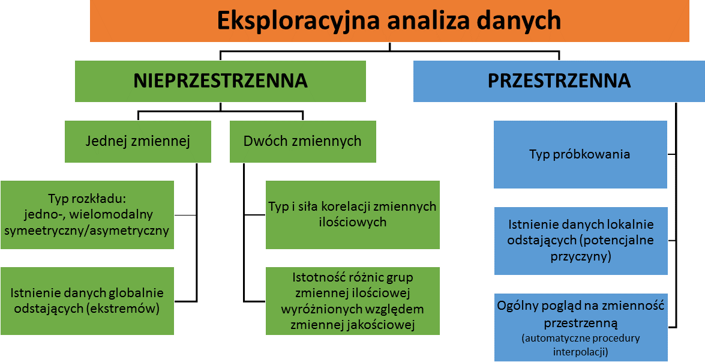
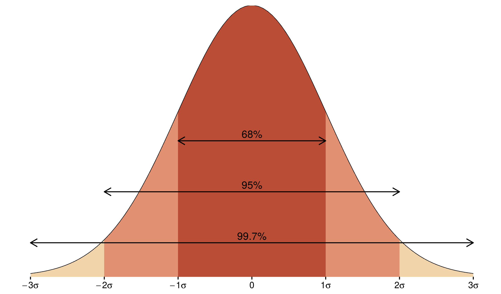
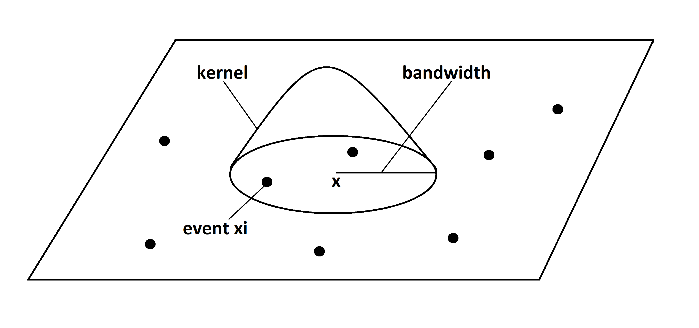
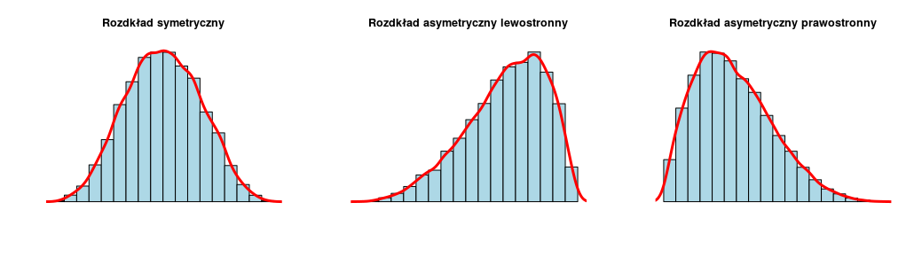
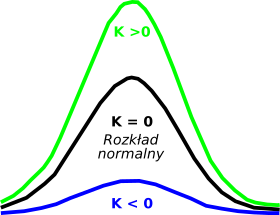
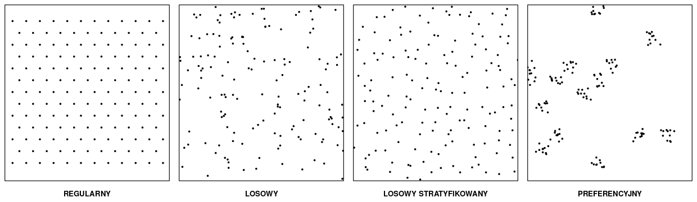

# EKSPLORACYJNA ANALIZA DANYCH {#sec-eksploracja-teoria}

::: {.callout-note}
## Czego się nauczysz

**Po tym rozdziale potrafisz:**

-   wyjaśnić, czemu służy eksploracyjna analiza danych i dlaczego poprzedza właściwą analizę,
    a nie następuje po niej,
-   wskazać, które pytania rozstrzyga analiza nieprzestrzenna, a które przestrzenna, i dlaczego
    żadna z nich nie zastępuje drugiej,
-   dobrać zakres eksploracji do typu danych: punktowych, obszarowych i geostatystycznych,
-   rozpoznać cztery typy próbkowania.

**Rozumiesz i umiesz zinterpretować:**

-   podstawowe statystyki opisowe oraz wniosek o kształcie rozkładu płynący z porównania
    średniej i mediany,
-   skośność i kurtozę jako liczbowy opis rozkładu,
-   współczynniki korelacji Pearsona i Spearmana oraz warunki stosowania każdego z nich,
-   różnicę między **istotnością statystyczną** a **siłą zależności**,
-   różnicę między wartością odstającą globalnie a lokalnie oraz narzędzie właściwe dla każdej
    z nich,
-   konsekwencje typu próbkowania dla dalszych analiz.

**Zastosowanie w R:** @sec-eksploracja. **Słownik pojęć:** @sec-slownik.
:::

## Wprowadzenie

Każda analiza danych przestrzennych powinna być poprzedzona **eksploracyjną analizą danych**
(ang. *exploratory data analysis*, EDA). Jej celem jest uzyskanie podstawowych informacji
o analizowanych danych: jakie wartości przyjmuje badana zmienna, jaki ma rozkład, czy w zbiorze
są wartości odstające, czy zmienna jest powiązana z innymi zmiennymi oraz jak rozkłada się
w przestrzeni.

Eksploracja nie jest etapem pomocniczym, który można pominąć. Decyduje o tym, czy w ogóle wolno
zastosować wybraną metodę — geostatystyczne metody estymacji wymagają danych o określonych
właściwościach (@sec-pola-semiwariogram), a miary autokorelacji przestrzennej zakładają
poprawnie przypisane wartości do jednostek odniesienia (@sec-obszarowe-autokorelacja). Sposób
wykonania eksploracji — dobór metod — zależy od posiadanego zbioru danych oraz od postawionego
pytania.

Przykładem jest mapa stopy bezrobocia w powiatach, na której jeden powiat odcina się wartością
19 % przy kilku procentach w powiatach sąsiednich. Mapa nie rozstrzyga, czy jest to lokalne
uwarunkowanie gospodarcze, czy zapis wartości 1,9 bez przecinka — ale pokazuje, że przed
przystąpieniem do analizy trzeba wrócić do źródła danych. Taka wartość nie zwraca uwagi
w zestawieniu liczbowym, ponieważ mieści się w zakresie zmiennej; widać ją dopiero wtedy, gdy
zestawi się ją z otoczeniem.

## Pojęcia podstawowe

Eksploracyjna analiza danych dzieli się na **nieprzestrzenną** i **przestrzenną**. Obie są
konieczne, ponieważ każda z nich pokazuje coś, czego druga nie wykrywa.

| Analiza nieprzestrzenna | Analiza przestrzenna |
|---|---|
| uwzględnia wartości atrybutów, nie ich lokalizację | podstawą analizy jest lokalizacja obserwacji |
| wykonywana na tabeli atrybutów dołączonej do danych geoprzestrzennych | wykonywana na mapie |
| podstawowe statystyki opisowe, typ rozkładu danych, analiza korelacji, zmienność cechy w grupach | typ próbkowania, ogólny pogląd na zmienność przestrzenną zjawiska, wartości odstające lokalnie |
| nie wykryje wartości odstającej lokalnie, jeśli mieści się ona w typowym zakresie zmiennej | nie wykryje wartości odstającej globalnie, jeśli leży ona wśród podobnych do siebie |

Rozróżnienie to przenosi się na definicję wartości nietypowych:

-   **Wartość odstająca globalnie** (ang. *global outlier*) to wartość bardzo niska lub bardzo
    wysoka względem pozostałych w zbiorze. Wykrywa ją analiza rozkładu zmiennej.
-   **Wartość odstająca lokalnie** (ang. *local outlier*) mieści się w typowym zakresie
    zmiennej, ale wyraźnie odbiega od wartości w swoim najbliższym otoczeniu. Wykrywa ją
    wyłącznie mapa.

Trzecim pojęciem używanym w całym rozdziale jest **typ próbkowania** — sposób rozmieszczenia
punktów pomiarowych w przestrzeni, niezależny od wartości, jakie w tych punktach zmierzono.

## Analiza nieprzestrzenna

### Statystyki opisowe

Podstawowa charakterystyka zmiennej ilościowej obejmuje miary położenia i miary rozproszenia.

| Statystyka | Co opisuje | Na co zwrócić uwagę |
|---|---|---|
| **średnia arytmetyczna** | przeciętny poziom zmiennej | wrażliwa na wartości skrajne; pojedyncza bardzo wysoka wartość ją zawyża |
| **mediana** | wartość środkowa — połowa obserwacji jest od niej mniejsza | odporna na wartości skrajne |
| **kwartyle** | wartości dzielące zbiór na cztery równe części | pierwszy i trzeci kwartyl ograniczają połowę obserwacji położoną centralnie |
| **minimum i maksimum** | zakres zmienności | wartości skrajne warto sprawdzić pod kątem błędów pomiaru |
| **odchylenie standardowe** | przeciętne odchylenie od średniej | wyrażone w jednostkach zmiennej, więc łatwe do interpretacji |
| **liczebność grup** | liczba obserwacji w każdej kategorii | niezbędna przy porównywaniu grup — grupa kilkunastoelementowa nie uprawnia do mocnych wniosków |

Porównanie średniej i mediany jest pierwszą informacją o kształcie rozkładu. Średnia wyraźnie
wyższa od mediany wskazuje na rozkład z wydłużonym prawym ramieniem, niższa — z wydłużonym
lewym.

Odchylenie standardowe nabiera dodatkowego znaczenia, gdy rozkład zmiennej jest zbliżony do
normalnego. Dla rozkładu normalnego:

-   68 % obserwacji mieści się w granicach jednego odchylenia standardowego od średniej,
-   95 % obserwacji — w granicach dwóch odchyleń standardowych,
-   99,7 % obserwacji — w granicach trzech odchyleń standardowych.

::: {.callout-warning}
## Statystyki ilościowe a zmienne kategoryzowane
Dla zmiennych kategoryzowanych nie oblicza się minimum, maksimum, średniej, kwantyli ani
odchylenia standardowego. Jedyną statystyką opisową właściwą dla takiej zmiennej jest
**liczebność grup**. Kategorie zapisane liczbami — na przykład kod klasy pokrycia terenu —
pozwalają obliczyć średnią technicznie, ale wynik nie ma interpretacji.
:::

### Rozkład danych

Rozkład zmiennej opisuje się graficznie i liczbowo.

**Histogram** (ang. *histogram*) przedstawia liczbę obserwacji w kolejnych przedziałach
wartości. Jego wygląd zależy od przyjętej szerokości przedziałów, dlatego warto obejrzeć kilka
wariantów — różny podział na przedziały może prowadzić do różnych wniosków o kształcie rozkładu.

**Estymator jądrowy gęstości** (ang. *kernel density estimation*, KDE) daje wygładzony obraz
rozkładu, bez podziału na przedziały. Wynik zależy od szerokości pasma wygładzania: zbyt małe
daje obraz postrzępiony, zbyt duże — zaciera szczegóły.

**Wykres kwantyl-kwantyl** (ang. *quantile-quantile plot*) porównuje rozkład empiryczny
z teoretycznym, najczęściej z rozkładem normalnym. Punkty układające się wzdłuż prostej
oznaczają zgodność rozkładów.

Rozkład opisują liczbowo **skośność** i **kurtoza**:

-   **skośność** (ang. *skewness*) — asymetria rozkładu. Wartość równa zeru oznacza rozkład
    symetryczny, wartość dodatnia — rozkład asymetryczny prawostronnie, czyli z wydłużonym
    prawym ramieniem (pojedyncze wysokie wartości, średnia wyższa od mediany), wartość ujemna —
    rozkład asymetryczny lewostronnie, z wydłużonym lewym ramieniem.

    

-   **kurtoza** (ang. *kurtosis*) — koncentracja wartości wokół średniej w porównaniu
    z rozkładem normalnym. Wartość dodatnia oznacza rozkład bardziej wysmukły, czyli większą
    koncentrację wokół średniej; wartość ujemna — rozkład bardziej spłaszczony niż normalny,
    z wartościami rozłożonymi równomierniej.

    

Typ rozkładu ma znaczenie praktyczne: decyduje o wyborze miary korelacji oraz o tym, czy wolno
zastosować metody zakładające rozkład normalny.

### Wartości globalnie odstające

Wartość globalnie odstającą identyfikuje się na histogramie oraz na **wykresie pudełkowym**
(ang. *box plot*). Wykres pudełkowy przedstawia jednocześnie podstawowe statystyki opisowe
i wartości odstające:

-   wysokość pudełka to **rozstęp międzykwartylowy** (ang. *interquartile range*, IQR),
-   dolna krawędź pudełka to pierwszy kwartyl, górna — trzeci kwartyl,
-   linia wewnątrz pudełka to mediana,
-   pionowe linie (wąsy) sięgają najbardziej skrajnych wartości, które nie są jeszcze uznane za
    odstające — najwyżej 1,5 IQR ponad górną krawędź pudełka i najwyżej 1,5 IQR poniżej dolnej,
-   punkty poza wąsami to wartości odstające.

Granica 1,5 IQR jest umowna i przyjęta powszechnie [@nowosad_geostat]; w niektórych
zastosowaniach stosuje się mnożnik 3,0, wskazujący wyłącznie wartości skrajne.

Wykrycie wartości odstającej nie oznacza, że należy ją usunąć. W analizie danych należy
zidentyfikować takie wartości, ustalić ich przyczynę — czy są wynikiem błędu pomiaru lub zapisu,
czy wiążą się z analizowanym zjawiskiem — i dopiero wtedy zdecydować o ewentualnym usunięciu.
Wartość odstająca może być poprawną obserwacją zjawiska rzadkiego, a wtedy jest najcenniejszą
informacją w zbiorze. Decyzja wymaga powrotu do źródła danych.

### Zależność między zmiennymi ilościowymi

Zależność dwóch zmiennych ilościowych przedstawia **wykres rozrzutu** (ang. *scatter plot*),
a opisuje **współczynnik korelacji**:

-   **współczynnik korelacji liniowej Pearsona** (ang. *Pearson correlation*) — mierzy siłę
    zależności liniowej; wymaga rozkładów zbliżonych do normalnego i jest wrażliwy na wartości
    odstające,
-   **współczynnik korelacji rang Spearmana** (ang. *Spearman rank correlation*) — mierzy siłę
    zależności monotonicznej, obliczany na rangach; odporny na wartości odstające i nie wymaga
    normalności rozkładu.

Oba przyjmują wartości od −1 do 1. Wartość bliska zera oznacza brak zależności, bliska ±1 —
zależność silną. Znak wskazuje kierunek.

Przy wielu zmiennych wygodnym narzędziem jest **macierz korelacji** oraz **macierz wykresów
rozrzutu**, przedstawiająca jednocześnie rozkłady zmiennych, wykresy rozrzutu dla wszystkich par
i wartości współczynników.

::: {.callout-important}
## Istotność statystyczna to nie siła zależności
Test korelacji podaje dwie liczby: **wartość współczynnika** oraz **poziom istotności**.
Druga z nich zależy nie tylko od siły zależności, ale też od liczby obserwacji — przy dużej
próbie istotna statystycznie okazuje się nawet bardzo słaba zależność.

Wynik istotny statystycznie oznacza jedynie, że obserwowanej zależności nie da się przypisać
przypadkowi przy tej liczbie obserwacji. Nie oznacza, że zależność jest silna ani że jest
przydatna. Siłę zależności opisuje wartość współczynnika, nie poziom istotności.
:::

### Zależność między zmienną ilościową a jakościową

Zróżnicowanie zmiennej ilościowej w grupach wyznaczonych zmienną jakościową przedstawia
wykres pudełkowy sporządzony osobno dla każdej grupy. Pozwala porównać położenie, rozproszenie
i asymetrię rozkładów.

Istotność różnic ocenia się testem statystycznym. **Analiza wariancji** (ang. *analysis of
variance*, ANOVA) odpowiada na pytanie, czy średnie wartości zmiennej różnią się istotnie między
grupami. Daje jedną odpowiedź dla całego podziału — nie wskazuje, **które** grupy się różnią.

Do wskazania konkretnych par grup służą **porównania wielokrotne** (ang. *post-hoc
comparisons*), na przykład test Tukeya. Korygują one poziom istotności z uwagi na liczbę
wykonywanych porównań.

Analiza wariancji zakłada niezależność obserwacji, zbliżony do normalnego rozkład reszt oraz
zbliżoną wariancję w porównywanych grupach — założenia znane z kursu statystyki, które przed
odczytaniem wyniku należy sprawdzić.

Wykres pudełkowy przedstawia każdą grupę w tej samej skali graficznej, niezależnie od jej
liczebności. Dlatego czyta się go zawsze razem z liczebnością grup: wyraźna różnica oparta na
kilkunastu obserwacjach jest słabą przesłanką.

## Analiza przestrzenna

### Sprawdzenie poprawności współrzędnych

Mapa lokalizacyjna, przedstawiająca położenie obserwacji na tle granicy obszaru analizy,
pozwala odpowiedzieć na trzy pytania:

-   czy współrzędne są w odpowiedniej kolejności (X–Y, a nie Y–X)?
-   czy są wyrażone w odpowiednim układzie współrzędnych?
-   czy wszystkie obserwacje leżą w badanym obszarze?

Błąd w którymkolwiek z tych punktów jest na mapie natychmiast widoczny — obserwacje wypadają
daleko poza obszar albo tworzą układ odbity względem przekątnej.

### Wartości odstające lokalnie

Temperatura 10 °C w zbiorze o zakresie od 8 do 25 °C jest zupełnie zwyczajna, ale jeśli
wszystkie okoliczne punkty wskazują 20 °C, jest to sygnał błędu pomiaru albo zjawiska lokalnego.
Występowanie niskich wartości otoczonych wysokimi — lub odwrotnie — może oznaczać błąd w danych
albo wpływ innego czynnika na analizowaną cechę.

Analiza nieprzestrzenna takiej wartości nie wykryje, ponieważ pomija lokalizację; wartość mieści
się w zakresie zmiennej, więc nie wyróżnia się ani w statystykach opisowych, ani na histogramie.
Wykrywa ją mapa rozkładu przestrzennego zmiennej — dla danych punktowych przez porównanie
wartości w punkcie z wartościami w punktach sąsiednich, dla danych obszarowych przez porównanie
wartości w obszarze z wartościami w obszarach graniczących.

Dla danych obszarowych narzędziem systematycznym są lokalne miary autokorelacji przestrzennej,
omawiane w @sec-obszarowe-autokorelacja.

### Typ próbkowania

Rozmieszczenie punktów pomiarowych w przestrzeni wpływa na wybór i na wynik dalszych analiz.
Wyróżnia się cztery typy próbkowania [@nowosad_geostat]:

-   **regularne** (ang. *regular*) — punkty rozłożone równomiernie na badanym obszarze,
-   **losowe** (ang. *random*) — każda lokalizacja ma takie samo prawdopodobieństwo wystąpienia,
    a każdy punkt jest losowany niezależnie od pozostałych,
-   **losowe stratyfikowane** (ang. *stratified*) — obszar dzieli się na regularne komórki
    i w każdej komórce losuje się lokalizację punktu,
-   **preferencyjne** (ang. *clustered*) — pewne obszary są opróbowane znacznie częściej niż
    pozostałe, na przykład z uwagi na spodziewane wartości analizowanej cechy.

Typ próbkowania ma bezpośrednie znaczenie dla geostatystyki: od rozmieszczenia punktów
i odległości między nimi zależy, dla jakich odstępów można wyznaczyć semiwariogram
(@sec-pola-semiwariogram). Próbkowanie preferencyjne powoduje dodatkowo, że obszary gęściej
opróbowane mają nieproporcjonalnie duży wpływ na wynik.

### Ogólna charakterystyka zmienności przestrzennej

Na etapie eksploracji przydatna jest prosta, automatyczna procedura interpolacji, pozwalająca
zobaczyć ogólny obraz zmienności zjawiska w całym obszarze. Nie jest to jeszcze estymacja —
służy wyłącznie ocenie, czy zmienna ma strukturę przestrzenną, czyli czy wartości podobne do
siebie występują blisko siebie. Jeśli takiej struktury nie ma, metody geostatystyczne nie mają
zastosowania. Metody interpolacji omawia @sec-pola-interpolacja.

## Dobór metod eksploracji do typu danych

Zakres eksploracji zależy od nurtu metodologicznego i od pytania badawczego.

### Statystyka punktów

**Cel:** określenie, w jaki sposób obiekty lub zdarzenia są rozmieszczone w przestrzeni.

Eksploracja obejmuje: sprawdzenie poprawności współrzędnych, wgląd w typ próbkowania oraz
określenie zależności między lokalizacją a innymi czynnikami — na przykład czy więcej włamań
notuje się w obszarach o wysokich cenach nieruchomości.

### Dane obszarowe

**Cel:** analiza podobieństwa i różnic między obszarami, wyszukanie obszarów podobnych do siebie
oraz obszarów znacząco różnych od sąsiednich.

Eksploracja obejmuje: charakterystykę statystyczną danych (statystyki podstawowe, rozkład,
wartości globalnie odstające) oraz sprawdzenie poprawności danych, w tym identyfikację wartości
odstających lokalnie.

### Geostatystyka

**Cel:** zrozumienie zmienności przestrzennej lub czasowej zjawiska oraz oszacowanie wartości
dla całego obszaru na podstawie danych punktowych.

Eksploracja obejmuje: charakterystykę statystyczną danych, sprawdzenie poprawności
współrzędnych, identyfikację wartości odstających lokalnie, wgląd w typ próbkowania oraz ogólny
pogląd na zmienność przestrzenną z wykorzystaniem prostej automatycznej procedury interpolacji.

## Powiązanie z ćwiczeniami

| Zadanie eksploracji | Funkcje | Pakiet | Gdzie wykonujesz |
|---|---|---|---|
| podsumowanie numeryczne | `summary()`, `mean()`, `median()`, `sd()`, `table()` | base | @sec-eksploracja |
| rozkład zmiennej | `geom_histogram()`, `geom_density()` | `ggplot2` | @sec-eksploracja |
| skośność i kurtoza | `skewness()`, `kurtosis()` | `e1071` | @sec-eksploracja |
| korelacja i jej istotność | `cor.test(method =)`, `chart.Correlation()` | base, `PerformanceAnalytics` | @sec-eksploracja |
| zróżnicowanie w grupach | `geom_boxplot()`, `aov()`, `TukeyHSD()` | `ggplot2`, base | @sec-eksploracja |
| eksploracja przestrzenna | `tm_symbols()`, `tm_polygons()`, `tm_grid()` | `tmap` | @sec-eksploracja |

Opis pakietów wraz z odnośnikami do dokumentacji zawiera @sec-pakiety, a pełne zestawienie
funkcji — @sec-funkcje.

## Literatura

-   @nowosad_geostat — eksploracyjna analiza danych nieprzestrzennych i przestrzennych, typy
    próbkowania.
-   @anselin_geoda — eksploracyjna analiza danych: histogram, wykres pudełkowy, wykres rozrzutu,
    wartości odstające.
-   @lovelace2025 — praca z danymi przestrzennymi w R.

## Pytania kontrolne

1.  Czemu służy eksploracyjna analiza danych i dlaczego wykonuje się ją przed właściwą analizą,
    a nie po niej?

::: {.callout-tip collapse="true"}
## Sprawdź odpowiedź
Celem eksploracji jest uzyskanie podstawowych informacji o danych: zakresu wartości, typu
rozkładu, obecności wartości odstających, zależności od innych zmiennych oraz sposobu
rozmieszczenia obserwacji w przestrzeni. Wykonuje się ją przed analizą, ponieważ rozstrzyga,
czy wybraną metodę w ogóle wolno zastosować — metody geostatystyczne wymagają danych
o określonych właściwościach, a wartość będąca błędem zapisu zafałszuje wynik każdej analizy,
do której trafi.
:::

2.  Średnia wartość zmiennej jest wyraźnie wyższa od mediany. Co to mówi o rozkładzie i która
    z tych miar lepiej opisuje wartość przeciętną?

::: {.callout-tip collapse="true"}
## Sprawdź odpowiedź
Rozkład jest asymetryczny prawostronnie — ma wydłużone prawe ramię, czyli pojedyncze wysokie
wartości zawyżają średnią. Przy takim rozkładzie lepszą miarą wartości przeciętnej jest
mediana, ponieważ jest odporna na wartości skrajne. W praktyce podaje się obie miary.
:::

3.  Zmienna ma dodatnią skośność i dodatnią kurtozę. Jak wygląda jej rozkład?

::: {.callout-tip collapse="true"}
## Sprawdź odpowiedź
Dodatnia skośność oznacza asymetrię prawostronną — rozkład ma wydłużone prawe ramię. Dodatnia
kurtoza oznacza większą niż w rozkładzie normalnym koncentrację wartości wokół średniej, czyli
rozkład bardziej wysmukły. Razem: większość obserwacji skupia się w wąskim zakresie, a nieliczne
wysokie wartości tworzą długie prawe ramię.
:::

4.  Kiedy należy użyć współczynnika korelacji rang Spearmana zamiast współczynnika Pearsona?

::: {.callout-tip collapse="true"}
## Sprawdź odpowiedź
Wtedy, gdy naruszone jest założenie o rozkładzie zbliżonym do normalnego — na przykład gdy
w zbiorze są wartości odstające — albo gdy zależność nie jest liniowa, lecz monotoniczna.
Współczynnik Spearmana obliczany jest na rangach, więc jest odporny na wartości odstające
i nie wymaga normalności rozkładu. Współczynnik Pearsona mierzy wyłącznie zależność liniową.
:::

5.  Test korelacji dał wynik istotny statystycznie przy współczynniku równym 0,17. Czy oznacza
    to, że zależność jest silna?

::: {.callout-tip collapse="true"}
## Sprawdź odpowiedź
Nie. Poziom istotności zależy nie tylko od siły zależności, ale też od liczby obserwacji — przy
dużej próbie istotna statystycznie okazuje się nawet bardzo słaba zależność. Wynik istotny
oznacza jedynie, że obserwowanej zależności nie da się przypisać przypadkowi przy tej liczbie
obserwacji. Siłę zależności opisuje wartość współczynnika, a 0,17 to zależność bardzo słaba.
:::

6.  Czym różni się wartość odstająca lokalnie od wartości odstającej globalnie i dlaczego
    histogram nie wykryje tej pierwszej?

::: {.callout-tip collapse="true"}
## Sprawdź odpowiedź
Wartość odstająca globalnie jest bardzo niska lub bardzo wysoka względem całego zbioru, więc
wyróżnia się w statystykach opisowych, na histogramie i na wykresie pudełkowym. Wartość
odstająca lokalnie mieści się w typowym zakresie zmiennej, ale wyraźnie odbiega od wartości
w swoim najbliższym otoczeniu. Histogram jej nie wykryje, ponieważ nie uwzględnia lokalizacji
obserwacji — wartość trafia do przedziału, w którym jest wiele innych obserwacji. Wykrywa ją
mapa rozkładu przestrzennego zmiennej.
:::

7.  Punkty pomiarowe są rozmieszczone preferencyjnie. Jakie są konsekwencje dla dalszej analizy?

::: {.callout-tip collapse="true"}
## Sprawdź odpowiedź
Obszary opróbowane gęściej mają nieproporcjonalnie duży wpływ na wynik, ponieważ wnoszą do
obliczeń więcej obserwacji niż obszary opróbowane rzadko. Dodatkowo od rozmieszczenia punktów
i odległości między nimi zależy, dla jakich odstępów można wyznaczyć semiwariogram — przy
próbkowaniu preferencyjnym część zakresu odległości jest reprezentowana słabo albo wcale.
:::

8.  Dysponujesz lokalizacjami kradzieży samochodów w mieście, bez atrybutów. Jaki zakres
    eksploracji jest właściwy i czym różni się od eksploracji danych geostatystycznych?

::: {.callout-tip collapse="true"}
## Sprawdź odpowiedź
Jest to zadanie statystyki punktów: celem jest określenie, w jaki sposób zdarzenia są
rozmieszczone w przestrzeni. Eksploracja obejmuje sprawdzenie poprawności współrzędnych, wgląd
w typ próbkowania oraz określenie zależności między lokalizacją a innymi czynnikami. Nie ma tu
zastosowania analiza rozkładu wartości atrybutu, ponieważ atrybutu nie ma. W geostatystyce
analizowana jest wartość zmierzona w punkcie, więc eksploracja obejmuje dodatkowo pełną
charakterystykę statystyczną zmiennej, identyfikację wartości odstających lokalnie oraz ogólny
pogląd na zmienność przestrzenną uzyskany prostą procedurą interpolacji.
:::

::: {#najwazniejsze-eksploracja .callout-important}
## Najważniejsze informacje — zanim przejdziesz do części praktycznej
-   Eksploracyjna analiza danych poprzedza każdą analizę przestrzenną i rozstrzyga, czy wybraną
    metodę w ogóle wolno zastosować.
-   Analiza nieprzestrzenna pracuje na wartościach atrybutów, przestrzenna — na ich lokalizacji;
    żadna nie zastępuje drugiej.
-   Średnia jest wrażliwa na wartości skrajne, mediana nie; ich porównanie jest pierwszą
    informacją o asymetrii rozkładu.
-   Skośność opisuje asymetrię rozkładu — znak wskazuje, które ramię jest wydłużone; kurtoza
    opisuje koncentrację wartości wokół średniej względem rozkładu normalnego.
-   Współczynnik korelacji Pearsona wymaga zależności liniowej i rozkładu zbliżonego do
    normalnego; przy naruszeniu tych warunków stosuje się współczynnik korelacji rang Spearmana.
-   Istotność statystyczna zależy od liczby obserwacji i nie jest miarą siły zależności.
-   Wartość odstająca lokalnie mieści się w typowym zakresie zmiennej, więc wykrywa ją wyłącznie
    mapa.
-   Cztery typy próbkowania to: regularne, losowe, losowe stratyfikowane i preferencyjne.
:::
