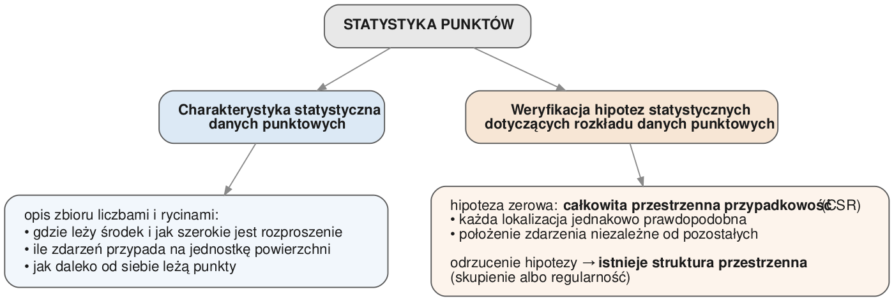
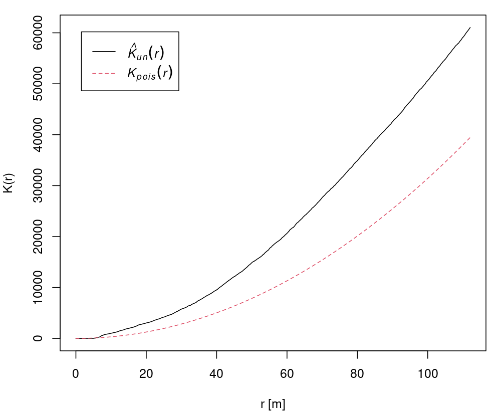
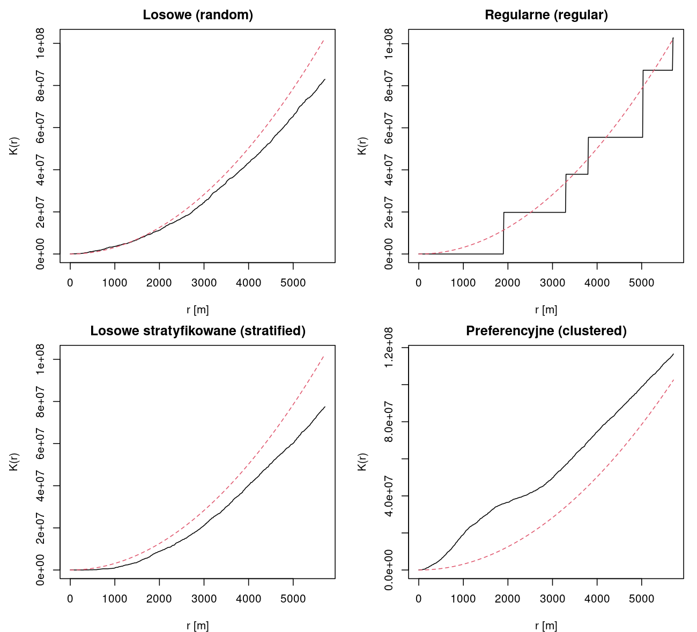

# DANE PUNKTOWE

::: {.callout-note}
## Czego się nauczysz

**Po tym rozdziale potrafisz:**

-   wyjaśnić, na jakie pytanie odpowiada analiza rozkładu przestrzennego danych punktowych,
-   wskazać trzy grupy metod tej analizy i metody należące do każdej z nich,
-   sformułować hipotezę zerową przyjmowaną w tej analizie,
-   odróżnić dane punktowe oznakowane od nieoznakowanych.

**Rozumiesz i umiesz zinterpretować:**

-   średnią centralną, medianę centralną, odległość standardową i elipsę odchylenia
    standardowego,
-   średnią intensywność, wynik testu zliczania w kwadratach i mapę gęstości jądra,
-   statystyki najbliższego sąsiada oraz wskaźnik Clarka-Evansa,
-   przebieg funkcji G i funkcji K Ripleya względem obwiedni,
-   dlaczego efekt brzegowy zawyża odległości mierzone przy granicy obszaru badań.

**Część praktyczna:** @sec-punkty-centrograficzne, @sec-punkty-intensywnosc,
@sec-punkty-odleglosc. **Słownik pojęć:** @sec-slownik. **Funkcje:** @sec-funkcje.
:::

## Wprowadzenie

Analiza rozkładu przestrzennego danych punktowych odpowiada na pytanie, **w jaki sposób obiekty
lub zdarzenia są rozmieszczone w przestrzeni**. Materiałem wejściowym są same lokalizacje —
współrzędne miejsc, w których coś się wydarzyło albo coś się znajduje.

Klasycznym przykładem jest epidemia cholery w londyńskiej dzielnicy Soho w 1854 roku. John Snow
naniósł na plan dzielnicy miejsca zgonów oraz położenie publicznych pomp wodnych.

Na mapie widać, że zgony nie są rozłożone równomiernie: skupiają się wokół jednej z pomp,
podczas gdy w otoczeniu pozostałych jest ich niewiele. Rozmieszczenie zdarzeń nie wygląda więc na
przypadkowe — a to wskazuje, że działa na nie jakiś czynnik. Analiza rozkładu punktów opisuje
takie odstępstwo liczbowo i pozwala sprawdzić, czy jest ono większe od tego, co daje sam
przypadek.

Pytanie, **dlaczego** rozmieszczenie jest takie, a nie inne, wymaga odniesienia lokalizacji
zdarzeń do innych zmiennych — czym zajmują się metody opisane w kolejnych częściach skryptu.

### Statystyka punktów

**Statystyka punktów** to dział statystyki przestrzennej zajmujący się rozmieszczeniem zdarzeń
w przestrzeni. Od pozostałych działów odróżnia ją to, czym jest dana wejściowa: nie wartość
zmierzona w punkcie ani wartość zagregowana w jednostce przestrzennej, lecz **sama lokalizacja
zdarzenia**. Zbiór takich lokalizacji nazywany jest wzorcem punktowym, a pytanie badawcze dotyczy
jego struktury — czy zdarzenia rozkładają się równomiernie, czy tworzą skupiska.

Zadania statystyki punktów dzielą się na dwa:

**Charakterystyka statystyczna** opisuje zbiór punktów liczbami i rycinami: wskazuje jego środek
i rozproszenie, podaje liczbę zdarzeń przypadającą na jednostkę powierzchni, pokazuje, jak daleko
od siebie leżą punkty. Jest odpowiednikiem statystyk opisowych w statystyce klasycznej, z tą
różnicą, że opisuje położenie, a nie wartość zmiennej.

**Weryfikacja hipotez** rozstrzyga, czy zaobserwowany obraz różni się od tego, co dałby czysty
przypadek. Hipotezą zerową jest **całkowita przestrzenna przypadkowość** (opisana w następnej
sekcji), a jej odrzucenie oznacza, że w danych istnieje struktura przestrzenna. Bez tego kroku
charakterystyka statystyczna pozostaje samym opisem: pokazuje, jak zbiór wygląda, ale nie
rozstrzyga, czy jego wygląd wymaga wyjaśnienia.

::: {.callout-note}
## Przykład przewijający się przez rozdział
Wszystkie ryciny ilustrujące metody obliczono na danych z mapy Snowa: **250 adresów**, pod
którymi odnotowano zgony na cholerę, na fragmencie Soho o wymiarach około **496 × 448 m**
(powierzchnia 222 138 m²). Dane są w układzie współrzędnych wyrażonym w metrach, więc wszystkie
odległości podane niżej to metry.
:::

## Pojęcia podstawowe

### Punkt, zdarzenie i znak

**Punkt** (ang. *point*) to lokalizacja opisana parą współrzędnych. **Zdarzenie** (ang. *event*)
to obiekt lub zjawisko, którego lokalizację zarejestrowano — zgon, przestępstwo, drzewo, szkoła.
Dodatkowa cecha przypisana zdarzeniu nazywana jest **znakiem** (ang. *mark*); w terminologii
systemów informacji geograficznej odpowiada mu atrybut.

### Dane oznakowane i nieoznakowane

Rozróżnienie między lokalizacją a znakiem dzieli zbiory danych punktowych na dwie grupy:

-   **dane punktowe nieoznakowane** (ang. *unmarked spatial point pattern data*) — same
    lokalizacje, bez atrybutów,
-   **dane punktowe oznakowane** (ang. *marked spatial point pattern data*) — lokalizacje wraz
    z wartością przypisaną każdemu zdarzeniu, na przykład liczbą zgonów pod danym adresem albo
    średnicą drzewa.

Obie mapy pokazują te same 250 lokalizacji, ale odpowiadają na inne pytania. Lewa mówi, gdzie
odnotowano zgony; prawa — gdzie było ich najwięcej. Metody opisane w tym rozdziale analizują
**wyłącznie lokalizacje**, więc stosuje się je do danych nieoznakowanych. Wszystkie zbiory
używane w części praktycznej są nieoznakowane. Jeśli dane mają atrybut, a pytanie dotyczy jego
wartości, właściwe są metody z pozostałych części skryptu.

### Obszar badań i okno analizy

Zbiór punktów zawsze leży wewnątrz jakiegoś obszaru, a wynik wielu metod zależy od tego, jak ten
obszar wyznaczono. Granica obszaru badań nosi nazwę **okna analizy** (ang. *window*). W pakiecie
`spatstat`, używanym w części praktycznej, wzorzec punktowy jest obiektem klasy `ppp` (ang.
*planar point pattern*) i zawiera zarówno współrzędne punktów, jak i okno analizy.

### Typy rozkładu punktów

Rozmieszczenie punktów opisuje się na skali od rozproszenia do skupienia:

Wyróżnia się trzy typy rozkładu, a każdy z nich mówi coś innego o procesie, który doprowadził do
powstania zbioru:

-   **losowy** — na rozmieszczenie nie działa żaden czynnik albo działa wiele czynników, których
    wpływy wzajemnie się znoszą,
-   **regularny** — punkty rozmieszczone równomiernie; zwykle efekt świadomego działania, a nie
    procesu naturalnego,
-   **skupiony** — występują skupiska (klastry) punktów, co wskazuje, że na rozmieszczenie
    wpływa jakiś czynnik.

### Całkowita przestrzenna przypadkowość

Punktem odniesienia dla wszystkich metod tej części jest **całkowita przestrzenna przypadkowość**
(ang. *complete spatial randomness*, CSR). Jest to model, w którym każda lokalizacja w obszarze
badań jest jednakowo prawdopodobna, a położenie każdego zdarzenia nie zależy od położenia
pozostałych [@moraga2023].

Całkowita przestrzenna przypadkowość jest **hipotezą zerową** analizy rozkładu punktów. Jej
odrzucenie oznacza, że w danych istnieje struktura przestrzenna — skupienie albo regularność.
Samo odrzucenie hipotezy nie wskazuje jednak przyczyny tej struktury.

### Efekt brzegowy

Punkt leżący blisko granicy obszaru badań może mieć swojego faktycznego najbliższego sąsiada
**poza** tym obszarem. Sąsiad ten nie został zarejestrowany, więc zapisana odległość jest
zawyżona. Zjawisko to nosi nazwę **efektu brzegowego** (ang. *edge effect*) i dotyczy wszystkich
metod opartych na odległości.

Funkcje pakietu `spatstat` udostępniają korekty brzegowe, które to obciążenie zmniejszają; wybór
korekty jest decyzją analityka i pokazany jest na liczbach w @sec-punkty-odleglosc. Efekt
brzegowy jest jednym z trzech zagrożeń, przed którymi ostrzega literatura przedmiotu — obok
niewłaściwego wyznaczenia okna analizy i stosowania opisywanych metod do wzorców próbkowanych,
czyli takich, w których zarejestrowano tylko część zdarzeń [@paez].

## Trzy grupy metod

Metody analizy rozkładu punktów dzielą się na trzy grupy. Każda opisuje rozmieszczenie w inny
sposób i żadna nie zastępuje pozostałych.

Statystyki centrograficzne podsumowują zbiór jako całość: podają jego środek i miarę
rozproszenia. Metody oparte na intensywności odnoszą liczbę punktów do powierzchni obszaru
badań. Metody oparte na odległości pomijają obszar i pracują na odległościach między samymi
punktami.

## Statystyki centrograficzne

Statystyki centrograficzne są **przestrzennymi statystykami opisowymi** — stanowią modyfikację
statystyk opisowych znanych ze statystyki klasycznej i są podstawową formą opisu rozkładu
przestrzennego danych punktowych. Dzielą się na dwie podgrupy:

-   **statystyki tendencji centralnej** — wyznaczają punkt, wokół którego skoncentrowane są
    lokalizacje badanego zjawiska,
-   **statystyki dyspersji** — określają, jak daleko od tego punktu rozproszone są pozostałe
    punkty.

### Średnia centralna

**Średnia centralna** (ang. *mean center*) to punkt o współrzędnych będących średnimi
arytmetycznymi współrzędnych wszystkich punktów zbioru:

$$\overline{x_c} = \frac{\sum_{i=1}^{n} x_i}{n} \qquad \overline{y_c} = \frac{\sum_{i=1}^{n} y_i}{n}$$

gdzie $x_i$ i $y_i$ to współrzędne $i$-tego punktu, a $n$ — liczba punktów w zbiorze.

Jest to jedna z najczęściej stosowanych miar centrograficznych. Podobnie jak średnia
arytmetyczna w statystyce klasycznej, jest **silnie zależna od lokalizacji punktów skrajnych**:
pojedynczy punkt położony daleko od pozostałych przesuwa ją w swoją stronę.

### Mediana centralna

**Mediana centralna** (ang. *median center*) to punkt o współrzędnych będących medianami
współrzędnych, wyznaczanymi **osobno dla każdej osi**:

$$\widetilde{x_c} = \mathrm{med}(x_1, \ldots, x_n) \qquad \widetilde{y_c} = \mathrm{med}(y_1, \ldots, y_n)$$

Mediana centralna jest odporna na wartości skrajne: pojedynczy punkt położony bardzo daleko od
pozostałych przesuwa średnią centralną, a mediany centralnej praktycznie nie zmienia. Porównanie
położenia obu środków jest prostym sprawdzeniem, czy średnia centralna nie została zaburzona
przez nietypowe lokalizacje.

::: {.callout-note}
## Mediana centralna a mediana geometryczna
Tak zdefiniowana mediana centralna **nie jest** punktem minimalizującym sumę odległości do
wszystkich punktów zbioru, nazywanym medianą geometryczną albo środkiem minimalnej odległości.
Ten drugi punkt nie ma rozwiązania w postaci wzoru i wyznacza się go iteracyjnie. Część
podręczników używa nazwy „mediana centralna" właśnie w tym drugim znaczeniu, dlatego przed
interpretacją wyniku sprawdź, co liczy używana funkcja.
:::

### Odległość standardowa

**Odległość standardowa** (ang. *standard distance*) to absolutna miara rozproszenia punktów
w przestrzeni. Określa średnią odległość punktów od średniej centralnej i obliczana jest jako
średnia kwadratowa tych odległości:

$$d = \sqrt{\frac{\sum_{i=1}^{n} d_{ic}^2}{n}} \qquad \text{gdzie} \qquad d_{ic}^2 = (x_i - \overline{x_c})^2 + (y_i - \overline{y_c})^2$$

Symbol $d_{ic}$ oznacza odległość $i$-tego punktu od średniej centralnej.

Odległość standardowa jest odpowiednikiem odchylenia standardowego w statystyce klasycznej.
Wyrażona jest w jednostkach układu współrzędnych, więc dla danych w układzie odwzorowanym —
w metrach. Graficznie przedstawia się ją jako okrąg o środku w średniej centralnej i promieniu
równym odległości standardowej.

### Elipsa odchylenia standardowego

**Elipsa odchylenia standardowego** (ang. *standard deviational ellipse*) pozwala określić
kierunki rozrzutu punktów w przestrzeni. Opisują ją trzy parametry:

-   $s_x$, $s_y$ — długości dwóch prostopadłych półosi elipsy,
-   $\theta$ — kąt obrotu elipsy, czyli kierunek, w którym punkty są najbardziej rozproszone.

Odległość standardowa podaje jedną liczbę opisującą rozproszenie we wszystkich kierunkach
jednocześnie, a elipsa rozdziela je na dwa kierunki prostopadłe. Stosunek dłuższej półosi do
krótszej mówi, jak silnie rozkład jest wydłużony: wartość bliska 1 oznacza rozproszenie
jednakowe we wszystkich kierunkach.

### Przykład: cztery statystyki dla zgonów w Soho

{width=50%}

Dla tego zbioru:

-   **średnia centralna i mediana centralna leżą 11 m od siebie** — bardzo blisko jak na obszar
    o rozmiarach ok. 500 × 450 m. Oznacza to, że w zbiorze nie ma pojedynczych adresów
    położonych tak daleko od pozostałych, by przesunąć średnią;
-   **odległość standardowa wynosi 137 m** — tyle wynosi przeciętne oddalenie adresu od środka
    zbioru. Sama ta liczba niewiele mówi; nabiera znaczenia w porównaniu z innym zbiorem albo
    innym okresem;
-   **półosie elipsy wynoszą 111 m i 160 m**, a ich stosunek 1,45 oznacza rozkład umiarkowanie
    wydłużony. Kąt obrotu $\theta$ = 66,5° wskazuje kierunek największego rozproszenia.

### Zakres wniosków

Statystyki centrograficzne opisują zbiór punktów jako całość i **nie rozstrzygają**, czy
rozkład jest losowy, regularny czy skupiony. Pojedyncza wartość odległości standardowej nic nie
znaczy bez punktu odniesienia — nabiera znaczenia dopiero w porównaniu z innym zbiorem danych
albo z innym okresem. Typ rozkładu rozstrzygają metody oparte na odległości.

::: {.callout-warning}
## Elipsa opisuje też kształt obszaru badań
Punkty leżą zawsze wewnątrz jakiegoś obszaru, a jeśli obszar ten jest wydłużony, to **każdy**
rozkład punktów w jego wnętrzu — również całkowicie losowy — da wydłużoną elipsę. Zanim uznasz
kierunek elipsy za właściwość badanego zjawiska, porównaj go z kierunkiem samego obszaru analizy.
Przykład liczbowy zawiera @sec-punkty-centrograficzne.
:::

## Metody oparte na intensywności

Metody oparte na intensywności analizują rozkład przestrzenny punktów **pod względem badanego
obszaru**. Stosowane są między innymi w epidemiologii i kryminologii, gdzie pytanie brzmi, czy
natężenie obserwowanych zjawisk jest w obszarze jednorodne, czy zmienia się w przestrzeni.

### Średnia intensywność

Jeśli przyjmuje się, że intensywność zdarzeń jest stała w całym obszarze, opisuje ją jedna
liczba — **średnia intensywność**, czyli liczba zdarzeń przypadająca na jednostkę powierzchni:

$$\lambda = \frac{n}{a}$$

gdzie $n$ to liczba zdarzeń, a $a$ — powierzchnia obszaru badań.

Dla zbioru z Soho $n$ = 250, a powierzchnia analizowanego fragmentu wynosi 222 138 m², więc
$\lambda$ = 0,001125 zdarzenia na metr kwadratowy, czyli **11,25 adresu ze zgonem na hektar**.

Wartość ta zależy od tego, jaki obszar uznano za obszar badań. Gdyby zamiast całego fragmentu
dzielnicy wziąć sam kwartał wokół skupienia zgonów, powierzchnia byłaby kilkakrotnie mniejsza,
a intensywność odpowiednio większa — przy tych samych punktach.

### Test zliczania w kwadratach

Założenie o stałej intensywności sprawdza **test zliczania w kwadratach** (ang. *quadrat count
test*). Przebiega w trzech krokach:

1.  podział obszaru badań na równe kwadraty,
2.  zliczenie punktów w każdym kwadracie,
3.  porównanie zliczeń z wartościami oczekiwanymi, czyli z sytuacją, w której w każdym kwadracie
    jest ta sama liczba punktów.

{width=50%}

Przy 250 punktach i 9 oczkach wartość oczekiwana wynosi 27,8 punktu na oczko. Zliczenia
rzeczywiste wahają się od 2 do 60: w górnym rzędzie jest ich 2, 12 i 10, a w środkowym i dolnym
— od 14 do 60. Już sam ten rozrzut sugeruje, że intensywność nie jest stała.

Statystykę testową oblicza się jako sumę po wszystkich oczkach [@mgimond; @paez]:

$$X^2 = \sum_{i=1}^{m} \frac{(O_i - E_i)^2}{E_i}$$

gdzie $O_i$ to zliczenie obserwowane w oczku $i$, $E_i$ — zliczenie oczekiwane, a $m$ — liczba
oczek. Statystykę porównuje się z rozkładem $\chi^2$ o $m - 1$ stopniach swobody. Warunkiem
stosowalności testu jest **wartość oczekiwana większa od 5 w każdym oczku**; przy drobniejszej
siatce warunek ten przestaje być spełniony i wtedy stosuje się wariant oparty na symulacji Monte
Carlo.

{width=50%}

Trzy liczby w każdym oczku oznaczają kolejno:

-   **lewa górna** — zliczenie **obserwowane** $O_i$, czyli liczba punktów, które faktycznie
    wpadły do tego oczka,
-   **prawa górna** — zliczenie **oczekiwane** $E_i$, to samo dla wszystkich oczek i równe
    $n/m$ = 250/9 = 27,8,
-   **dolna** — **residuum Pearsona**, czyli $(O_i - E_i)/\sqrt{E_i}$. Pokazuje, o ile odchyleń
    standardowych zliczenie w tym oczku odbiega od oczekiwanego. Wartość dodatnia oznacza więcej
    punktów, niż wynikałoby z jednorodnej intensywności, ujemna — mniej.

Residua pokazują, **gdzie** leży źródło odstępstwa: w dolnym środkowym oczku residuum wynosi 6,1
(60 punktów wobec 27,8 oczekiwanych), a w lewym górnym −4,9 (2 punkty wobec 27,8). Test
chi-kwadrat daje dla tych danych $X^2$ = 123,6 przy 8 stopniach swobody i $p$ < 0,001, więc
hipotezę o stałej intensywności odrzucamy: zdarzenia nie rozkładają się w obszarze równomiernie.

Wynik zależy od przyjętej liczby oczek. Ten sam zbiór podzielony na siatkę 2×2 i 4×4 może dać
różne rozstrzygnięcia, ponieważ każda siatka opisuje zmienność na innej skali. Siatka zbyt
drobna łamie przy tym warunek $E_i > 5$.

### Estymacja gęstości jądra

**Estymacja gęstości jądra** (ang. *kernel density estimation*, KDE) opisuje intensywność jako
wielkość zmienną w przestrzeni. Metoda wykorzystuje **ruchome okno** do obliczenia lokalnej
intensywności dla kolejnych podzbiorów badanego obszaru.

Ruchome okno definiuje się przez ustawienie parametrów **jądra** (ang. *kernel*) — jego kształtu
oraz rozmiaru, nazywanego szerokością pasma (ang. *bandwidth*). Jądro nie tylko wyznacza kształt
i rozmiar okna, lecz może także ważyć punkty według zadanej funkcji; często stosuje się w tej
roli funkcję gaussowską.

Wynikiem jest siatka rastrowa, w której każde oczko ma przypisaną wartość intensywności
obliczoną dla obszaru o wielkości ruchomego okna wyśrodkowanego na tym oczku. Rozdzielczość
komórki wynikowej jest zawsze mniejsza niż rozmiar ruchomego okna.

Obie mapy przedstawiają ten sam zbiór. Przy paśmie 20 m widać kilkanaście osobnych ognisk
odpowiadających pojedynczym ulicom i kwartałom. Przy paśmie 60 m obraz jest wygładzony i zostaje
jedno wyraźne maksimum w środkowo-południowej części obszaru. **Szerokość pasma nie wynika
z danych** — wybiera ją analityk, a wybór rozstrzyga, czy na mapie zobaczy się wiele małych
skupień, czy jedno duże.

### Zakres wniosków

Żadne z trzech założeń — zasięg obszaru badań, liczba kwadratów, szerokość pasma — nie wynika
z danych. Wybiera je analityk i musi podać je razem z wynikiem.

## Metody oparte na odległości

Metody oparte na odległości wykorzystują informację o odległości między każdą lokalizacją
pomiaru lub obserwacji a najbliższym innym pomiarem lub obserwacją. W odróżnieniu od metod
opartych na intensywności nie wymagają dzielenia obszaru na fragmenty, więc ich wynik nie zależy
od wyboru siatki ani szerokości pasma.

### Statystyki najbliższego sąsiada

Podstawą jest wektor odległości od każdego punktu do jego najbliższego sąsiada. Wektor ten
podsumowuje się tak jak każdą inną zmienną ilościową — wartością minimalną i maksymalną, średnią,
medianą i kwantylami — oraz przedstawia na histogramie.

Dla tego zbioru odległości wynoszą od 2 m do 90 m, mediana to 8 m, a średnia 10 m. Odczyt
mediany mówi, że **połowa adresów ma innego adresu ze zgonem nie dalej niż 8 metrów**. Histogram
jest wyraźnie prawostronnie asymetryczny: zdecydowana większość odległości mieści się poniżej
20 m, a pojedyncze adresy są oddalone o kilkadziesiąt metrów. Rozbieżność między medianą (8 m)
a średnią (10 m) sygnalizuje właśnie te nieliczne izolowane lokalizacje.

### Wskaźnik Clarka-Evansa

**Wskaźnik Clarka-Evansa** [@clark1954] to stosunek rzeczywistej średniej odległości od
najbliższego sąsiada do odległości oczekiwanej przy rozmieszczeniu losowym. Jest jedną liczbą opisującą cały
zbiór:

-   $R < 1$ — punkty leżą bliżej siebie, niż wynikałoby z rozmieszczenia losowego, co wskazuje na
    występowanie skupień,
-   $R = 1$ — rozmieszczenie losowe,
-   $R > 1$ — rozmieszczenie bardziej regularne; dla regularnej siatki heksagonalnej wskaźnik
    przyjmuje wartość 2,15.

Dla zgonów w Soho wskaźnik wynosi **0,675** bez korekty brzegowej i **0,629** z korektą
`cdf` — w obu przypadkach wyraźnie mniej niż 1: adresy leżą bliżej siebie, niż wynikałoby
z rozmieszczenia losowego. Jest to ta sama informacja, którą daje test zliczania w kwadratach,
ale uzyskana bez dzielenia obszaru na oczka. Korekta brzegowa jest decyzją analityka
i w części praktycznej podajemy ją jawnie (@sec-punkty-odleglosc).

### Funkcje podsumowujące

**Funkcje podsumowujące** (ang. *summary functions*) porównują wartości empiryczne, obliczone na
podstawie danych, z wartościami teoretycznymi wynikającymi z rozmieszczenia losowego — i robią to
**w funkcji odległości**, a nie dla jednej liczby.

**Funkcja G** podsumowuje rozkład odległości do najbliższego sąsiada w postaci dystrybuanty (ang.
*cumulative distribution function*). Wartość $G(r)$ to udział punktów, których najbliższy sąsiad
leży nie dalej niż $r$. Funkcja G patrzy wyłącznie na najbliższego sąsiada, więc **operuje tylko
w jednej skali**. Porównanie krzywej empirycznej $G_{emp}$ z teoretyczną $G_t$ czyta się
następująco:

-   $G_{emp} > G_t$ — punkty zlokalizowane bliżej, niż to wynika z rozkładu losowego, co może
    wskazywać na istnienie klastrów,
-   $G_{emp} < G_t$ — punkty zlokalizowane dalej, niż to wynika z rozkładu losowego, co może
    wskazywać na rozkład regularny lub rozproszony.

{width=50%}

Krzywa empiryczna biegnie **powyżej** teoretycznej na zakresie od około 6 do 37 m: przy
$r$ = 10 m sąsiada w promieniu 10 m ma 71% adresów, podczas gdy przy rozmieszczeniu losowym
byłoby ich 30%. Odczyt ten wskazuje na skupienie punktów. Powyżej 37 m obie krzywe zbiegają się
do jedynki, bo na takiej odległości każdy adres ma już jakiegoś sąsiada.

Przebieg funkcji G wygląda inaczej dla każdego z czterech typów próbkowania opisanych wyżej:

Wskaźniki Clarka-Evansa podane niżej policzono bez korekty brzegowej.

-   **Losowe** — krzywa empiryczna biegnie blisko teoretycznej na całym zakresie; rozkład jest
    nieodróżnialny od losowego (wskaźnik Clarka-Evansa 1,00).
-   **Regularne** — krzywa jest schodkiem: do 1900 m wynosi 0, a potem skacze do 1. Wszystkie
    punkty mają najbliższego sąsiada w **dokładnie tej samej** odległości 1900 m, bo leżą
    w węzłach siatki. Do tego progu krzywa leży poniżej teoretycznej, czyli punkty są od siebie
    dalej, niż wynikałoby z losowania (wskaźnik 1,98).
-   **Losowe stratyfikowane** — krzywa leży poniżej teoretycznej, ale łagodnie: losowanie
    jednego punktu w każdej komórce siatki wymusza pewną regularność, słabszą niż przy
    próbkowaniu regularnym (wskaźnik 1,32).
-   **Preferencyjne** — krzywa leży wyraźnie powyżej teoretycznej i osiąga 1 już około 1000 m;
    punkty leżą znacznie bliżej siebie, niż wynikałoby z losowania (wskaźnik 0,37).

**Funkcja K Ripleya** odpowiada na pokrewne pytanie przy innej definicji sąsiedztwa: zlicza
**wszystkie** punkty leżące w otoczeniu o promieniu $r$, nie tylko najbliższy. Dzięki temu
analizuje wzorzec przestrzenny **na wielu skalach** jednocześnie. Interpretacja jest analogiczna:
$K_{emp} > K_t$ wskazuje na skupienie punktów, a $K_{emp} < K_t$ — na ich rozrzut, czyli sytuację,
w której punkty są otoczone przez mniejszą liczbę punktów, niż można by oczekiwać przy
rozmieszczeniu losowym [@mgimond].

{width=50%}

Krzywa empiryczna leży powyżej teoretycznej od około 6 m aż do końca zakresu (112 m), co
prowadzi do tego samego wniosku co funkcja G — z tą różnicą, że dotyczy on nie tylko najbliższego
otoczenia, ale całej skali kilkudziesięciu metrów. Funkcja G przestaje odróżniać rozkłady powyżej
37 m, bo tam osiąga już wartość 1; funkcja K opisuje strukturę dalej.

Odczyt jest zgodny z funkcją G, ale obejmuje szerszy zakres odległości. Dla próbkowania
**losowego** krzywa empiryczna pokrywa się z teoretyczną na małych odległościach. Dla
**regularnego** jest schodkowa i do około 2500 m leży poniżej teoretycznej. Dla **losowego
stratyfikowanego** leży poniżej teoretycznej na całym zakresie. Dla **preferencyjnego** biegnie
wyraźnie powyżej, i to już od najmniejszych odległości.

::: {.callout-warning}
## Odczyt na dużych odległościach
Powyższe krzywe policzono bez korekty brzegowej. Przy dużych promieniach otoczenie punktu
wystaje poza okno analizy, więc zliczana jest tylko jego część i krzywa empiryczna jest zaniżona.
Widać to na panelach „losowe" i „stratyfikowane", gdzie krzywa oddala się od teoretycznej
w prawej części wykresu. Wniosek o typie rozkładu wyciąga się więc z zakresu małych odległości
względem rozmiaru obszaru albo stosuje korektę brzegową.
:::

### Obwiednia

Krzywa teoretyczna opisuje wartość **przeciętną** przy rozmieszczeniu losowym, a pojedyncza
realizacja takiego rozmieszczenia od tej przeciętnej odbiega. Samo porównanie krzywej empirycznej
z teoretyczną mówi więc, w którą stronę odbiega rozmieszczenie, ale nie rozstrzyga, czy
odstępstwo jest większe od zwykłej zmienności losowania.

Rozstrzyga to **obwiednia** (ang. *envelope*). Buduje się ją przez symulację: generuje się wiele
zbiorów punktów przy hipotezie zerowej o całkowitej przestrzennej przypadkowości, dla każdego
z nich oblicza się funkcję G lub K, a z otrzymanego zbioru krzywych wyznacza się pas wartości.
Pas ten jest obszarem nieodrzucania hipotezy zerowej, a wniosek odczytuje się z położenia krzywej
empirycznej względem niego [@moraga2023]:

-   krzywa **wewnątrz** obwiedni — rozkład nie różni się istotnie od losowego,
-   krzywa **powyżej** obwiedni — rozkład istotnie skupiony,
-   krzywa **poniżej** obwiedni — rozkład istotnie rozproszony.

Sposób budowy pasa rozstrzyga, jak wolno go czytać. Obwiednia **jednoczesna** ma stałą
szerokość i pozwala ocenić **całą krzywę naraz**; jej poziom istotności wynosi
$\alpha = \texttt{nrank}/(1 + \texttt{nsim})$. Obwiednia **punktowa**, zwracana domyślnie, jest
testem wyłącznie przy jednej, z góry ustalonej wartości $r$ — szczegóły i konsekwencje
odczytywania jej jako testu całej krzywej omawia @sec-punkty-odleglosc.

{width=50%}

Krzywa empiryczna wychodzi **ponad** obwiednię. Rozkład zgonów jest więc **istotnie
skupiony**: odstępstwo od rozmieszczenia losowego jest większe niż zmienność, jakiej można
oczekiwać przy samym losowaniu. Wniosek jest przy tym **binarny** i dotyczy całej krzywej
łącznie — obwiednia jednoczesna nie wskazuje, **przy jakich odległościach** odstępstwo
występuje.

::: {.callout-warning}
## Obwiednia jest wynikiem procedury losowej
Każde uruchomienie symulacji daje nieco inny pas. Aby wynik był powtarzalny, przed obliczeniem
obwiedni ustawia się ziarno generatora liczb losowych. Dwie osoby, które tego nie zrobią,
otrzymają dwie różne obwiednie dla tych samych danych.
:::

### Zakres wniosków

Metody oparte na odległości rozstrzygają, **czy** i **na jakiej odległości** rozmieszczenie
punktów odbiega od losowego. Nie wskazują natomiast, **gdzie** w obszarze badań leżą miejsca
zagęszczone — to pytanie należy do metod opartych na intensywności.

## Powiązanie z ćwiczeniami

| Grupa metod | Funkcje | Pakiet | Gdzie wykonujesz |
|---|---|---|---|
| statystyki centrograficzne | `center_mean()`, `center_median()`, `std_distance()`, `std_dev_ellipse()` | `sfdep` | @sec-punkty-centrograficzne |
| przygotowanie wzorca punktowego | `as.owin()`, `as.ppp()`, `rescale()` | `spatstat` | @sec-punkty-intensywnosc |
| oparte na intensywności | `quadratcount()`, `quadrat.test()`, `density()` | `spatstat` | @sec-punkty-intensywnosc |
| oparte na odległości | `nndist()`, `clarkevans()`, `clarkevans.test()`, `Gest()`, `Kest()`, `envelope()` | `spatstat` | @sec-punkty-odleglosc |

Opis pakietów wraz z odnośnikami do dokumentacji zawiera @sec-pakiety, a pełne zestawienie
funkcji — @sec-funkcje.

## Literatura

-   @mgimond — centrografia, metody oparte na intensywności i na odległości.
-   @paez — analiza wzorców punktowych, rozdziały 9–17: zliczanie w kwadratach, funkcje G i K,
    testowanie hipotez przy użyciu obwiedni, ograniczenia metod.
-   @moraga2023 — wzorce punktowe, całkowita przestrzenna przypadkowość, funkcje G i K.
-   @lovelace2025 — praca z danymi przestrzennymi w R.
-   @anselin_cluster — kurs wideo *Spatial Cluster Analysis* przygotowany przez Luca Anselina.
    Części dotyczące danych punktowych:
    [wprowadzenie](https://www.youtube.com/watch?v=oQ9JzWkJJO0),
    [pojęcie wzorca punktowego](https://www.youtube.com/watch?v=f-FH6lrJsUs),
    [intensywność i CSR](https://www.youtube.com/watch?v=AXmLikQJEbE),
    [wizualizacja intensywności — gęstość jądra](https://www.youtube.com/watch?v=AikwT-kemvk),
    [metody oparte na odległości](https://www.youtube.com/watch?v=qlQq2ByBaKc),
    [funkcja K](https://www.youtube.com/watch?v=pdbziXN4PiA).

## Pytania kontrolne

1.  Co jest celem metod stosowanych w ramach statystyki punktów?

::: {.callout-tip collapse="true"}
## Sprawdź odpowiedź
Celem jest określenie, **w jaki sposób** obiekty lub zdarzenia są rozmieszczone w przestrzeni:
losowo, regularnie czy w skupieniach. Zadania dzielą się na dwa: **charakterystykę statystyczną**
zbioru punktów (środek, rozproszenie, intensywność, odległości) oraz **weryfikację hipotez**
dotyczących rozkładu, czyli rozstrzygnięcie, czy zaobserwowany obraz różni się od tego, co dałby
czysty przypadek.
:::

2.  Wymień i krótko opisz trzy grupy metod stosowanych do analizy rozkładu danych punktowych.
    Podaj przykład metody z każdej grupy.

::: {.callout-tip collapse="true"}
## Sprawdź odpowiedź
-   **Statystyki centrograficzne** — przestrzenne statystyki opisowe; podsumowują zbiór jako
    całość. Przykłady: średnia centralna, mediana centralna, odległość standardowa, elipsa
    odchylenia standardowego.
-   **Metody oparte na intensywności** — analizują rozkład punktów względem badanego obszaru.
    Przykłady: średnia intensywność, test zliczania w kwadratach, estymacja gęstości jądra.
-   **Metody oparte na odległości** — wykorzystują odległości między punktami, bez dzielenia
    obszaru. Przykłady: statystyki najbliższego sąsiada, wskaźnik Clarka-Evansa, funkcja G,
    funkcja K Ripleya.
:::

3.  Czym jest całkowita przestrzenna przypadkowość i co oznacza odrzucenie tej hipotezy?

::: {.callout-tip collapse="true"}
## Sprawdź odpowiedź
To model, w którym każda lokalizacja w obszarze badań jest jednakowo prawdopodobna, a położenie
każdego zdarzenia nie zależy od położenia pozostałych. Jest hipotezą zerową analizy rozkładu
punktów. Jej odrzucenie oznacza, że w danych istnieje struktura przestrzenna — skupienie albo
regularność — ale nie wskazuje przyczyny tej struktury.
:::

4.  Czym różnią się dane punktowe oznakowane od nieoznakowanych i do których z nich stosuje się
    metody tej części skryptu?

::: {.callout-tip collapse="true"}
## Sprawdź odpowiedź
Dane nieoznakowane to same lokalizacje, bez atrybutów. Dane oznakowane mają dodatkowo wartość
przypisaną każdemu zdarzeniu — znak, czyli w terminologii systemów informacji geograficznej
atrybut. Metody tej części analizują wyłącznie lokalizacje, więc stosuje się je do danych
nieoznakowanych.
:::

5.  Co to jest średnia centralna? Czym różni się od mediany centralnej i co oznacza wyraźna
    różnica w położeniu obu środków?

::: {.callout-tip collapse="true"}
## Sprawdź odpowiedź
Średnia centralna to punkt o współrzędnych będących średnimi arytmetycznymi współrzędnych
wszystkich punktów zbioru. Mediana centralna to punkt o współrzędnych będących medianami
współrzędnych, liczonymi osobno dla każdej osi.

Średnia centralna jest wrażliwa na punkty skrajne — pojedynczy punkt położony daleko od
pozostałych przesuwa ją w swoją stronę; mediana centralna na takie punkty jest odporna. Wyraźna
różnica położenia obu środków wskazuje więc, że w zbiorze są lokalizacje odległe od reszty i że
średnia centralna została przez nie zaburzona. Dla zgonów w Soho oba środki leżą 11 m od siebie
przy obszarze o rozmiarach ok. 500 × 450 m, czyli takich lokalizacji nie ma.
:::

6.  Co to jest odległość standardowa i w jakich jednostkach jest wyrażona?

::: {.callout-tip collapse="true"}
## Sprawdź odpowiedź
To absolutna miara rozproszenia punktów: średnia kwadratowa odległości punktów od średniej
centralnej, czyli odpowiednik odchylenia standardowego w statystyce klasycznej. Wyrażona jest
w jednostkach układu współrzędnych — dla danych w układzie odwzorowanym w metrach. Graficznie
przedstawia się ją jako okrąg o środku w średniej centralnej i promieniu równym tej odległości.
Pojedyncza wartość nic nie znaczy bez punktu odniesienia: nabiera sensu w porównaniu z innym
zbiorem albo innym okresem.
:::

7.  Elipsa odchylenia standardowego wyszła wyraźnie wydłużona w kierunku północ–południe. Czy
    oznacza to, że badane zjawisko rozkłada się w tym kierunku?

::: {.callout-tip collapse="true"}
## Sprawdź odpowiedź
Nie można tego stwierdzić bez porównania z kształtem obszaru badań. Punkty leżą zawsze wewnątrz
jakiegoś obszaru, a jeśli obszar jest wydłużony południkowo, to każdy rozkład punktów w jego
wnętrzu — również całkowicie losowy — da elipsę wydłużoną w tym samym kierunku. Kierunek elipsy
wolno uznać za właściwość zjawiska dopiero wtedy, gdy różni się od kierunku obszaru analizy.
:::

8.  Do czego służy test zliczania w kwadratach i jak interpretujemy jego wynik?

::: {.callout-tip collapse="true"}
## Sprawdź odpowiedź
Sprawdza założenie o **stałej intensywności** zdarzeń w obszarze badań. Obszar dzieli się na
równe kwadraty, zlicza punkty w każdym z nich i porównuje zliczenia z wartościami oczekiwanymi,
czyli z sytuacją, w której w każdym kwadracie jest ta sama liczba punktów. Im większa rozbieżność,
tym mniej prawdopodobne, że intensywność jest stała.

Statystyka testowa to $X^2 = \sum (O_i - E_i)^2 / E_i$, porównywana z rozkładem $\chi^2$
o $m - 1$ stopniach swobody; warunkiem stosowalności jest wartość oczekiwana większa od 5
w każdym oczku. Dla zgonów w Soho przy siatce 3×3 wartość oczekiwana wynosi 27,8 punktu na
oczko, a zliczenia wahają się od 2 do 60; test daje $X^2$ = 123,6 przy 8 stopniach swobody
i $p$ < 0,001, więc hipotezę o stałej intensywności odrzucamy. Residua Pearsona wskazują, które
oczka odpowiadają za odstępstwo. Wynik zależy od przyjętej liczby oczek — ta sama zbiorowość na
siatce 2×2 i 4×4 może dać różne rozstrzygnięcia, bo każda siatka opisuje zmienność na innej
skali.
:::

9.  Na czym polega estymacja gęstości jądra i od czego zależy uzyskany obraz?

::: {.callout-tip collapse="true"}
## Sprawdź odpowiedź
Metoda opisuje intensywność jako wielkość zmienną w przestrzeni. Ruchome okno, zdefiniowane
kształtem i rozmiarem jądra, przesuwa się nad obszarem i dla każdego położenia oblicza lokalną
intensywność. Wynikiem jest siatka rastrowa, w której każde oczko ma przypisaną wartość
obliczoną dla obszaru o wielkości okna wyśrodkowanego na tym oczku.

Obraz zależy od **szerokości pasma**: pasmo wąskie daje powierzchnię rozdrobnioną, z osobnym
maksimum przy niemal każdym skupieniu punktów, a pasmo szerokie — wygładzoną, na której zostają
tylko największe zgrupowania. Dla zgonów w Soho pasmo 20 m daje kilkanaście ognisk, a pasmo
60 m — jedno wyraźne maksimum. Szerokość pasma nie wynika z danych; wybiera ją analityk.
:::

10. Co to jest funkcja G? Jak interpretuje się przebieg krzywej empirycznej względem
    teoretycznej?

::: {.callout-tip collapse="true"}
## Sprawdź odpowiedź
Funkcja G podsumowuje rozkład odległości do najbliższego sąsiada w postaci dystrybuanty: $G(r)$
to udział punktów, których najbliższy sąsiad leży nie dalej niż $r$. Krzywa teoretyczna opisuje
przebieg oczekiwany przy rozmieszczeniu losowym.

-   $G_{emp} > G_t$ — punkty leżą bliżej siebie, niż wynika z rozkładu losowego, co może
    wskazywać na istnienie klastrów,
-   $G_{emp} < G_t$ — punkty leżą dalej, co może wskazywać na rozkład regularny lub rozproszony.

Funkcja G patrzy wyłącznie na najbliższego sąsiada, więc operuje w jednej skali.
:::

11. Co to jest funkcja K Ripleya i czym różni się od funkcji G?

::: {.callout-tip collapse="true"}
## Sprawdź odpowiedź
Różnicą jest definicja sąsiedztwa. Funkcja G patrzy wyłącznie na **najbliższego** sąsiada, więc
operuje w jednej skali i opisuje strukturę na małych odległościach. Funkcja K zlicza
**wszystkie** punkty leżące w otoczeniu o promieniu $r$, więc uwzględnia także sąsiadów dalszych
i opisuje strukturę na wielu skalach jednocześnie.

Interpretacja obu jest analogiczna: krzywa empiryczna powyżej teoretycznej wskazuje skupienie,
poniżej — rozproszenie.
:::

12. W jaki sposób wykonuje się testowanie hipotezy dotyczącej rozkładu danych dla funkcji G
    oraz K Ripleya?

::: {.callout-tip collapse="true"}
## Sprawdź odpowiedź
Przy użyciu **obwiedni**. Generuje się wiele zbiorów punktów przy hipotezie zerowej o całkowitej
przestrzennej przypadkowości, dla każdego oblicza się funkcję G lub K, a z otrzymanego zbioru
krzywych wyznacza się pas wartości — obszar nieodrzucania hipotezy zerowej. Wniosek odczytuje się
z położenia krzywej empirycznej względem tego pasa.

Dla obwiedni **jednoczesnej** poziom istotności wynosi
$\alpha = \texttt{nrank}/(1 + \texttt{nsim})$ — przy 99 symulacjach i `nrank = 5` daje to 0,05.
Obwiednia **punktowa** jest testem tylko przy jednej, z góry ustalonej odległości
(@sec-punkty-odleglosc). Ponieważ jest to procedura losowa, przed obliczeniem obwiedni ustawia
się ziarno generatora liczb losowych.
:::

13. Krzywa empiryczna funkcji G leży powyżej obwiedni. Jaki z tego wniosek?

::: {.callout-tip collapse="true"}
## Sprawdź odpowiedź
Rozkład punktów jest istotnie skupiony. Obwiednia wyznacza obszar nieodrzucania hipotezy
o całkowitej przestrzennej przypadkowości; krzywa leżąca powyżej niej oznacza, że punkty mają
bliżej do najbliższego sąsiada, niż daje rozmieszczenie losowe, a odstępstwo jest większe od
zwykłej zmienności losowania. Krzywa wewnątrz obwiedni oznaczałaby rozkład nieodróżnialny od
losowego, a poniżej — rozkład istotnie rozproszony.

Zastrzeżenie: wniosek obwiedni jednoczesnej jest **binarny** i dotyczy całej krzywej łącznie.
Odległości, na których krzywa wychodzi poza pas, nie są „skalą, na której pojawia się
skupienie" — tego ten test nie rozstrzyga (@sec-punkty-odleglosc).
:::

14. O czym informuje wskaźnik Clarka-Evansa i jak interpretuje się jego wartości? Co oznacza
    wartość 2,15?

::: {.callout-tip collapse="true"}
## Sprawdź odpowiedź
Jest to stosunek rzeczywistej średniej odległości od najbliższego sąsiada do odległości
oczekiwanej przy rozmieszczeniu losowym — jedna liczba opisująca cały zbiór:

-   $R < 1$ — punkty leżą bliżej siebie, niż wynikałoby z przypadku, czyli występują skupienia,
-   $R = 1$ — rozmieszczenie losowe,
-   $R > 1$ — rozmieszczenie bardziej regularne.

Wartość 2,15 odpowiada regularnej siatce heksagonalnej, czyli najbardziej regularnemu
rozmieszczeniu punktów na płaszczyźnie. Dla zgonów w Soho wskaźnik wynosi 0,675 bez korekty
brzegowej i 0,629 z korektą `cdf`, co w obu wariantach wskazuje na skupienie.
:::

::: {#najwazniejsze-punkty .callout-important}
## Najważniejsze informacje — zanim przejdziesz do części praktycznej

-   Analiza rozkładu danych punktowych odpowiada na pytanie, **jak** zdarzenia są rozmieszczone
    w przestrzeni: losowo, regularnie czy w skupieniach. Dzieli się na charakterystykę
    statystyczną zbioru i weryfikację hipotez dotyczących rozkładu.
-   Hipotezą zerową jest **całkowita przestrzenna przypadkowość** (CSR); jej odrzucenie oznacza
    istnienie struktury przestrzennej.
-   Do **statystyk centrograficznych** należą: średnia centralna i mediana centralna (tendencja
    centralna) oraz odległość standardowa i elipsa odchylenia standardowego (dyspersja). Opisują
    zbiór jako całość i nie rozstrzygają typu rozkładu — służą do porównywania zbiorów.
-   Do **metod opartych na intensywności** należą: średnia intensywność $\lambda = n/a$, test
    zliczania w kwadratach i estymacja gęstości jądra. Opisują rozkład względem obszaru, więc
    każdy ich wynik zależy od założeń analityka: zasięgu obszaru, liczby kwadratów i szerokości
    pasma.
-   Do **metod opartych na odległości** należą: statystyki najbliższego sąsiada, wskaźnik
    Clarka-Evansa oraz funkcje podsumowujące — funkcja G i funkcja K Ripleya, czytane wraz
    z obwiednią.
-   Średnia centralna to średnia współrzędnych, mediana centralna — mediana współrzędnych liczona
    osobno dla każdej osi; odległość standardowa wyrażona jest w jednostkach układu
    współrzędnych, a kierunek elipsy odchylenia standardowego w dużej mierze odzwierciedla
    kształt obszaru badań.
-   Funkcja G opisuje strukturę przez odległość do **najbliższego** sąsiada, więc działa w jednej
    skali; funkcja K zlicza **wszystkie** punkty w promieniu $r$ i opisuje strukturę na wielu
    skalach. Krzywa empiryczna **wewnątrz** obwiedni oznacza rozkład nieodróżnialny od losowego,
    **powyżej** — istotne skupienie, **poniżej** — istotne rozproszenie.
-   Wskaźnik Clarka-Evansa: $R < 1$ skupienie, $R = 1$ rozkład losowy, $R > 1$ rozkład regularny
    (dla regularnej siatki heksagonalnej $R = 2{,}15$).
:::
