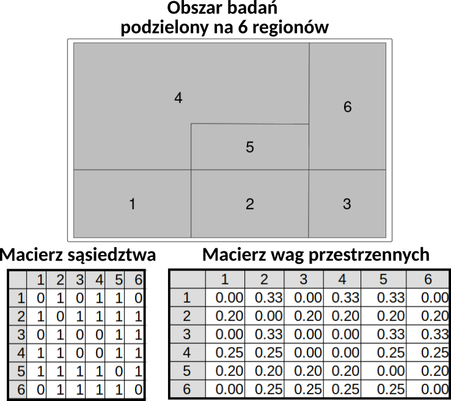
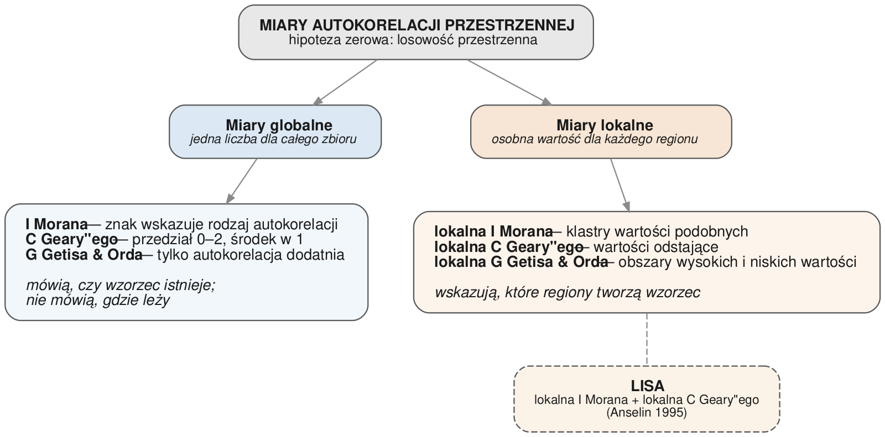
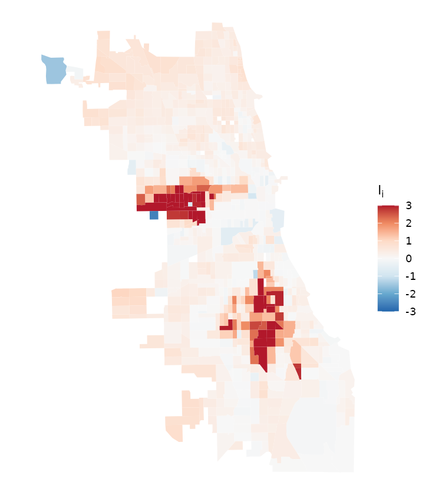
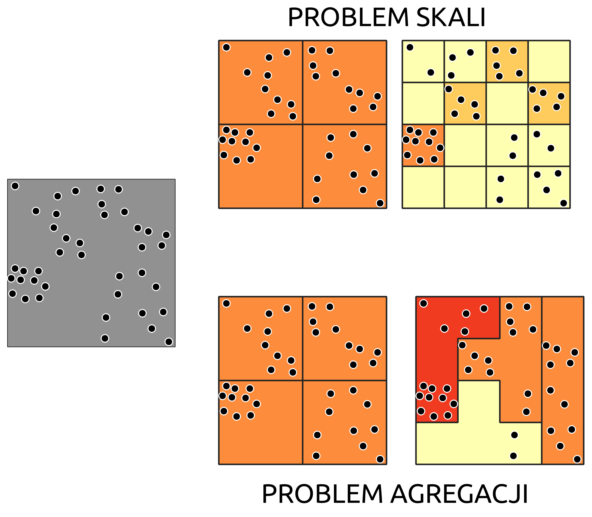
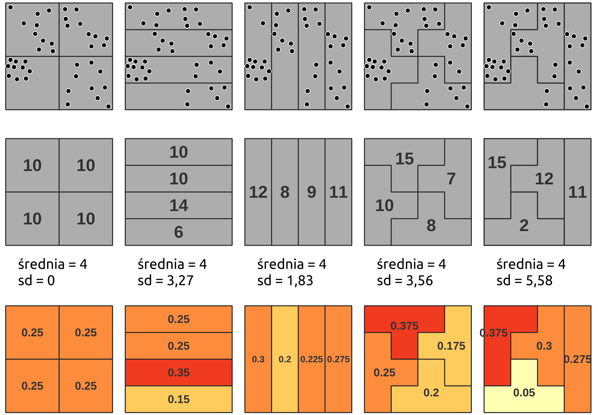

# DANE OBSZAROWE

::: {.callout-note}
## Czego się nauczysz

**Po tym rozdziale potrafisz:**

-   wyjaśnić, czym jest autokorelacja przestrzenna i co oznacza jej brak,
-   wskazać trzy kryteria wyznaczania sąsiedztwa obszarów i konsekwencje wyboru każdego z nich,
-   opisać, jak z macierzy sąsiedztwa powstaje macierz wag przestrzennych,
-   wymienić miary globalne i lokalne autokorelacji oraz powiedzieć, na jakie pytanie odpowiada
    każda grupa.

**Rozumiesz i umiesz zinterpretować:**

-   znak i wielkość statystyk I Morana, C Geary'ego i G Getisa & Orda,
-   wynik testu istotności opartego na symulacji oraz pseudo *p*-value,
-   wykres rozrzutu Morana wraz z czterema ćwiartkami,
-   mapę lokalnych statystyk i mapę klastrów,
-   dlaczego wynik analizy zależy od podziału obszaru na jednostki.

**Część praktyczna:** @sec-obszarowe-sasiedztwo, @sec-obszarowe-autokorelacja.
**Słownik pojęć:** @sec-slownik. **Funkcje:** @sec-funkcje.
:::

## Wprowadzenie

**Dane obszarowe** (ang. *areal data*) powstają przez podzielenie obszaru badań na jednostki
przestrzenne, w których agregowane są wyniki — na przykład na jednostki administracyjne albo
obszary spisowe. Charakteryzują się skokową zmiennością wartości: w obrębie jednostki wartość
jest stała, a na granicy zmienia się skokowo. Przykładami są dane społeczno-ekonomiczne
udostępniane w ramach spisów ludności: stopa bezrobocia według powiatów, liczba ludności według
obszarów spisowych.

Celem analizy danych obszarowych jest **ocena podobieństwa i różnic między obszarami**:
wyszukanie obszarów podobnych do siebie oraz obszarów znacząco różnych od sąsiednich.

::: {.callout-note}
## Przykład przewijający się przez rozdział — zbiór już znany
Wszystkie ryciny w tym rozdziale obliczono na pliku `cook_przygotowane.gpkg`, czyli **na tych
samych danych, które poznałeś w części praktycznej**: plik powstaje krok po kroku
w @sec-dane-przestrzenne i jest przedmiotem Przykładu 1 w @sec-eksploracja.

Są to **788 obszarów spisowych** hrabstwa Cook wraz ze współczynnikiem kradzieży samochodów na
1000 mieszkańców (`CRIME_RATE`). Z eksploracji wiesz już, że współczynnik waha się od 0,16 do
31,13 przy medianie 2,89 i ma rozkład silnie asymetryczny prawostronnie, a jego wartości są
wyraźnie wyższe w południowej i środkowej części hrabstwa.

Eksploracja zatrzymała się na stwierdzeniu, że **mapa pokazuje jakiś układ przestrzenny**. Ten
rozdział podaje miary, którymi ten układ opisuje się liczbowo i sprawdza, czy nie jest dziełem
przypadku.
:::

Obie mapy przedstawiają **ten sam zbiór liczb** — identyczne minimum, maksimum, średnią i rozkład.
Różnią się wyłącznie tym, którym obszarom przypisano które wartości. Na mapie po lewej wartości
wysokie sąsiadują z wysokimi i tworzą zwarte obszary; na mapie po prawej rozkładają się bez
żadnego porządku. Analiza nieprzestrzenna nie odróżni tych dwóch sytuacji, bo pomija lokalizację.
Odróżniają je dopiero miary opisane w tym rozdziale.

## Pojęcia podstawowe

### Autokorelacja przestrzenna

**Autokorelacja przestrzenna** (ang. *spatial autocorrelation*) określa zależność przestrzenną,
która może być obserwowana jako zgrupowania (klastry) podobnych wartości albo jako systematyczny
wzorzec przestrzenny (ang. *spatial pattern*). Oznacza, że obserwacje bliskie geograficznie są
bardziej do siebie podobne niż obserwacje odległe.

Pomiar autokorelacji wymaga dwóch rzeczy jednocześnie:

-   miary **podobieństwa wartości** — o ile wartości w dwóch obszarach różnią się od siebie,
-   definicji **sąsiedztwa w przestrzeni geograficznej** — które obszary uznajemy za sąsiadujące.

Druga z nich nie wynika z danych i jest decyzją analityka; poświęcona jest jej następna sekcja.

### Losowość przestrzenna

Brak autokorelacji przestrzennej oznacza **losowość przestrzenną** (ang. *spatial randomness*):
wartości obserwowane w danym obszarze nie zależą od wartości obserwowanych w obszarach
sąsiednich, a obserwowany wzorzec przestrzenny jest równie prawdopodobny jak każdy inny.

Losowość przestrzenna jest **hipotezą zerową** w analizie autokorelacji. Nie szukamy jej
w danych — przeciwnie, celem analizy jest jej **odrzucenie**, bo odrzucenie hipotezy zerowej
oznacza, że w danych istnieje jakiś wzorzec.

::: {.callout-note}
## Losowość przestrzenna a całkowita przestrzenna przypadkowość
Obie nazwy opisują hipotezę zerową, ale dotyczą **różnych rzeczy**. Całkowita przestrzenna
przypadkowość (CSR), omawiana w części o danych punktowych, jest modelem rozmieszczenia
**lokalizacji zdarzeń**: każde miejsce jest jednakowo prawdopodobne. Losowość przestrzenna
w analizie danych obszarowych dotyczy **wartości przypisanych do ustalonych jednostek**:
jednostki się nie zmieniają, zmienia się tylko to, która wartość trafia do której. Dlatego
hipotezę tę weryfikuje się przestawianiem wartości między jednostkami, a nie losowaniem nowych
lokalizacji.
:::

### Autokorelacja dodatnia i ujemna

**Autokorelacja dodatnia** oznacza, że w sąsiadujących obszarach obserwuje się podobne wartości:
wysokie otoczone wysokimi albo niskie otoczone niskimi. Obszary sąsiedzkie są wtedy **mniej
zróżnicowane**, niż wynikałoby to z losowego rozmieszczenia wartości.

**Autokorelacja ujemna** oznacza, że wartości sąsiednie różnią się od siebie — na przykład niskie
wartości otoczone wysokimi. Obszary sąsiedzkie są wtedy **bardziej zróżnicowane**, niż wynikałoby
z losowego rozmieszczenia. Skrajnym przypadkiem jest **efekt szachownicy**, widoczny na prawym
panelu ryciny.

### Zmienna opóźniona przestrzennie

Większość miar autokorelacji zestawia wartość w obszarze z wartościami w jego otoczeniu. Otoczenie
podsumowuje **zmienna opóźniona przestrzennie** (ang. *spatial lag*) — ważona suma wartości
sąsiadów:

$$\tilde{x}_i = \sum_{j} w_{ij}\, x_j$$

gdzie $w_{ij}$ to waga przypisana parze obszarów $i$ oraz $j$, a $x_j$ — wartość w obszarze $j$.
Przy wagach standaryzowanych wierszami (opisanych niżej) wagi w każdym wierszu sumują się do
jedynki, więc zmienna opóźniona przestrzennie jest po prostu **średnią wartością u sąsiadów**.

## Sąsiedztwo obszarów

Sąsiadów przestrzennych można definiować na kilka sposobów, a wybór definicji zmienia wynik
każdej miary liczonej dalej.

### Kryterium wspólnej granicy

Kryterium wspólnej granicy (ang. *adjacency*) zakłada, że sąsiadami są obszary mające wspólną
granicę. Granicę tę wyznacza się jedną z dwóch reguł:

-   **reguła rook** — sąsiadami są obszary stykające się **odcinkiem** granicy,
-   **reguła queen** — sąsiadami są obszary stykające się odcinkiem granicy **albo choćby jednym
    punktem** (narożnikiem).

{width=70%}

Nazwy pochodzą od ruchów figur szachowych. Dla komórki środkowej siatki 3×3 reguła rook wskazuje
**4 sąsiadów**, a reguła queen — **8**. Różnica dotyczy wyłącznie obszarów stykających się
narożnikiem, więc w podziałach administracyjnych, gdzie styk w jednym punkcie zdarza się rzadko,
obie reguły dają często ten sam wynik.

### Kryterium odległości

Kryterium odległości zakłada, że sąsiadami są obszary leżące w pewnej odległości od siebie,
niekoniecznie stykające się granicami. Odległość mierzy się **między centroidami** obszarów.
Wyróżnia się trzy warianty:

-   **sąsiedzi w promieniu *d*** — sąsiadem jest obszar, którego centroid leży nie dalej niż *d*
    od centroidu obszaru odniesienia,
-   ***k* najbliższych sąsiadów** (ang. *k nearest neighbours*, knn) — sąsiadami jest *k*
    obszarów o centroidach położonych najbliżej. Kryterium to pierwotnie dotyczy danych
    punktowych, więc dla danych obszarowych trzeba najpierw wyznaczyć centroidy; na to, które
    obszary trafią do zbioru sąsiadów, wpływa wielkość i kształt regionów,
-   **odległość odwrotna** ($1/d$) — sąsiadami są wszystkie obszary, ale z wagą malejącą wraz
    z odległością.

Dla obszaru zaznaczonego na czerwono reguła queen wskazuje **5 sąsiadów**, kryterium odległości
do 3 km — **32**, a kryterium 6 najbliższych sąsiadów — z definicji **6**. Trzy kryteria dają
więc trzy różne zbiory sąsiadów dla tego samego obszaru, a każdy z nich prowadzi do innej wartości
miary autokorelacji.

Dwa kryteria różnią się przy tym własnością istotną praktycznie. Sąsiedztwo wyznaczone wspólną
granicą i promieniem *d* jest **symetryczne**: jeśli obszar A jest sąsiadem B, to B jest sąsiadem
A. Sąsiedztwo *k* najbliższych sąsiadów symetryczne **nie jest** — obszar duży może być jednym
z *k* najbliższych sąsiadów obszaru małego, podczas gdy w drugą stronę zależność nie zachodzi.

## Macierz wag przestrzennych

**Macierz wag przestrzennych** to tabela $N \times N$, w której przechowywane są informacje
o **występowaniu** oraz o **sile** zależności przestrzennych między obiektami. Każdy element
reprezentuje powiązanie między parą jednostek, a przekątna jest zerowa — jednostka nie jest
sąsiadem samej siebie. Macierz wag stanowi podstawę większości technik analizy danych obszarowych.

Powstaje w dwóch krokach:

### Macierz sąsiedztwa

Mając definicję sąsiedztwa, buduje się **macierz sąsiedztwa** — tabelę, w której zapisana jest
informacja o tym, czy obszary ze sobą sąsiadują. Najprostszą jej formą jest macierz binarna:

$$
m_{ij} =
\begin{cases}
1 & \text{obszar } i \text{ jest sąsiadem obszaru } j \\
0 & \text{obszar } i \text{ nie jest sąsiadem obszaru } j \\
0 & \text{elementy na przekątnej}
\end{cases}
$$

### Standaryzacja

W kolejnym kroku macierz sąsiedztwa standaryzuje się, aby otrzymać wagi. Najczęściej stosuje się
**standaryzację wierszami** do jedynki, tak aby suma wag w każdym wierszu wynosiła 1:

$$w_{ij} = \frac{m_{ij}}{w_{i}}$$

gdzie $m_{ij}$ to wartość macierzy sąsiedztwa dla obszarów $i$ oraz $j$, a $w_i$ — suma
$i$-tego wiersza, czyli liczba sąsiadów obszaru $i$.

Standaryzacja ma konsekwencję, o której trzeba pamiętać przy interpretacji: obszar mający
2 sąsiadów przypisuje każdemu z nich wagę 1/2, a obszar mający 8 sąsiadów — po 1/8. **Pojedynczy
sąsiad znaczy tym więcej, im mniej sąsiadów ma dany obszar.** W zbiorze z hrabstwa Cook liczba
sąsiadów waha się od 1 do 17 przy średniej 6,5, więc różnice w wadze pojedynczego sąsiada są
znaczne.

## Miary autokorelacji przestrzennej

Miary autokorelacji służą do testowania, czy autokorelacja przestrzenna w danych występuje.
Dzielą się na dwie grupy:

**Miary globalne** to jednoliczbowe wskaźniki autokorelacji przestrzennej, czyli ogólnego
podobieństwa regionów. Informują, że wartości nie są w przestrzeni rozmieszczone losowo — czyli
że istnieją przesłanki, by sądzić, że podobne wartości grupują się w przestrzeni. **Nie
informują**, gdzie te zgrupowania leżą.

**Miary lokalne** obliczane są osobno dla każdego regionu. Pozwalają odpowiedzieć na pytania:
czy dany region jest otoczony regionami o wysokich czy o niskich wartościach, oraz czy jest
podobny, czy różny względem swoich sąsiadów. Dzięki temu umożliwiają identyfikację klastrów.

### Globalna I Morana

Najstarsza miara przestrzenna, wprowadzona przez @moran1950:

$$I = \frac{n}{\sum_{i}\sum_{j} w_{ij}} \cdot
\frac{\sum_{i}\sum_{j} w_{ij}\,(x_i - \bar{x})(x_j - \bar{x})}{\sum_{i}(x_i - \bar{x})^2}$$

gdzie $n$ to liczba obszarów, $x_i$ — wartość w obszarze $i$, $\bar{x}$ — średnia wartość
w zbiorze, a $w_{ij}$ — waga pary obszarów. Licznik sumuje iloczyny odchyleń od średniej dla par
sąsiadów: jest dodatni, gdy sąsiedzi odchylają się w tę samą stronę, a ujemny, gdy w przeciwne.

Hipotezy: $H_0$ — brak autokorelacji przestrzennej; $H_1$ — autokorelacja przestrzenna.
Interpretacja:

-   $I = 0$ — wartości rozłożone losowo,
-   $I > 0$ — autokorelacja dodatnia; sąsiadujące wartości są podobne, czyli wartości podobne
    stykają się częściej, niż wynikałoby to z przypadku,
-   $I < 0$ — autokorelacja ujemna; sąsiadujące wartości są różne.

Dla współczynnika kradzieży w hrabstwie Cook $I$ = **0,578**, czyli autokorelacja wyraźnie
dodatnia.

::: {.callout-warning}
## Wysoka wartość statystyki nie znaczy, że jest ona istotna
Sama wartość statystyki nie rozstrzyga, czy odnotowana zależność nie jest dziełem przypadku.
Poza policzeniem statystyki należy **wykonać test** określający jej istotność.
:::

### Globalna C Geary'ego

Statystyka C Geary'ego porównuje wartości sąsiadów bezpośrednio, przez kwadrat ich różnicy:

$$C = \frac{n-1}{2\sum_{i}\sum_{j} w_{ij}} \cdot
\frac{\sum_{i}\sum_{j} w_{ij}\,(x_i - x_j)^2}{\sum_{i}(x_i - \bar{x})^2}$$

Licznik jest sumą kwadratów różnic między sąsiadami, więc statystyka jest **zawsze dodatnia**
i mieści się w przedziale od 0 do 2:

-   **0–1** — autokorelacja dodatnia; sąsiadujące wartości są podobne (różnice małe),
-   **1** — brak autokorelacji przestrzennej; sąsiadujące wartości rozłożone losowo,
-   **1–2** — autokorelacja ujemna; sąsiadujące wartości nie są podobne (różnice duże).

Dla danych z hrabstwa Cook $C$ = **0,462**, co prowadzi do tego samego wniosku co I Morana:
autokorelacja dodatnia. Zwróć uwagę na **przeciwny kierunek skali**: w przypadku I Morana
autokorelację dodatnią wskazuje wartość wysoka, a w przypadku C Geary'ego — niska.

### Globalna G Getisa & Orda

Statystyka G Getisa & Orda jest udziałem iloczynów wartości par sąsiadujących obszarów w sumie
iloczynów wszystkich par:

$$G = \frac{\sum_{i}\sum_{j} w_{ij}\, x_i x_j}{\sum_{i}\sum_{j} x_i x_j}, \qquad j \neq i$$

Licznik obejmuje wyłącznie pary sąsiadów, bo dla par niesąsiadujących $w_{ij} = 0$. Jeśli
wysokie wartości sąsiadują ze sobą, iloczyny w liczniku są duże i statystyka rośnie. Konstrukcja
ta ma dwie konsekwencje. Po pierwsze, **wszystkie wartości $x_i$ muszą być nieujemne** — inaczej
iloczyny mogłyby się znosić. Po drugie, statystyka **wymaga wag binarnych**, nie standaryzowanych
wierszami.

Dla danych z hrabstwa Cook $G$ = 0,0135 przy wartości oczekiwanej 0,0082. Sama wartość $G$ nie ma
interpretacji w oderwaniu od wartości oczekiwanej, dlatego wynik testu podaje się jako
**statystykę standaryzowaną**: tutaj 25,3 przy $p$ < 0,001.

Test weryfikuje hipotezę zerową o braku autokorelacji przestrzennej przeciwko hipotezie
alternatywnej o autokorelacji **dodatniej**. Oznacza to, że statystyka **nie mierzy autokorelacji
ujemnej** — rozkład szachownicowy pozostanie dla niej nieodróżnialny od losowego.

### Testowanie istotności

Istotność statystyki globalnej można ocenić testem asymptotycznym albo testem opartym na
**symulacji**. W tym drugim wielokrotnie przestawia się wartości między obszarami — zachowując
sam podział na jednostki — i dla każdego takiego przestawienia liczy statystykę. Otrzymany rozkład
pokazuje, jakich wartości należałoby się spodziewać, gdyby prawdziwa była hipoteza o losowości
przestrzennej.

{width=60%}

Dla danych z hrabstwa Cook wartości symulowane mieszczą się w przedziale od −0,055 do 0,070,
czyli skupiają się wokół zera, a wartość obserwowana wynosi 0,578 i leży daleko poza tym
przedziałem. Hipotezę o losowości przestrzennej odrzucamy.

Istotność wyraża się **pseudo *p*-value**, obliczaną ze wzoru:

$$p = \frac{N_{extreme} + 1}{N + 1}$$

gdzie $N_{extreme}$ to liczba symulowanych wartości statystyki skrajniejszych od wartości
obserwowanej, a $N$ — liczba symulacji. Przy 999 symulacjach i żadnej wartości skrajniejszej
otrzymujemy $p$ = 1/1000 = 0,001 — i jest to **najmniejsza wartość osiągalna** przy tej liczbie
symulacji. Liczba symulacji wyznacza więc dokładność wyniku.

### Lokalna I Morana

Lokalna statystyka I Morana obliczana jest dla każdego obszaru osobno:

$$I_i = \frac{x_i - \bar{x}}{m_2} \sum_{j} w_{ij}\,(x_j - \bar{x})
\qquad \text{gdzie} \qquad m_2 = \frac{\sum_{i}(x_i - \bar{x})^2}{n}$$

Jest to iloczyn odchylenia wartości w obszarze $i$ od średniej oraz sumy odchyleń jego sąsiadów,
odniesiony do wariancji zbioru. Mierzy, czy region jest otoczony przez regiony o podobnych, czy
o różnych wartościach — w stosunku do losowego rozmieszczenia wartości w przestrzeni:

-   $I_i > 0$ — grupowanie wartości podobnych (wyższych albo niższych od średniej),
-   $I_i < 0$ — połączenie wartości różnych, na przykład wysokiej otoczonej niskimi.

{width=50%}

Wartości wahają się od −2,59 do 11,74. Czerwone obszary to te, które wraz z sąsiadami tworzą
zgrupowania wartości podobnych; niebieskie — obszary odstające od swojego otoczenia. Mapa ta
pokazuje **wartość statystyki**, a nie jej istotność; podział na klastry wymaga dodatkowego kroku,
opisanego niżej.

### Lokalna C Geary'ego

Lokalna statystyka C Geary'ego pokazuje średnie różnice między obszarem a jego sąsiadami, co
pomaga znaleźć wartości odstające:

$$c_i = \sum_{j} w_{ij}\,(z_i - z_j)^2$$

gdzie $z_i$ to **wartość standaryzowana** w obszarze $i$. Statystyka jest sumą kwadratów różnic,
więc **nie może przyjmować wartości ujemnych** — dla danych z hrabstwa Cook mieści się
w przedziale od 0,00 do 24,81. Interpretacja nie opiera się więc na znaku:

-   **niskie** wartości $c_i$ wskazują na autokorelację dodatnią, czyli podobieństwo obszaru do
    sąsiadów,
-   **wysokie** wartości wskazują na autokorelację ujemną, czyli na obszar odstający od otoczenia.

Wniosek o istotności opiera się na pseudo *p*-value wyznaczonej z permutacji, nie na samej
wartości statystyki. O tym, czy wartość istotna leży po stronie „niskiej", czy „wysokiej",
rozstrzyga jej położenie względem rozkładu statystyki w zbiorze.

{width=50%}

Rozkład wartości jest silnie asymetryczny: mediana wynosi 0,31, a maksimum 24,81. Obszary jasne
to te, które niewiele różnią się od swoich sąsiadów; pojedyncze obszary ciemne odstają od
otoczenia najmocniej i to one są kandydatami na wartości odstające przestrzennie. Test oparty na
permutacjach wskazał **323 obszary istotne** przy poziomie 0,05 — z czego 203 o wartości
$c_i$ poniżej mediany zbioru (podobieństwo do sąsiadów) i 120 powyżej niej (odstawanie od
sąsiadów).

Zwróć uwagę na różnicę w stosunku do poprzednich dwóch map: lokalna I Morana i lokalna G mają
skalę dwukierunkową, bo ich znak niesie informację. Tutaj skala jest jednokierunkowa, bo
wszystkie wartości są dodatnie — to bezpośrednia konsekwencja wzoru, w którym sumuje się kwadraty
różnic.

### Lokalna G Getisa & Orda

Lokalna statystyka G Getisa & Orda służy do identyfikacji lokalnych koncentracji przestrzennych,
które nie ujawniają się w analizie globalnej. W postaci podstawowej jest to udział wartości
sąsiadów w sumie wartości w całym zbiorze:

$$G_i = \frac{\sum_{j} w_{ij}\, x_j}{\sum_{j} x_j}$$

Tak zdefiniowana statystyka jest zawsze dodatnia, więc jej wartość sama w sobie nie ma
interpretacji. Funkcje liczące ją w R zwracają **wartość standaryzowaną**, czyli odchylenie od
wartości oczekiwanej wyrażone w jednostkach odchylenia standardowego, i dopiero dla niej
obowiązują progi:

-   $G_i > 0$ — zgrupowanie regionów o wysokich wartościach; obszar i jego sąsiedzi mają wartości
    wysokie. Jest to **obszar wysokich wartości** (ang. *hot spot*),
-   $G_i < 0$ — zgrupowanie regionów o niskich wartościach, czyli **obszar niskich wartości**
    (ang. *cold spot*).

Jako wysokie uznaje się wartości wyższe od średniej, a jako niskie — niższe od średniej. Podobnie
jak miara globalna, lokalna statystyka G **nie mierzy autokorelacji ujemnej**.

{width=50%}

Dla danych z hrabstwa Cook wartości wahają się od −2,47 do 8,11, a 462 z 788 obszarów ma wartość
ujemną — co potwierdza, że funkcja zwraca wielkość standaryzowaną, a nie surowy iloraz.

### Zestawienie

| Statystyka | Autokorelacja ujemna | Brak autokorelacji | Autokorelacja dodatnia |
|---|---|---|---|
| I Morana oraz lokalna $I_i$ | $I < 0$ | $I = 0$ | $I > 0$ |
| C Geary'ego (globalna) | $C > 1$ | $C = 1$ | $C < 1$ |
| lokalna $C_i$ | wartości wysokie | — | wartości niskie |
| G Getisa & Orda oraz lokalna $G_i$ | nie dotyczy | $G_i = 0$ | $G_i > 0$ — obszar wysokich wartości; $G_i < 0$ — obszar niskich wartości |

**LISA** (ang. *local indicators of spatial association*, lokalne wskaźniki związków
przestrzennych) to nazwa zbiorcza dwóch statystyk lokalnych zaproponowanych przez @anselin1995: lokalnej I Morana, służącej do identyfikacji klastrów wartości wysokich i niskich, oraz
lokalnej C Geary'ego, pokazującej średnie różnice między obszarem a sąsiadami.

## Wykres rozrzutu Morana

Wykres rozrzutu Morana przedstawia zależność między wartościami zmiennej (oś pozioma)
a wartościami zmiennej opóźnionej przestrzennie (oś pionowa). Linie przerywane wyznaczają średnie
obu zmiennych; po standaryzacji obie wynoszą zero i dzielą wykres na cztery ćwiartki.

{width=60%}

**Nachylenie linii regresji na wykresie rozrzutu Morana jest tożsame z globalną statystyką
I Morana** — dla tych danych wynosi 0,578, czyli dokładnie tyle, ile podaje statystyka globalna.
Wykres jest więc graficzną reprezentacją tej statystyki.

Cztery ćwiartki (ang. *quadrant*) opisują cztery możliwe relacje między obszarem a jego
sąsiadami:

| | Wartości niskie w regionie $i$ (L) | Wartości wysokie w regionie $i$ (H) |
|:---:|:---:|:---:|
| **Wartości wysokie u sąsiadów (H)** | **ćwiartka LH (Q2)** — autokorelacja ujemna | **ćwiartka HH (Q1)** — autokorelacja dodatnia |
| **Wartości niskie u sąsiadów (L)** | **ćwiartka LL (Q3)** — autokorelacja dodatnia | **ćwiartka HL (Q4)** — autokorelacja ujemna |

Ćwiartka Q1 (HH) obejmuje obszary o wartościach wyższych od średniej otoczone obszarami również
o wartościach wyższych od średniej; Q3 (LL) — obszary o wartościach niższych od średniej otoczone
podobnymi. Obie wskazują autokorelację dodatnią. Ćwiartki Q2 (LH) i Q4 (HL) przedstawiają
autokorelację ujemną: obszar odstaje od swojego otoczenia.

### Identyfikacja klastrów

Przynależność do ćwiartki sama w sobie nie wystarcza do wskazania klastra — każdy obszar leży
w którejś z czterech ćwiartek. **Klastry wydziela się wyłącznie z obszarów, dla których lokalna
statystyka okazała się istotna statystycznie**; pozostałe pozostają nieprzypisane.

{width=55%}

Statystyka lokalna liczona dla 788 obszarów to 788 testów wykonanych naraz, dlatego poziom
istotności skorygowano metodą FDR (ang. *false discovery rate*). Bez tej korekty klastrów jest
więcej: 179 obszarów zamiast 97. Korekta jest decyzją analityka i podaje się ją razem
z wynikiem — rozdział @sec-obszarowe-autokorelacja pokazuje oba warianty na innym zbiorze.

Dla współczynnika kradzieży w hrabstwie Cook po korekcie istotnych okazało się **97 obszarów
z 788**: 92 należą do klastra High-High, a 5 do typu Low-High. Pozostałe 691 obszarów nie
różni się istotnie od tego, czego można oczekiwać przy losowym rozmieszczeniu wartości. Mapa pokazuje dwa
zwarte obszary wysokich wartości — zachodnią i południową część Chicago — czyli dokładnie tę
informację, której statystyka globalna dostarczyć nie może.

## Problem zmiennych jednostek odniesienia

Dane obszarowe powstają przez agregację, a sposób tej agregacji wpływa na wynik analizy. Zjawisko
to nosi nazwę **problemu zmiennych jednostek odniesienia** (ang. *modifiable areal unit problem*,
MAUP) i łączy dwa osobne problemy.

**Problem skali** (ang. *scale problem*) to zmiana informacji wywołana poziomem agregacji
przestrzennej. Ta sama zmienna analizowana na poziomie gmin, powiatów i województw daje różne
wyniki.

{width=55%}

**Problem agregacji** (ang. *zonation problem*) wynika ze sposobu podziału przestrzeni na strefy.
Wyniki analizy mogą się różnić w zależności od tego, jak poprowadzono granice jednostek — nawet
przy zachowaniu tej samej skali, czyli tej samej liczby i wielkości jednostek.

{width=55%}

Konsekwencja dla wniosków jest taka, że wartość miary autokorelacji opisuje **zmienną w danym
podziale**, a nie samą zmienną. Porównywanie wartości statystyki policzonych na różnych podziałach
nie ma uzasadnienia, a wnioski formułuje się zawsze z zaznaczeniem, na jakich jednostkach
pracowano.

## Powiązanie z ćwiczeniami

| Zagadnienie | Funkcje | Pakiet | Gdzie wykonujesz |
|---|---|---|---|
| sąsiedztwo wg wspólnej granicy | `poly2nb(queen =)` | `spdep` | @sec-obszarowe-sasiedztwo, @sec-obszarowe-autokorelacja |
| sąsiedztwo wg odległości i *k* najbliższych sąsiadów | `dnearneigh()`, `knearneigh()`, `knn2nb()` | `spdep` | @sec-obszarowe-sasiedztwo |
| macierz wag przestrzennych | `nb2listw(style =)`, `nb2mat()`, `listw2mat()` | `spdep` | @sec-obszarowe-sasiedztwo, @sec-obszarowe-autokorelacja |
| zmienna opóźniona przestrzennie | `lag.listw()` | `spdep` | @sec-obszarowe-autokorelacja |
| miary globalne | `moran.test()`, `moran.mc()`, `geary.test()`, `globalG.test()` | `spdep` | @sec-obszarowe-autokorelacja |
| miary lokalne | `localmoran()`, `localC_perm()`, `localG_perm()` | `spdep` | @sec-obszarowe-autokorelacja |
| wykres rozrzutu i klastry | `moran.plot()`, `hotspot()` | `spdep` | @sec-obszarowe-autokorelacja |

Opis pakietów wraz z odnośnikami do dokumentacji zawiera @sec-pakiety, a pełne zestawienie
funkcji — @sec-funkcje.

## Literatura

-   @mgimond — autokorelacja przestrzenna, macierz wag, statystyka I Morana.
-   @moraga2023 — miary autokorelacji przestrzennej, miary lokalne.
-   @anselin_geoda — dokumentacja GeoDa: lokalna I Morana, lokalna C Geary'ego, statystyki
    Getisa & Orda.
-   @kopczewska2023 — przegląd miar autokorelacji wraz z ich realizacją w R.
-   @lovelace2025 — praca z danymi przestrzennymi w R.

## Pytania kontrolne

1.  Czym jest autokorelacja przestrzenna i co oznacza jej brak?

::: {.callout-tip collapse="true"}
## Sprawdź odpowiedź
Autokorelacja przestrzenna to zależność, w której obserwacje bliskie geograficznie są bardziej do
siebie podobne niż obserwacje odległe; obserwuje się ją jako zgrupowania podobnych wartości albo
systematyczny wzorzec przestrzenny. Jej brak to **losowość przestrzenna**: wartości w danym
obszarze nie zależą od wartości u sąsiadów, a obserwowany wzorzec jest równie prawdopodobny jak
każdy inny. Losowość przestrzenna jest hipotezą zerową analizy — celem jest jej odrzucenie.
:::

2.  Czym różni się autokorelacja dodatnia od ujemnej i jak wygląda każda z nich na mapie?

::: {.callout-tip collapse="true"}
## Sprawdź odpowiedź
Przy autokorelacji **dodatniej** sąsiadujące obszary mają wartości podobne — wysokie otoczone
wysokimi, niskie otoczone niskimi — więc obszary sąsiedzkie są **mniej zróżnicowane**, niż
wynikałoby to z losowego rozmieszczenia wartości. Na mapie widać zwarte obszary o zbliżonych
wartościach.

Przy autokorelacji **ujemnej** wartości sąsiednie różnią się od siebie, więc obszary sąsiedzkie
są **bardziej zróżnicowane** niż przy rozmieszczeniu losowym. Skrajnym przypadkiem jest efekt
szachownicy: wartości wysokie i niskie na przemian.
:::

3.  Jak określić, czy dwa regiony ze sobą sąsiadują? Wymień kryteria i podaj konsekwencje wyboru.

::: {.callout-tip collapse="true"}
## Sprawdź odpowiedź
Dwa kryteria główne: **wspólnej granicy** (reguła *rook* — styk odcinkiem granicy; reguła
*queen* — styk odcinkiem albo choćby narożnikiem) oraz **odległości** mierzonej między
centroidami (sąsiedzi w promieniu *d*, *k* najbliższych sąsiadów, odległość odwrotna).

Wybór zmienia wynik każdej miary liczonej dalej: dla przykładowego obszaru spisowego reguła queen
wskazała 5 sąsiadów, kryterium odległości do 3 km — 32, a kryterium 6 najbliższych sąsiadów —
6. Dodatkowo sąsiedztwo *k* najbliższych sąsiadów **nie jest symetryczne**: A może być sąsiadem
B, podczas gdy B nie jest sąsiadem A.
:::

4.  Czym jest macierz sąsiedztwa i co oznaczają jej elementy?

::: {.callout-tip collapse="true"}
## Sprawdź odpowiedź
To tabela, w której zapisana jest informacja o występowaniu relacji sąsiedztwa między obszarami.
W postaci binarnej element $m_{ij}$ wynosi 1, gdy obszar $i$ jest sąsiadem obszaru $j$, i 0, gdy
nie jest. Elementy na przekątnej są zerowe, ponieważ obszar nie jest sąsiadem samego siebie.
:::

5.  Po co standaryzuje się macierz sąsiedztwa i co zmienia się po standaryzacji?

::: {.callout-tip collapse="true"}
## Sprawdź odpowiedź
Standaryzacja zamienia informację o samym występowaniu sąsiedztwa na **wagi**, czyli miarę siły
powiązania. Najczęściej stosuje się standaryzację wierszami do jedynki: $w_{ij} = m_{ij}/w_i$,
gdzie $w_i$ to liczba sąsiadów obszaru $i$. Po standaryzacji suma wag w każdym wierszu wynosi 1,
a zmienna opóźniona przestrzennie staje się po prostu średnią wartością u sąsiadów.

Konsekwencja: obszar mający 2 sąsiadów przypisuje każdemu wagę 1/2, a obszar mający 8 sąsiadów —
po 1/8. Pojedynczy sąsiad znaczy tym więcej, im mniej sąsiadów ma dany obszar.
:::

6.  Czym różnią się miary globalne od lokalnych i na jakie pytanie odpowiada każda grupa?

::: {.callout-tip collapse="true"}
## Sprawdź odpowiedź
**Miary globalne** sprowadzają cały zbiór do jednej liczby i odpowiadają na pytanie, czy wzorzec
przestrzenny w ogóle istnieje. Nie wskazują, gdzie leżą zgrupowania podobnych wartości.

**Miary lokalne** liczone są osobno dla każdego regionu i odpowiadają na pytanie, czy dany region
jest otoczony regionami o wartościach wysokich czy niskich oraz czy jest do nich podobny.
Pozwalają wskazać klastry. Obie grupy są potrzebne: miara globalna bliska zeru nie wyklucza
istnienia lokalnych klastrów, które wzajemnie się znoszą.
:::

7.  Czym jest zmienna opóźniona przestrzennie i jaką rolę pełni na wykresie rozrzutu Morana?

::: {.callout-tip collapse="true"}
## Sprawdź odpowiedź
To ważona suma wartości u sąsiadów, $\tilde{x}_i = \sum_j w_{ij} x_j$. Przy wagach
standaryzowanych wierszami jest to średnia wartość u sąsiadów.

Na wykresie rozrzutu Morana tworzy oś pionową, podczas gdy oś pozioma to wartość zmiennej
w obszarze. Dzięki temu wykres zestawia obszar z jego otoczeniem, a nachylenie linii regresji
równa się globalnej statystyce I Morana.
:::

8.  Globalna statystyka C Geary'ego dla pewnego zbioru wyniosła 0,6. Co to oznacza?

::: {.callout-tip collapse="true"}
## Sprawdź odpowiedź
Autokorelację dodatnią: sąsiadujące wartości są podobne. Statystyka C Geary'ego mieści się
w przedziale od 0 do 2, przy czym przedział 0–1 oznacza autokorelację dodatnią, wartość 1 — brak
autokorelacji, a przedział 1–2 — autokorelację ujemną.

Zwróć uwagę na przeciwny kierunek skali niż w przypadku I Morana: tam autokorelację dodatnią
wskazuje wartość **wysoka**, tutaj — **niska**.
:::

9.  Jak czyta się wynik testu istotności opartego na symulacji i czym jest pseudo *p*-value?

::: {.callout-tip collapse="true"}
## Sprawdź odpowiedź
W teście wielokrotnie przestawia się wartości między obszarami — zachowując sam podział na
jednostki — i dla każdego przestawienia liczy statystykę. Otrzymany rozkład pokazuje, jakich
wartości należałoby oczekiwać przy prawdziwej hipotezie o losowości przestrzennej. Wniosek
wyciąga się z położenia wartości obserwowanej względem tego rozkładu.

Pseudo *p*-value oblicza się ze wzoru $p = (N_{extreme} + 1)/(N + 1)$, gdzie $N_{extreme}$ to
liczba symulowanych wartości skrajniejszych od obserwowanej, a $N$ — liczba symulacji. Przy 999
symulacjach najmniejsza osiągalna wartość to 0,001; liczba symulacji wyznacza więc dokładność
wyniku.
:::

10. Statystyka I Morana wyniosła 0,45. Czy to wystarczy, by stwierdzić autokorelację przestrzenną?

::: {.callout-tip collapse="true"}
## Sprawdź odpowiedź
Nie. Sama wartość statystyki nie rozstrzyga, czy odnotowana zależność nie jest dziełem przypadku —
nawet wysokie wartości nie świadczą o tym, że statystyka jest istotna statystycznie. Poza
policzeniem wartości należy wykonać test istotności: asymptotyczny albo oparty na symulacji.
Dopiero wynik testu uprawnia do odrzucenia hipotezy o losowości przestrzennej.
:::

11. Na czym polega problem zmiennych jednostek odniesienia i co z niego wynika dla wniosków
    z analizy?

::: {.callout-tip collapse="true"}
## Sprawdź odpowiedź
MAUP łączy dwa problemy. **Problem skali** to zmiana wyniku wraz z poziomem agregacji: ta sama
zmienna analizowana na poziomie gmin, powiatów i województw daje różne wyniki. **Problem
agregacji** to zmiana wyniku wraz ze sposobem poprowadzenia granic jednostek, nawet przy
zachowaniu tej samej liczby i wielkości jednostek.

Wniosek: wartość miary autokorelacji opisuje **zmienną w danym podziale**, a nie samą zmienną.
Porównywanie wartości policzonych na różnych podziałach nie ma uzasadnienia, a wnioski formułuje
się zawsze z zaznaczeniem, na jakich jednostkach pracowano.
:::

::: {#najwazniejsze-obszarowe .callout-important}
## Najważniejsze informacje — zanim przejdziesz do części praktycznej

-   Autokorelacja przestrzenna oznacza, że obserwacje bliskie geograficznie są bardziej do siebie
    podobne niż odległe; jej brak to **losowość przestrzenna**, przyjmowana jako hipoteza zerowa.
-   Autokorelacja **dodatnia** oznacza, że obszary sąsiednie są mniej zróżnicowane, niż wynikałoby
    z losowego rozmieszczenia wartości; **ujemna** — że są bardziej zróżnicowane (efekt
    szachownicy).
-   Pomiar autokorelacji wymaga dwóch rzeczy: miary **podobieństwa wartości** i definicji
    **sąsiedztwa w przestrzeni geograficznej**.
-   Sąsiedztwo wyznacza się kryterium wspólnej granicy (reguła *rook* albo *queen*) albo
    kryterium odległości (promień *d*, *k* najbliższych sąsiadów, odległość odwrotna); wybór
    kryterium zmienia wynik.
-   Macierz wag przestrzennych powstaje w dwóch krokach: macierz sąsiedztwa, następnie
    standaryzacja — najczęściej wierszami do jedynki, czyli $w_{ij} = m_{ij}/w_i$.
-   **Miary globalne** (I Morana, C Geary'ego, G Getisa & Orda) sprowadzają zbiór do jednej liczby
    i nie wskazują, gdzie leżą zgrupowania; **miary lokalne** (lokalna $I_i$, $C_i$, $G_i$)
    liczone są dla każdego regionu i pozwalają wskazać klastry.
-   Progi interpretacyjne: $I$ i $I_i$ dodatnie oznaczają autokorelację dodatnią; $C$ globalne
    mieści się w przedziale 0–2, przy czym 0–1 to autokorelacja dodatnia, a 1 brak; $G$ i $G_i$
    mierzą **wyłącznie** autokorelację dodatnią. Lokalna $C_i$ jest nieujemna — czyta się ją
    względem wartości oczekiwanej z permutacji, nie względem zera.
-   Klastry wydziela się **wyłącznie** z obszarów, dla których statystyka lokalna okazała się
    istotna statystycznie.
-   Wynik analizy zależy od podziału obszaru na jednostki — **problem zmiennych jednostek
    odniesienia** (MAUP) łączy problem skali agregacji i problem sposobu podziału na strefy.
:::
