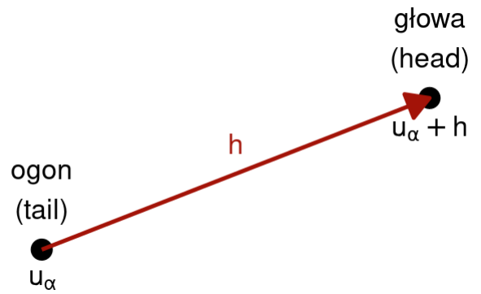
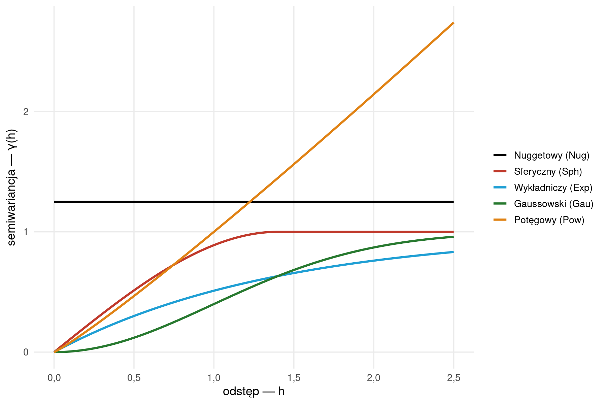
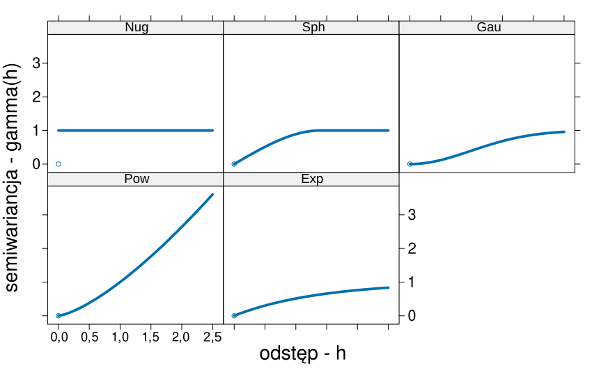

# DANE POWIERZCHNIOWE CIĄGŁE PRZESTRZENNIE

::: {.callout-note}
## Czego się nauczysz

**Po tym rozdziale potrafisz:**

-   wyjaśnić, na jakie pytanie odpowiada interpolacja przestrzenna i kiedy jej zastosowanie ma
    sens,
-   wskazać metody deterministyczne i metody geostatystyczne oraz podać własność, która je
    odróżnia,
-   wymienić cztery funkcje geostatystyki i dwa założenia, na których się opiera,
-   odczytać wzór semiwariancji, semiwariogramu empirycznego oraz pięciu modeli podstawowych,
-   opisać pięć kroków estymacji geostatystycznej i wskazać, czym różnią się trzy warianty
    krigingu.

**Rozumiesz i umiesz zinterpretować:**

-   wpływ wykładnika potęgowego na powierzchnię uzyskaną metodą średniej ważonej odwrotnością
    odległości,
-   wykres rozrzutu z przesunięciem, chmurę semiwariogramu i semiwariogram empiryczny,
-   trzy elementy modelu semiwariogramu: efekt samorodka, semiwariancję progową i zasięg,
-   przebieg pięciu modeli podstawowych oraz to, jaką zmienność przestrzenną każdy z nich opisuje,
-   wariancję krigingową i to, czym różni się od błędu estymacji,
-   wartości optymalne średniego błędu estymacji, pierwiastka błędu średniokwadratowego
    i współczynnika determinacji,
-   różnicę między walidacją podzbiorem a kroswalidacją.

**Część praktyczna:** @sec-pola-interpolacja, @sec-pola-semiwariogram, @sec-pola-estymacja,
@sec-pola-ocena. **Słownik pojęć:** @sec-slownik. **Pakiety:** @sec-pakiety.
**Funkcje:** @sec-funkcje.
:::

## Wprowadzenie

**Dane powierzchniowe ciągłe przestrzennie** (ang. *surface data*, *spatially continuous data*),
zwane też danymi geostatystycznymi, opisują zjawiska występujące w sposób ciągły w przestrzeni
dwuwymiarowej: temperaturę powietrza, sumę opadów, wysokość terenu, zawartość metali ciężkich
w glebie, stężenie zanieczyszczeń powietrza. Zjawisko ma wartość w **każdej** lokalizacji
obszaru badań, ale pomiaru dokonuje się wyłącznie w wybranym, skończonym zbiorze lokalizacji —
zbieranie danych jest kosztowne, a sieć pomiarowa zawsze pozostaje rzadsza niż obszar, który ma
opisywać.

Z tej różnicy bierze się pytanie badawcze całej części: **jaka jest wartość badanej cechy
w lokalizacjach, w których pomiaru nie wykonano?** Odpowiedzi udziela **interpolacja
przestrzenna**.

Wykonanie mapy rozkładu temperatury dla całego kraju wymaga interpolacji, ponieważ stacje
meteorologiczne nie pokrywają równomiernie całego obszaru. Na podstawie odczytów z pobliskich
stacji szacuje się temperaturę w lokalizacjach, w których nie ma żadnego posterunku.

{width=50%}

Druga grupa pytań dotyczy nie samej wartości, lecz **struktury zmienności przestrzennej**: na
jaką odległość wartości pozostają do siebie podobne, jak szybko to podobieństwo maleje i czy
jest ono jednakowe we wszystkich kierunkach. Odpowiedzi na te pytania udziela **geostatystyka** —
i to ona dostarcza również najlepszej odpowiedzi na pytanie pierwsze, bo szacuje wartość wraz
z oceną własnej niepewności.

::: {.callout-note}
## Przykład przewijający się przez rozdział

Wszystkie ryciny oparte na danych pomiarowych przedstawiają **temperaturę powietrza** zmierzoną
w **247 lokalizacjach** na obszarze o rozmiarach około 11,4 × 8,6 km; granica obszaru badań
obejmuje 63,4 km². Dane są w układzie współrzędnych PL-1992, wyrażonym w metrach, więc wszystkie
odległości podane niżej to metry, a temperatury — stopnie Celsjusza. Zmierzone wartości mieszczą
się w przedziale od 7,88 do 24,94 °C, a wariancja próby wynosi 15,79.

Ten sam zbiór danych jest używany w czterech rozdziałach praktycznych tej części.
:::

## Pojęcia podstawowe

### Interpolacja przestrzenna

**Interpolacja przestrzenna** (ang. *spatial interpolation*) to szacowanie wartości analizowanej
cechy w punkcie, dla którego nie ma danych pomiarowych. Opiera się na zbiorze punktów pomiarowych
oraz na **zidentyfikowanych na ich podstawie regułach** podobieństwa przestrzennego, malejącego
wraz z odległością.

Sformułowanie to jest mocniejsze, niż się na pierwszy rzut oka wydaje: reguły podobieństwa nie są
przyjmowane z góry, lecz **wyprowadzane z danych**. Jak dokładnie — zależy od metody, i właśnie ta
różnica dzieli metody interpolacji na dwie grupy.

Interpolacja ma sens tylko wtedy, gdy interpolowana cecha charakteryzuje się **ciągłością
zmienności przestrzennej**, rozumianą jako tendencja wzrostu zróżnicowania wartości wraz ze
wzrostem odległości pomiędzy punktami. Chwilowa temperatura powietrza tę własność ma; wysokość
chwilowego opadu — już nie, bo między punktem w strefie opadu a punktem poza nią różnica jest
skokowa, niezależnie od dzielącej je odległości.

### Powierzchnia statystyczna i siatka interpolacyjna

Wynikiem interpolacji jest zwykle **mapa rastrowa**, nazywana też **powierzchnią statystyczną**
(ang. *statistical surface*). Wartości oblicza się najczęściej w **centrach poszczególnych
komórek rastra**: każda komórka jest jednym punktem estymacji, a zbiór tych punktów nazywany jest
**siatką interpolacyjną** (ang. *interpolation grid*).

Rozdzielczość siatki jest decyzją analityka, a nie własnością danych: im mniejsza komórka, tym
więcej punktów estymacji i dłuższe obliczenia, przy niezmienionej liczbie pomiarów.

### Sąsiedztwo szukania

Oszacowania w danej lokalizacji zazwyczaj nie liczy się na całym zbiorze danych, lecz na
ograniczonej liczbie najbliższych punktów pomiarowych. Ten ograniczony zbiór nazywany jest
**sąsiedztwem szukania** (ang. *search neighborhood*) i definiuje go analityk, podając:

-   maksymalną liczbę najbliższych obserwacji, które mogą zostać użyte w obliczeniach,
-   maksymalny promień uwzględnianego sąsiedztwa, czyli rozmiar ruchomego okna,
-   minimalną liczbę obserwacji wymaganych w zadanym promieniu — jeżeli jest ich mniej, obliczeń
    w tym oknie nie wykonuje się.

Sąsiedztwo szukania nie jest własnością żadnej konkretnej metody. Dotyczy zarówno metod
deterministycznych, jak i **wszystkich** wariantów krigingu.

### Oznaczenia

Opis zmienności przestrzennej posługuje się czterema symbolami, które powracają we wszystkich
wzorach tego rozdziału:

-   $u_{\alpha}$ — wektor współrzędnych, czyli lokalizacja punktu pomiarowego,
-   $z(u_{\alpha})$ — wartość badanej cechy $z$ w lokalizacji $u_{\alpha}$, określana jako
    **ogon** (ang. *tail*),
-   $h$ — **odstęp** (ang. *lag*), czyli wektor przesunięcia pomiędzy dwiema lokalizacjami,
-   $z(u_{\alpha}+h)$ — wartość cechy w lokalizacji odległej od $u_{\alpha}$ o odstęp $h$,
    określana jako **głowa** (ang. *head*).

{width=50%}

Nazwy „głowa" i „ogon" wskazują zwrot wektora $h$ i mają znaczenie wtedy, gdy zmienność
przestrzenna zależy nie tylko od odległości, ale także od kierunku.

## Klasyfikacja metod interpolacji

Metody interpolacji dzielą się na **deterministyczne** i **(geo)statystyczne**. Podział ten nie
dotyczy wyglądu wyniku, lecz tego, skąd biorą się parametry metody i co metoda zwraca.

| Metody deterministyczne | Metody (geo)statystyczne |
|---|---|
| Parametry są zazwyczaj ustalane w oparciu o określaną często arbitralnie funkcję odległości lub powierzchni | Parametry określane są w oparciu o teorię prawdopodobieństwa |
| Brak szacunków oceny błędu modelu | Wynik estymacji zawiera także oszacowanie błędu |
| Prostota oraz krótki czas obliczeń | Wymagają większych zasobów sprzętowych |
| Metoda diagramów Woronoja, metoda średniej ważonej odwrotnością odległości (IDW), funkcje wielomianowe, funkcje sklejane | Kriging |

Dwa wiersze środkowe są rozstrzygające. Metoda deterministyczna zwraca **jedną liczbę** —
oszacowanie — i nie mówi nic o tym, jak bardzo można mu ufać. Metoda geostatystyczna zwraca
**dwie**: oszacowanie oraz miarę niepewności tego oszacowania. Za tę informację płaci się
czasem obliczeń oraz koniecznością wcześniejszego opisania struktury przestrzennej danych.

## Metody deterministyczne

### Diagramy Woronoja

**Metoda diagramów Woronoja** (ang. *Voronoi diagram*) polega na stworzeniu nieregularnych
poligonów na podstawie analizowanych punktów, a następnie wpisaniu w każdy poligon wartości
odpowiadającego mu punktu. Każdy poligon obejmuje obszar, dla którego dany punkt pomiarowy jest
najbliższy.

{width=50%}

W systemach informacji geograficznej metoda ta znana jest także jako **metoda poligonów
Thiessena** — od nazwiska amerykańskiego meteorologa Alfreda Thiessena, który zastosował ją do
wyznaczania średniej sumy opadów w zlewni na podstawie wyników z kilku posterunków pomiarowych.

Wynik jest **powierzchnią skokową**: wartość pozostaje stała wewnątrz poligonu i zmienia się
nagle na jego krawędzi. Zbiór wartości na mapie jest dokładnie zbiorem wartości zmierzonych —
metoda nie liczy żadnych wartości pośrednich, lecz przepisuje pomiary.

Jedno z wczesnych zastosowań diagramów Woronoja wdrożył John Snow, badając epidemię cholery
w londyńskiej dzielnicy Soho w 1854 roku. Wyznaczył obszary, dla których poszczególne pompy wodne
były najbliższym źródłem zaopatrzenia w wodę, i porównał je z rozmieszczeniem zgonów.

{width=50%}

Metoda jest stosowana także poza interpolacją: do przyspieszania obliczeń wyznaczających
najbliższego sąsiada, w badaniach wzorców wzrostu koron drzew, do wyznaczania najbliższego
lotniska zapasowego na trasie lotu nad oceanem oraz do wyznaczania zasięgu potencjalnego rynku
sieci sklepów lub obwodów szkolnych.

### Metoda średniej ważonej odwrotnością odległości (IDW)

**Metoda średniej ważonej odwrotnością odległości** (ang. *inverse distance weighted*, IDW) jest
jedną z najczęściej stosowanych metod interpolacji. Wartość analizowanej cechy w punkcie
interpolacji wyznaczana jest jako **średnia ważona** z otaczających punktów pomiarowych, przy
czym waga przypisana punktowi jest **odwrotnie proporcjonalna do odległości**. Im punkt bardziej
oddalony, tym mniejszy jego wpływ na interpolowaną wartość.

Wartość w nieznanej lokalizacji obliczana jest ze wzoru:

$$z = \frac{\sum_{i=1}^{n} w_i z_i}{\sum_{i=1}^{n} w_i}$$

a waga $w_i$ dla danego punktu — ze wzoru:

$$w_i = \frac{1}{d_{i}^{\,p}}$$

gdzie $w_i$ to waga przypisana punktowi w lokalizacji $i$, $z_i$ — wartość cechy w lokalizacji
$i$, $d_i$ — odległość tego punktu od lokalizacji szacowanej, a $p$ — **wykładnik potęgowy**.
Po podstawieniu wag do wzoru pierwszego otrzymujemy postać:

$$z = \frac{\sum_{i=1}^{n} \dfrac{z_i}{d_{i}^{\,p}}}{\sum_{i=1}^{n} \dfrac{1}{d_{i}^{\,p}}}$$

#### Przykład rachunkowy {.unnumbered}

{width=40%}

Dla wykładnika potęgowego równego 1:

$$z = \frac{10/100 + 15/150 + 20/600}{1/100 + 1/150 + 1/600} =
\frac{\frac{60 + 60 + 20}{600}}{\frac{6 + 4 + 1}{600}} =
\frac{\frac{140}{600}}{\frac{11}{600}} = \frac{140}{11} = 12{,}7272$$

Oszacowanie leży bliżej wartości 10 niż 20, mimo że 10 jest wartością skrajną — decyduje o tym
odległość, nie wielkość pomiaru: punkt o wartości 10 leży sześciokrotnie bliżej niż punkt
o wartości 20.

#### Wykładnik potęgowy {.unnumbered}

Wartość wykładnika ustalana jest **arbitralnie**. Domyślnie stosuje się 2, co oznacza, że wagi
maleją z kwadratem odległości, więc punkty dwa razy dalsze mają wpływ **czterokrotnie mniejszy**.
Wartość 0 oznacza, że wszystkie punkty mają taką samą wagę, a oszacowanie staje się zwykłą
średnią arytmetyczną.

{width=60%}

**Wyższa wartość wykładnika** oznacza, że:

-   największy wpływ mają najbliższe punkty pomiarowe,
-   powierzchnia jest bardziej szczegółowa, czyli mniej wygładzona,
-   wraz ze wzrostem wykładnika wartość nieznanego punktu zbliża się do wartości najbliższego
    punktu pomiarowego.

**Niższa wartość wykładnika** oznacza większy wpływ punktów bardziej odległych i powierzchnię
bardziej wygładzoną.

Dla przykładu powyżej wykładnik 0 daje 15, wykładnik 1 — 12,7272, a wykładnik 2 — 11,6981.
Oszacowanie przesuwa się w stronę wartości punktu najbliższego, czyli 10.

#### Ograniczenia metody {.unnumbered}

-   Jakość wyniku może się obniżyć, jeśli punkty pomiarowe są rozłożone nierównomiernie.
-   Wartość minimalna oraz maksymalna może wystąpić **tylko w lokalizacji punktów pomiarowych**.
-   Wartość w punkcie interpolacji mieści się w zakresie wartości punktów pomiarowych
    uwzględnionych w obliczeniu: średnia ważona nie może być większa niż najwyższa ani mniejsza
    niż najniższa wartość wejściowa.
-   Metoda nie odzwierciedla zagłębień, wzniesień ani grzbietów, zatem **nie pozwala oszacować
    wartości ekstremalnych wykraczających poza te, które zostały zmierzone**.

### Funkcje wielomianowe

**Funkcje wielomianowe** (ang. *polynomials*) to globalna interpolacja dopasowująca **jedną
gładką powierzchnię**, zdefiniowaną funkcją matematyczną, do wszystkich danych punktowych.
Stopień wielomianu określa, jak bardzo powierzchnia może się wyginać: stopień pierwszy daje
płaszczyznę, wyższe stopnie dopuszczają wygięcia.

Ponieważ dopasowywana jest jedna funkcja do całego obszaru, każdy punkt pomiarowy wpływa na
kształt powierzchni **wszędzie**. Stąd bierze się podstawowe ograniczenie metody: jest ona
**czuła na występowanie wartości odstających** — pojedynczy nietypowy pomiar przechyla całą
powierzchnię.

Metodę stosuje się tam, gdzie interpolowana wartość zmienia się stopniowo z regionu na region,
na przykład przy rozprzestrzenianiu się zanieczyszczeń powietrza w obszarze przemysłowym, oraz
do **usuwania z danych trendu** globalnego lub długodystansowego.

### Funkcje sklejane

**Funkcje sklejane** (ang. *splines*) dopasowują do wartości analizowanych punktów krzywą
powierzchnię. W wyniku otrzymuje się powierzchnię gładką, przechodzącą **dokładnie przez punkty
wejściowe** — i to odróżnia je od funkcji wielomianowych, które przez punkty pomiarowe zwykle nie
przechodzą, oraz od metody IDW, która punkty pomiarowe odtwarza, ale między nimi nie może wyjść
poza zakres ich wartości.

{width=50%}

Metodę stosuje się do generowania delikatnie zmieniających się powierzchni: wysokości terenu,
wysokości zwierciadła wody, stężenia zanieczyszczeń.

::: {.callout-note}
## Funkcje sklejane w części praktycznej

Funkcje sklejane są jedyną metodą deterministyczną, której część praktyczna nie wykonuje.
Rozdziały ćwiczeniowe pokazują diagramy Woronoja, metodę IDW i funkcje wielomianowe
(@sec-pola-interpolacja). Funkcje sklejane pozostają na poziomie interpretacyjnym: trzeba znać
ich własność — przejście dokładnie przez punkty wejściowe — oraz ich miejsce w klasyfikacji metod.
:::

## Geostatystyka

**Geostatystyka** jest to zbiór narzędzi statystycznych uwzględniających w analizie danych ich
przestrzenną i czasową lokalizację, a opartych o teorię funkcji losowych [@goovaerts1997].

### Cztery funkcje geostatystyki

1.  **Identyfikacja i modelowanie struktury przestrzennej lub czasowej** badanych cech. Polega na
    rozpoznawaniu i matematycznym opisywaniu prawidłowości w rozkładzie przestrzennym lub czasowym
    analizowanych cech. Wykorzystuje do tego między innymi semiwariogramy empiryczne, które
    pozwalają ocenić stopień autokorelacji danych.
2.  **Estymacja** — szacowanie wartości badanej cechy w nieopróbowanym miejscu lub momencie czasu.
    Najważniejszą grupą algorytmów estymacji jest **kriging**.
3.  **Symulacja** — generowanie sekwencji wielu alternatywnych, równie prawdopodobnych obrazów
    (realizacji) zmienności przestrzennej lub czasowej analizowanej cechy. Wykorzystuje
    mechanizmy losowe ograniczone koniecznością zachowania właściwości statystycznych danych,
    w tym ich semiwariogramu. Symulowane rozkłady służą do oceny niepewności.
4.  **Optymalizacja próbkowania** przestrzennego, czasowego lub czasoprzestrzennego. Polega na
    takim planowaniu rozmieszczenia punktów pomiarowych, aby zminimalizować koszty badań przy
    jednoczesnej maksymalizacji ilości i dokładności uzyskiwanych informacji. Wykorzystuje znaną
    lub zakładaną autokorelację przestrzenną badanej cechy, a czasem także wiedzę uprzednią.

Celem geostatystyki nie musi być zatem wyłącznie interpolacja. Może nim być również zrozumienie
genezy zmienności przestrzennej lub czasowej analizowanej cechy, symulowanie wartości w celu
oceny zakresu ich niepewności oraz optymalizacja sieci pomiarowej. Wszystkie trzy cele służą
dostarczaniu informacji umożliwiających podejmowanie decyzji dotyczących wykorzystywania zasobów
oraz ochrony środowiska i społeczeństwa przed skażeniami i katastrofami naturalnymi. Decyzje te
podejmowane są najczęściej na podstawie niekompletnych i niepewnych danych — geostatystyka
minimalizuje ryzyko decyzji złych.

### Ścieżka postępowania

Estymacja geostatystyczna, zwana inaczej interpolacją geostatystyczną, przebiega według stałego
schematu: od pomiarów przez opis i modelowanie struktury przestrzennej po oszacowanie wartości
w całym obszarze.

Pełna ścieżka postępowania składa się z siedmiu elementów:

1.  Zaprojektowanie sposobu (typu) próbkowania oraz organizacji zadań.
2.  Wykonanie pomiarów lub analiza laboratoryjna próbek.
3.  Wstępna eksploracja danych i ocena ich jakości.
4.  Analiza i modelowanie semiwariogramu na podstawie dostępnych danych, a czasem także wiedzy
    uprzedniej.
5.  Estymacja badanej cechy.
6.  Porównanie i ocena alternatywnych modeli.
7.  Stworzenie wynikowego produktu i jego dystrybucja.

Część praktyczna tej części skryptu obejmuje elementy od trzeciego do szóstego. Elementy pierwszy
i drugi należą do zaprojektowania badania, a siódmy — do jego zamknięcia; obydwa stają się istotne
przy samodzielnym doborze danych do projektu.

### Założenia geostatystyki

Metody geostatystyczne opierają się na dwóch założeniach dotyczących analizowanej cechy.

1.  **Przestrzenna ciągłość.** Przestrzenna korelacja między wartościami analizowanej cechy
    w dwóch lokalizacjach zależy tylko od ich odległości, a czasem również od kierunku — lecz nie
    od tego, gdzie te lokalizacje są położone. Oznacza to także, że w obrębie obszaru analizy
    w każdej lokalizacji można określić wartość cechy i że nie ulega ona gwałtownym, skokowym
    zmianom.
2.  **Stacjonarność.** Lokalne średnie i wariancje, określane na podzbiorach danych, są na całym
    badanym obszarze względnie stałe — brak jest ich kierunkowych zmian, czyli trendów.

Naruszenie stacjonarności nie unieważnia obliczeń, ale zmienia sens ich wyniku: jeżeli w danych
jest trend, semiwariogram opisuje łącznie trend i zmienność lokalną, a jego semiwariancja progowa
rośnie, zamiast ustabilizować się na poziomie zbliżonym do wariancji próby.

### Założenia dotyczące danych

Jednym z najważniejszych ograniczeń stosowania metod geostatystycznych jest spełnienie założeń
dotyczących danych wejściowych. Dane te muszą:

-   mieć dostateczną liczebność — minimalnie powyżej 30 obserwacji, ale zazwyczaj więcej niż
    100–150,
-   być reprezentatywne dla całego analizowanego obszaru,
-   być stworzone przy zastosowaniu jednolitej metodyki,
-   być wystarczająco dokładne.

Dane wejściowe **nie mogą mieć tej samej lokalizacji**, czyli tych samych współrzędnych. Dwa
pomiary o identycznych współrzędnych dają parę punktów o odstępie zerowym, której semiwariancja
nie daje się odróżnić od zmienności opisywanej efektem samorodka, a w obliczeniach estymacji
prowadzi do układu równań bez jednoznacznego rozwiązania.

## Analiza struktury przestrzennej

### Wykres rozrzutu z przesunięciem

W klasycznej statystyce relację między wartościami **dwóch cech** określa się za pomocą korelacji,
na przykład współczynnika korelacji liniowej Pearsona. W geostatystyce badamy **tę samą cechę, ale
pomiędzy dwoma lokalizacjami** odległymi od siebie o pewien odstęp $h$. Narzędziem jest **wykres
rozrzutu z przesunięciem** (ang. *h-scatterplot*, *lagged scatterplot*).

{width=55%}

Punkty układają się blisko prostej: na dystansie do 200 m wartości cechy są niemal identyczne.
Sporządzając taki wykres dla kolejnych, coraz większych przedziałów odległości, otrzymujemy obraz
tego, jak szybko zanika to podobieństwo.

Dla temperatury powietrza współczynnik korelacji w pierwszym przedziale wynosi 0,865, a następnie
maleje z każdym kolejnym przedziałem: 0,715, 0,615, 0,486, 0,398, 0,300, 0,195, aż do 0,175
w przedziale 3500–4000 m. Pozwala to stwierdzić, że cecha wykazuje **regularną zmienność
przestrzenną** — podobieństwo jej wartości zmniejsza się wraz z odległością. Jest to dokładnie
ta własność, której wymaga interpolacja.

### Semiwariancja

Zmienność przestrzenną analizowanej cechy określa się za pomocą **semiwariancji**. Semiwariancja
$\gamma(h)$ to połowa kwadratu różnicy pomiędzy wartościami badanej cechy $z$ w dwóch
lokalizacjach odległych o wektor $h$:

$$\gamma(h) = \frac{1}{2}\left(z(u_{\alpha}) - z(u_{\alpha} + h)\right)^{2}$$

Semiwariancja jest miarą **niepodobieństwa**: rośnie wtedy, gdy wartości w dwóch lokalizacjach
różnią się od siebie. Jest więc przeciwieństwem korelacji — i dlatego semiwariogram cechy
o regularnej zmienności przestrzennej **rośnie** wraz z odległością, podczas gdy korelacja maleje.

#### Przykład rachunkowy {.unnumbered}

Aby obliczyć semiwariancję dla pary punktów, trzeba znać wartość cechy w obu lokalizacjach.
W danych temperatury pierwsza para punktów ma wartości $z(u_{\alpha}) = 13{,}85$ °C oraz
$z(u_{\alpha}+h) = 15{,}48$ °C:

$$\gamma(h) = \frac{1}{2}\left(13{,}85 - 15{,}48\right)^{2} = \frac{1}{2}\left(-1{,}63\right)^{2}
= \frac{1}{2} \times 2{,}6569 = 1{,}3285 \approx 1{,}33$$

Odległość między tymi punktami wynosi około 3240,89 m, możemy zatem w uproszczeniu stwierdzić, że
dla tej pary punktów, odległych o 3240 m, wartość semiwariancji wynosi około 1,33.

### Chmura semiwariogramu

Jeżeli w badanej próbie mamy $n$ obserwacji, to możemy zaobserwować $\frac{1}{2}n(n-1)$ par
obserwacji. Dla temperatury powietrza, zmierzonej w 247 lokalizacjach, daje to 30 381 par. Dla
każdej pary obliczana jest semiwariancja, a wynik można przedstawić na wykresie zwanym **chmurą
semiwariogramu** (ang. *variogram cloud*). Położenie każdego punktu chmury określają dwie
współrzędne: odległość między dwoma punktami oraz wartość semiwariancji dla tej pary.

{width=60%}

Chmura jest nieczytelna jako opis zmienności — przy trzydziestu tysiącach par trudno z niej
odczytać prawidłowość. Jej wartość polega na czym innym: pozwala wskazać **pary odstające**,
czyli pary bliskich sobie lokalizacji o bardzo wysokiej semiwariancji, które mogą sygnalizować
błąd pomiaru lub wartość odstającą lokalnie.

### Semiwariogram empiryczny

**Semiwariogram empiryczny**, czyli oparty na danych, jest wykresem pokazującym relację pomiędzy
odległością a **przeciętną** wartością semiwariancji. Dla kolejnych odstępów wartość semiwariancji
jest uśredniana i przedstawiana w odniesieniu do średniej odległości zbioru par punktów
zawierających się w danym przedziale:

$$\hat{\gamma}(h) = \frac{1}{2N(h)}\sum_{\alpha=1}^{N(h)}
\left(z(u_{\alpha}) - z(u_{\alpha}+h)\right)^{2}$$

gdzie $N(h)$ oznacza liczbę par punktów zawartych w odstępie $h$.

{width=60%}

Semiwariancja rośnie od około 1,21 dla odstępu 214 m do około 15,37 dla odstępu 4596 m. Wartości
cechy w lokalizacjach bliskich są więc do siebie znacznie bardziej podobne niż w lokalizacjach
odległych — ta sama prawidłowość, którą pokazały wykresy rozrzutu z przesunięciem, wyrażona miarą
niepodobieństwa zamiast miarą podobieństwa.

## Modelowanie struktury przestrzennej

### Dlaczego semiwariogram empiryczny nie wystarcza

Semiwariogram wyliczony z danych punktowych jest:

-   **nieciągły** — wartości semiwariancji są średnimi przedziałowymi, więc istnieją tylko dla
    tych odstępów, które w danych wystąpiły,
-   **chaotyczny** — badana próba jest jedynie przybliżeniem rzeczywistości, często dodatkowo
    obciążonym błędami. Źródłem błędu jest zarówno pomiar analizowanej cechy, czyli dokładność
    określenia wartości $z(u_{\alpha})$, jak i błąd lokalizacji, czyli dokładność określenia
    wektora przesunięcia $h$.

Estymacje i symulacje przestrzenne wymagają natomiast znajomości wartości semiwariancji dla
**każdej sensownej kombinacji odległości i kierunku**, również takiej, która w danych pomiarowych
nie wystąpiła. **Modelowanie struktury przestrzennej** polega więc na zastąpieniu dyskretnych
miar empirycznych **ciągłą funkcją matematyczną**. Przy okazji modelowanie wygładza chaotyczne
fluktuacje danych empirycznych.

{width=60%}

### Trzy elementy modelu

Na podstawie modelu semiwariogramu można zazwyczaj określić trzy charakterystyki zmienności
przestrzennej analizowanej cechy.

**Efekt samorodka** (ang. *nugget*) to szacowana wariancja dla odstępu $h = 0$. W teorii dwa
pomiary wykonane w tym samym miejscu i czasie powinny być identyczne, a semiwariancja dla zerowego
odstępu powinna wynosić zero. Zazwyczaj tak nie jest — ze względu na błędy pomiarowe, nieznaną
zmienność wartości analizowanej cechy w skali mniejszej niż najkrótszy odstęp między punktami
pomiarowymi oraz zmienność w obrębie samej próbki.

**Semiwariancja progowa** (ang. *sill*) to maksymalny poziom zmienności danych w kontekście
przestrzennym. Najczęściej, jeśli analizowana cecha jest stacjonarna, jest to wartość zbliżona do
wariancji całej próby.

**Zasięg** (ang. *range*) to odległość, na której semiwariogram osiąga wartość semiwariancji
progowej. Określa maksymalny zasięg autokorelacji danych: pary lokalizacji odległe o więcej niż
zasięg nie są już do siebie bardziej podobne niż dwie lokalizacje wybrane losowo.

Dla temperatury powietrza model sferyczny daje efekt samorodka 0,68, semiwariancję progową 14,32
i zasięg 5480 m. Semiwariancja progowa jest tu zbliżona do wariancji próby wynoszącej 15,79, ale
nie jest jej równa — różnica wynosi około 9%.

### Dlaczego nie używamy dowolnych funkcji

W modelowaniu struktury przestrzennej nie stosuje się dowolnych funkcji matematycznych, lecz
ściśle określoną grupę tak zwanych **funkcji (modeli) dozwolonych**.

Głównym powodem jest **wymóg dodatniej określoności modelu**. Model semiwariogramu jest
wykorzystywany do wyznaczania wag w równaniach krigingu, a tylko wybrane funkcje gwarantują, że
macierz układu równań krigingu będzie możliwa do rozwiązania i że wynikowa wariancja zawsze
będzie dodatnia.

W praktyce ograniczenie wyboru funkcji nie stanowi znaczącej bariery w dobrym odwzorowaniu
semiwariogramu, ponieważ wolno używać dowolnej kombinacji liczby i typu funkcji dozwolonych.

### Modele podstawowe

Najczęściej używane modele podstawowe to: nuggetowy, sferyczny, gaussowski, potęgowy
i wykładniczy.

#### Model nuggetowy {.unnumbered}

**Model nuggetowy** (ang. *nugget effect model*) określa sytuację, w której wartość analizowanej
cechy nie wykazuje autokorelacji — niepodobieństwo jej wartości nie wzrasta wraz z odległością.

$$\gamma(h) = \begin{cases}
0 & \text{dla } h = 0 \\
C_0 > 0 & \text{dla } h > 0
\end{cases}$$

Model nuggetowy zazwyczaj nie jest używany samodzielnie — w większości zastosowań stanowi element
modelu złożonego. Konieczność użycia go samodzielnie oznacza zazwyczaj, że **odstęp próbkowania
był większy niż zasięg autokorelacji**: dane zostały zebrane zbyt rzadko, aby struktura
przestrzenna cechy mogła się w nich ujawnić. Jako składowa modelu złożonego służy do oszacowania
między innymi błędu pomiarowego i zmienności na krótkich odstępach.

#### Model sferyczny {.unnumbered}

**Model sferyczny** (ang. *spherical model*, `Sph`) jest jednym z najczęściej stosowanych modeli
geostatystycznych.

$$\gamma(h) = \begin{cases}
0 & \text{dla } h = 0 \\
C \left[ \dfrac{3}{2} \left( \dfrac{h}{a} \right) -
         \dfrac{1}{2} \left( \dfrac{h}{a} \right)^{3} \right] & \text{dla } 0 < h \leq a \\
C & \text{dla } h > a
\end{cases}$$

gdzie $\gamma(h)$ to semiwariancja dla odległości $h$, $C$ — semiwariancja progowa,
$a$ — zasięg.

W swoim początkowym odcinku, blisko początku układu współrzędnych, model ma charakter funkcji
liniowej o nachyleniu $3C/2a$. Reprezentuje cechę, której zmienność ma charakter **naprzemiennych
płatów niskich i wysokich wartości**; średnio płaty te mają średnicę określoną przez zasięg
modelu.

Model sferyczny najlepiej oddaje naturę zjawisk fizycznych o wyraźnym i skończonym zasięgu
oddziaływania: zawartości metali ciężkich lub azotu w glebie, gdzie procesy lokalne dominują nad
trendami regionalnymi, zasięgów złóż mineralnych oraz lokalnych zanieczyszczeń gleby.

#### Model wykładniczy {.unnumbered}

**Model wykładniczy** (ang. *exponential model*, `Exp`), obok sferycznego, jest jednym
z najczęściej stosowanych modeli geostatystycznych.

$$\gamma(h) = \begin{cases}
0 & \text{dla } h = 0 \\
C \left[ 1 - \exp\left( -\dfrac{3h}{a} \right) \right] & \text{dla } h > 0
\end{cases}$$

gdzie $\gamma(h)$ to semiwariancja dla odległości $h$, $C$ — semiwariancja progowa,
$a$ — zasięg. Zastosowanie we wzorze mnożnika 3 umożliwia interpretowanie parametru $a$ jako
**zasięgu praktycznego**.

Model ma charakter liniowy w fazie początkowej, ale o większym nachyleniu niż sferyczny —
wynoszącym $3C/a$, czyli dwukrotnie większym od $3C/2a$ modelu sferycznego. Wzrost semiwariancji
przy bardzo małych odległościach jest zatem znacznie szybszy niż w modelu sferycznym, co oznacza,
że wartości zmieniają się gwałtownie nawet między bliskimi punktami. Model wykładniczy opisuje
zatem zjawiska o **niskiej ciągłości przestrzennej**.

Od modelu sferycznego odróżnia go szczególnie to, że **nie ma skończonego zasięgu**. Podczas gdy
model sferyczny w pewnym punkcie staje się płaską linią, model wykładniczy zbliża się do progu
asymptotycznie. Teoretycznie oznacza to, że punkty wykazują podobieństwo nawet na bardzo dużych
dystansach, choć wpływ ten szybko maleje. Z tego powodu dla modelu wykładniczego wyznacza się
**zasięg praktyczny** (ang. *practical range*): odległość, przy której model osiąga 95% wartości
semiwariancji progowej.

Model stosuje się do modelowania opadów deszczu, które często zmieniają się gwałtownie na małym
obszarze, parametrów chemicznych gleby o dużej zmienności lokalnej, takich jak zasolenie i pH,
zmienności odczynu gleby wynikającej z różnic między typami gleb oraz stężeń pyłów zawieszonych
w miastach, gdzie lokalne źródła tworzą silne, ale szybko wygasające różnice przestrzenne.

#### Model gaussowski {.unnumbered}

**Model gaussowski** (ang. *Gaussian model*, `Gau`) wyróżnia się **parabolicznym kształtem** na
początkowym odcinku. Oznacza to, że wartości w punktach położonych blisko siebie są niemal
identyczne.

$$\gamma(h) = \begin{cases}
0 & \text{dla } h = 0 \\
C \left[ 1 - \exp\left( -\dfrac{3h^{2}}{a^{2}} \right) \right] & \text{dla } h > 0
\end{cases}$$

gdzie $\gamma(h)$ to semiwariancja dla odległości $h$, $C$ — semiwariancja progowa,
$a$ — zasięg.

Tak jak model wykładniczy, model gaussowski ma charakter asymptotyczny — semiwariancję progową
osiąga w nieskończonym odstępie — więc i dla niego wyznacza się **zasięg praktyczny**.

Model gaussowski tworzy ekstremalnie gładką powierzchnię, która może maskować lokalną zmienność.
Z uwagi na tę cechę **zazwyczaj nie powinien być stosowany samodzielnie**, lecz jako element
modelu złożonego.

Stosuje się go do modelowania cech o regularnej i łagodnej zmienności przestrzennej: poziomu
zwierciadła wód gruntowych w obszarze o mało zróżnicowanej rzeźbie i jednolitej budowie
geologicznej, ciśnienia atmosferycznego lub temperatury w stabilnych masach powietrza, terenu
o łagodnych, falistych kształtach oraz głębokości zalegania ciągłych warstw skalnych nieprzerwanych
uskokami.

#### Model potęgowy {.unnumbered}

**Model potęgowy** (ang. *power model*, `Pow`) różni się fundamentalnie od pozostałych modeli
podstawowych, ponieważ jest modelem **nieograniczonym**: jego wartość rośnie w nieskończoność,
dlatego niemożliwe jest określenie ani jego zasięgu, ani semiwariancji progowej.

$$\gamma(h) = \begin{cases}
0 & \text{dla } h = 0 \\
\omega h^{k} & \text{dla } h > 0
\end{cases}
\qquad \text{przy czym } 0 < k < 2$$

gdzie $\omega$ to parametr skali, czyli nachylenie krzywej, a $k$ — wykładnik potęgowy, który musi
mieścić się w przedziale $(0, 2)$.

Wykładnik $k$ w zakresie od 0 do 1 daje model wypukły „w górę", $k = 1$ to linia prosta, a $k$
w zakresie od 1 do 2 — model wypukły „w dół".

Model stosuje się, gdy obszar badań jest mniejszy niż zasięg autokorelacji, do opisu
przepuszczalności skał lub rozprzestrzeniania się zanieczyszczeń w bardzo dużej skali, gdzie
zmienność narasta wraz ze skalą obserwacji, oraz w analizie fraktalnej procesów wyglądających
podobnie niezależnie od powiększenia.

### Model złożony

Najczęściej pojedynczy model nie jest w stanie dokładnie odwzorować zmienności przestrzennej
analizowanej cechy. **Model złożony** to połączenie dwóch lub więcej modeli podstawowych.
Najbardziej powszechny model złożony składa się z funkcji nuggetowej, działającej dla odległości
$h = 0$, oraz drugiej funkcji, działającej dla odległości $h > 0$.

Model opisujący temperaturę powietrza w przykładzie tego rozdziału jest właśnie modelem złożonym:
składa się z funkcji nuggetowej o wartości 0,68 oraz funkcji sferycznej wnoszącej 13,65.
Semiwariancja progowa całego modelu to **suma** obu składowych, czyli 14,32.

### Wybór modelu zmienia wynik estymacji

Model semiwariogramu nie jest ozdobnikiem poprzedzającym obliczenia — to on wyznacza wagi
w równaniach krigingu, więc jego wybór zmienia obraz powierzchni estymowanej.

Ogólny wzorzec przestrzenny jest we wszystkich czterech przypadkach ten sam — niższe temperatury
w północnej części obszaru, wyższe w południowej — ale szczegół różni się wyraźnie. Model
gaussowski, o parabolicznym początku, daje powierzchnię najgładszą; model wykładniczy, o najszybszym
wzroście semiwariancji na krótkich dystansach, daje obraz najbardziej poszarpany, z wyraźnymi
lokalnymi szczytami i zagłębieniami wokół punktów pomiarowych. Model potęgowy, nieograniczony,
daje mapę zdominowaną przez zmienność wielkoskalową.

## Estymacja: kriging

**Kriging** to nazwa własna grupy algorytmów geostatystycznych służących do estymacji wartości
cechy ciągłej w dowolnej, nieopróbowanej lokalizacji na podstawie ograniczonego zbioru danych
pomiarowych z danego obszaru. Nazwa została nadana dla uhonorowania pionierskich prac geologa
Daniela Krige'a [@krige1951]; podstawy teoretyczne metody sformułował @matheron1963.

### Skąd biorą się wagi

Kriging zakłada, że wartość cechy w danej lokalizacji **zależy od sąsiednich obserwacji**, którym
przypisuje się odpowiednie wagi. Wagi wyznaczane są na podstawie **charakteru i siły autokorelacji
przestrzennej**, określonej z danych pomiarowych — stąd bierze się istotna rola semiwariogramów.

{width=50%}

Wagi zależą od zmieniającego się wraz z odległością, a czasem i kierunkiem, podobieństwa wartości.
Punkty mające podobne wartości i położone bliżej lokalizacji szacowanej otrzymują wyższą wagę niż
punkty położone dalej lub niewykazujące korelacji przestrzennej.

Przy ustalaniu wag uwzględniany jest także **przestrzenny rozkład punktów**: zgrupowane punkty
o podobnych wartościach otrzymują mniejszą wagę niż pojedynczy punkt położony w tej samej
odległości, ponieważ przekazują one łącznie mniej informacji niż pojedyncza lokalizacja. Jest to
własność, której metody deterministyczne nie mają — w metodzie IDW grupa pięciu blisko siebie
położonych punktów ma pięciokrotnie większy wpływ niż pojedynczy punkt w tej samej odległości,
choć niesie niemal tę samą informację.

### Pięć kroków estymacji

**Krok 1. Wykonanie semiwariogramu empirycznego** na podstawie dostępnych danych.

**Krok 2. Dopasowanie modelu do semiwariogramu empirycznego.** Dzięki dopasowaniu funkcji ciągłej
można odczytać wartość semiwariancji dla dowolnej kombinacji odległości i kierunku, również
takiej, która nie wystąpiła w danych pomiarowych. Im lepiej dopasowany model, tym odczytane
wartości semiwariancji bliższe tym, które uzyskalibyśmy z danych dla całej populacji.

**Krok 3. Obliczenie wag** dla punktów używanych w estymacji. W krigingu nieznana wartość cechy
w lokalizacji $u$ obliczana jest jako średnia ważona:

$$\hat{Z}(u) - m(u) = \sum_{\alpha=1}^{n(u)}
\lambda_{\alpha}(u)\left[\,Z(u_{\alpha}) - m(u_{\alpha})\,\right]$$

gdzie:

-   $\hat{Z}(u)$ — estymowana (szacowana) wartość cechy w lokalizacji $u$,
-   $m(u)$ oraz $m(u_{\alpha})$ — średnie wartości w punkcie estymacji $u$ oraz w punktach
    pomiarowych $u_{\alpha}$,
-   $\lambda_{\alpha}(u)$ — waga przypisana lokalizacji $u_{\alpha}$,
-   $Z(u_{\alpha})$ — zmierzona wartość cechy $Z$ w lokalizacji $u_{\alpha}$,
-   $n(u)$ — liczba danych pomiarowych użytych do estymacji, zazwyczaj ograniczona do punktów
    leżących w sąsiedztwie szukania wokół estymowanego punktu $u$.

Warunek nieobciążoności estymatora przyjmuje w poszczególnych wariantach krigingu różną postać.
W **krigingu zwykłym** i **krigingu z trendem** średnia jest nieznana, więc nieobciążoność
wymusza się, nakładając na wagi warunek $\sum_{\alpha} \lambda_{\alpha}(u) = 1$ — gdyby wagi
sumowały się do innej wartości, oszacowanie byłoby systematycznie zawyżone albo zaniżone
względem poziomu danych. W **krigingu prostym** średnia jest znana, więc warunku tego nie trzeba
nakładać: wagi sumują się tam do wartości mniejszej od 1, a brakującą część,
$1 - \sum_{\alpha} \lambda_{\alpha}(u)$, przejmuje znana średnia $m$ [@goovaerts1997]. Im dalej
od punktów pomiarowych, tym większa ta część — i dlatego estymacje krigingu prostego dążą na
obrzeżach obszaru do średniej globalnej.

Wagi obliczane są poprzez rozwiązanie układu równań macierzowych:

$$K \cdot \lambda = k$$

gdzie $K$ to macierz semiwariancji między wszystkimi znanymi lokalizacjami pomiarowymi, $k$ —
wektor semiwariancji między znanymi lokalizacjami $u_{\alpha}$ a punktem estymowanym $u$, a
$\lambda$ — wektor wag dla poszczególnych punktów pomiarowych.

Aby wyznaczyć wagi, trzeba znać trzy rzeczy:

1.  **odległości** między wszystkimi parami lokalizacji punktów pomiarowych,
2.  **odległości** między lokalizacjami punktów pomiarowych a lokalizacją punktu estymowanego,
3.  **dopasowany model semiwariogramu**, czyli funkcję opisującą przestrzenną autokorelację
    występującą w danych.

Dwie pierwsze informacje pochodzą ze współrzędnych, trzecia — z Kroku 2. Model semiwariogramu
zamienia odległości na semiwariancje, a semiwariancje — przez układ równań — na wagi.

**Krok 4. Wykonanie estymacji wybraną metodą krigingu.**

**Krok 5. Wizualizacja estymacji i wariancji krigingowej.** Estymacje wykonuje się najczęściej nie
dla jednego punktu, lecz dla zdefiniowanej siatki węzłów, więc wynik obliczeń przedstawiany jest
w postaci mapy rastrowej.

### Dwa wyniki krigingu

W wyniku krigingu otrzymujemy **dwie** informacje:

1.  **Estymację** — oszacowaną wartość cechy w lokalizacji o nieznanej wartości, $\hat{Z}(u)$.
2.  **Wariancję krigingową** — względną ocenę błędu (niepewności) estymacji w danym punkcie,
    wynikającą z niepewności związanej **z rozmieszczeniem punktów pomiarowych oraz z przyjętym
    modelem, a nie z konkretnych wartości badanej cechy**.

### Wariancja krigingowa

Wariancja krigingowa, zwana też wariancją estymacji, **nie zależy od zmierzonych wartości punktów
pomiarowych**, lecz od ich wzajemnego położenia, ich liczby oraz od modelu semiwariogramu.

Wariancja krigingowa przyjmuje najniższe wartości w pobliżu punktów pomiarowych, a najwyższe
w obszarach rzadko opróbowanych:

-   im więcej punktów pomiarowych w sąsiedztwie, tym mniejszy błąd,
-   w lokalizacji punktu pomiarowego wariancja krigingowa wynosi **zero** — kriging zwraca tam
    dokładnie wartość zmierzoną,
-   wariancja **rośnie wraz z oddalaniem się od lokalizacji punktów pomiarowych**: im dalej od
    punktów pomiarowych znajduje się punkt $u$, tym mniejsza jest korelacja przestrzenna, co
    powoduje wzrost niepewności.

Na mapie powyżej najniższa wartość wynosi 0,99, a nie zero — nie dlatego, że estymacja
w lokalizacji pomiaru jest obarczona niepewnością, lecz dlatego, że **żaden środek komórki siatki
nie pokrywa się dokładnie z punktem pomiarowym**. Przy rozdzielczości 90 m środek najbliższej
komórki może leżeć nawet 64 m od pomiaru, a na takim dystansie wariancja już wyraźnie wzrosła.

Z zależności tych wynika praktyczne zastosowanie wariancji krigingowej: jest ona dobrym narzędziem
do **oceny jakości sieci pomiarowej**, bo pokazuje, gdzie brakuje danych. Może być natomiast
niewystarczająca do oceny lokalnej niepewności wynikającej z samej zmienności zjawiska.
Intuicyjnie czujemy, że przy jednakowej konfiguracji przestrzennej punktów danych niepewność
oszacowania będzie większa wtedy, kiedy zmierzone wartości cechy różniły się między sobą znacznie,
niż wtedy, kiedy były do siebie podobne — wariancja krigingowa będzie zaś w obu sytuacjach
identyczna.

::: {.callout-important}
## Wariancja krigingowa nie jest miarą błędu estymacji

Wariancja krigingowa opisuje **geometrię sieci pomiarowej i przyjęty model**, a nie trafność
oszacowań. Jej mapę można narysować przed wykonaniem jakiegokolwiek pomiaru wartości cechy —
wystarczą współrzędne punktów i model semiwariogramu. Pytanie, o ile estymacja rozminęła się
z rzeczywistością, wymaga porównania wartości estymowanych ze zmierzonymi, czyli **walidacji**.
:::

### Warianty krigingu

Istnieje szereg metod krigingu. Do trzech podstawowych zalicza się kriging prosty, kriging zwykły
i kriging z trendem. **Różnią się one założeniem o średniej wartości analizowanej cechy** — nie
sposobem obliczania wag ani definicją sąsiedztwa szukania, które są dla nich wspólne.

**Kriging prosty** (ang. *simple kriging*, SK) zakłada, że średnia wartość analizowanej cechy jest
**znana i stała** na całym analizowanym obszarze.

**Kriging zwykły** (ang. *ordinary kriging*, OK) zakłada, że średnia wartość analizowanej cechy
jest **stała, ale nieznana**. Metoda uwzględnia lokalne wahania średniej: przyjmuje się, że średnia
jest stała tylko w lokalnym sąsiedztwie, czyli w tak zwanym **ruchomym oknie** wokół punktu,
którego wartość szacujemy.

**Kriging z trendem** (ang. *kriging with a trend*, KT), określany również jako kriging
z wewnętrznym trendem, do estymacji wykorzystuje — oprócz zmienności wartości wraz z odległością —
**położenie analizowanych punktów**, czyli ich współrzędne. Średnia, czyli trend, jest modelowana
matematycznie wewnątrz każdego sąsiedztwa szukania jako funkcja współrzędnych, na przykład liniowa
lub kwadratowa zależność od położenia. Kriging z trendem stosuje się, gdy średnia nie jest stała,
lecz zmienia się w sposób płynny i systematyczny na całym obszarze.

### Porównanie wariantów

Panel górny pokazuje, że wszystkie trzy metody dają **zbliżony ogólny wzorzec przestrzenny**.
Mapy różnic pokazują, że największe rozbieżności między estymacjami występują tam, gdzie
przekroczony zostaje zasięg autokorelacji, oraz na krawędziach obszaru, gdzie następuje
ekstrapolacja. Estymacje krigingu prostego dążą tam do średniej globalnej, estymacje krigingu
zwykłego — do najbliższej średniej lokalnej, a estymacje krigingu z trendem — do trendu średniej
wyznaczonego w najbliższym sąsiedztwie szukania.

Największe rozbieżności obserwujemy w porównaniach z **krigingiem prostym**: wynika to z tego, że
zakłada on stałą, znaną wartość średnią dla całego obszaru, podczas gdy dwa pozostałe warianty
wykorzystują wartości średnie zmieniające się lokalnie — w ruchomym oknie albo na podstawie trendu
wyznaczonego w sąsiedztwie szukania.

Różnica między **krigingiem zwykłym a krigingiem z trendem** jest najmniejsza. Oznacza to, że
lokalne przybliżenie średniej daje wyniki zbliżone do modelu uwzględniającego trend, co z kolei
sugeruje, że trend w danych może być słaby albo dobrze aproksymowany przez lokalne sąsiedztwo
w krigingu zwykłym.

## Ocena jakości estymacji

### Błąd estymacji

Jakość estymacji w geostatystyce ocenia się przede wszystkim poprzez analizę **błędu estymacji**,
czyli różnicy między wartością obserwowaną (zmierzoną) a oszacowaną przez model:

$$\text{błąd estymacji} = \text{wartość obserwowana} - \text{wartość estymowana}$$

Im mniejsza jest ta różnica, tym lepiej dobrany został model struktury przestrzennej, czyli
semiwariogram, oraz parametry obliczeń. Błąd dodatni oznacza, że estymacja była **zaniżona**
względem pomiaru; błąd ujemny — że była **zawyżona**.

Błąd estymacji można analizować za pomocą map, wykresów lub statystyk jakości estymacji. Mapa
pokazuje, czy błędy skupiają się w określonej części obszaru; histogram — czy ich rozkład jest
symetryczny; wykres rozrzutu wartości obserwowanych względem estymowanych — czy zależność między
nimi jest liniowa i czy estymacja nie jest systematycznie przesunięta.

### Statystyki jakości estymacji

Statystyki jakości estymacji stosowane są do oceny jakości estymacji lub do **porównania wyników
między kolejnymi estymacjami**: wykonanymi różnymi wariantami krigingu, przy użyciu alternatywnych
modeli semiwariogramu lub z innymi parametrami sąsiedztwa szukania.

**Średni błąd estymacji** (MPE, ang. *mean prediction error*):

$$MPE = \frac{\sum_{i=1}^{n}\left(v_i - \hat{v}_i\right)}{n}$$

gdzie $v_i$ to wartość obserwowana, $\hat{v}_i$ — wartość estymowana, a $n$ — liczba punktów
danych. **Optymalnie wartość średniego błędu estymacji powinna wynosić 0**, co oznacza, że błędy
przeszacowania i niedoszacowania wzajemnie się bilansują.

**Pierwiastek błędu średniokwadratowego** (RMSE, ang. *root mean square error*):

$$RMSE = \sqrt{\frac{\sum_{i=1}^{n}\left(v_i - \hat{v}_i\right)^{2}}{n}}$$

**Optymalnie wartość pierwiastka błędu średniokwadratowego powinna być jak najmniejsza.** Intencją
stworzenia tego wskaźnika była ocena błędu absolutnego, pozbawionego znaku: potęgowanie „usuwa"
znak błędu, a pierwiastkowanie umożliwia powrót do oryginalnej skali pomiarowej. Operacja
potęgowania zwiększa znaczenie dużych błędów i z tego powodu RMSE jest większe od średniej
z błędów bezwzględnych.

**Współczynnik determinacji** ($r^2$, ang. *coefficient of determination*) to **kwadrat
współczynnika korelacji liniowej** między wartościami obserwowanymi a estymowanymi:

$$r^{2} = \left[\frac{\sum_{i=1}^{n}\left(v_i - \overline{v}\right)
                        \left(\hat{v}_i - \overline{\hat{v}}\right)}
{\sqrt{\sum_{i=1}^{n}\left(v_i - \overline{v}\right)^{2}}\;
 \sqrt{\sum_{i=1}^{n}\left(\hat{v}_i - \overline{\hat{v}}\right)^{2}}}\right]^{2}$$

gdzie $\overline{v}$ i $\overline{\hat{v}}$ to średnie arytmetyczne wartości obserwowanych
i estymowanych. **Współczynnik determinacji przyjmuje wartości od 0 do 1**; im wartość bliższa 1,
tym silniejsza zależność między wartościami obserwowanymi a estymowanymi. W części praktycznej
liczy go wyrażenie `cor(obs, est)^2` (@sec-pola-ocena).

Mierzy on **siłę zależności**, a nie trafność: estymacja systematycznie zawyżona o stałą
wartość da $r^2$ równe 1. Dlatego czyta się go razem ze średnim błędem estymacji.

Idealna estymacja dawałaby brak błędu oraz współczynnik determinacji między pomiarami a ich
oszacowaniem równy 1, ale **w praktyce idealna estymacja nie jest osiągalna**: dane wejściowe mogą
być obarczone błędem lub niepewnością, znaczenie ma także wielkość i reprezentatywność próby.
Wysokie, pojedyncze wartości błędu mogą świadczyć o wystąpieniu wartości odstających.

Trzech statystyk nie czyta się osobno. Średni błąd estymacji bliski zeru oznacza wyłącznie, że
błędy się bilansują — może więc wystąpić także wtedy, gdy pojedyncze błędy są bardzo duże, ale
przeciwnych znaków. Dopiero RMSE mówi, jak duży jest typowy błąd pojedynczej estymacji.

### Walidacja wyników estymacji

Walidację wyników estymacji stosujemy, gdy chcemy wybrać optymalny model semiwariogramu do
wykonania estymacji albo porównać wyniki estymacji otrzymane różnymi metodami, na przykład
krigingiem prostym wobec zwykłego, lub przy różnych parametrach sąsiedztwa szukania.

Obie stosowane metody walidacji wykorzystują **posiadany już zbiór danych pomiarowych** do
wyznaczenia błędów estymacji, zamiast wymagać kosztownego i czasochłonnego zbierania dodatkowych
próbek kontrolnych. Różnią się sposobem podziału danych i wiarygodnością wyników.

**Walidacja podzbiorem** (ang. *jackknifing*) polega na podziale zbioru danych na dwa podzbiory:

-   **treningowy**, zawierający 70–80% punktów pomiarowych — wykorzystywany do stworzenia
    semiwariogramu empirycznego i zbudowania modelu,
-   **testowy**, zawierający 20–30% punktów pomiarowych — dla jego lokalizacji wykonuje się
    kriging, a następnie porównuje wynik estymowany z wartościami pomiarowymi.

Podział należy wykonać, wybierając punkty **losowo**.

**Kroswalidacja** (ang. *cross-validation*) używa tych samych danych do budowy modelu, estymacji
i oceny jej jakości. Procedura kroswalidacji metodą wyłączania jednej obserwacji (ang.
*leave-one-out cross-validation*, LOO) składa się z czterech kroków:

1.  Zbudowanie matematycznego modelu ze wszystkich dostępnych danych.
2.  Dla każdej znanej obserwacji: usunięcie jej ze zbioru danych, użycie modelu do wykonania
    estymacji w miejscu tej obserwacji oraz wyliczenie błędu estymacji.
3.  Podsumowanie otrzymanych wyników w formie statystyk opisowych.
4.  Wizualizacja błędów estymacji.

Dla każdego punktu kroswalidacja zwraca: wartość estymowaną — obliczoną **bez udziału pomiaru
z tej lokalizacji**, wariancję krigingową, wartość obserwowaną, błąd estymacji oraz
**znormalizowany błąd estymacji** (ang. *zscore*), obliczany jako iloraz błędu estymacji
i pierwiastka z wariancji krigingowej. Błąd znormalizowany pozwala porównywać błędy z obszarów
o różnym zagęszczeniu sieci pomiarowej: ten sam błąd bezwzględny znaczy co innego tam, gdzie
pomiarów jest dużo, i tam, gdzie jest ich mało.

#### Zalety i wady obu metod {.unnumbered}

| | Walidacja podzbiorem | Kroswalidacja |
|---|---|---|
| **Zaleta** | **Niezależność danych** — zbiór walidacyjny jest całkowicie niezależny od danych użytych do estymacji, dlatego metoda ta jest preferowana | **Efektywność przy małych zbiorach** — wykorzystuje wszystkie dostępne dane pomiarowe, co umożliwia walidację nawet bardzo nielicznych zbiorów |
| **Wady** | **Utrata danych** — proces wymaga usunięcia części oryginalnych pomiarów z obliczeń estymacyjnych, co może osłabić jakość samego modelu. **Wymóg dużej liczebności** — zbiór musi być na tyle duży, aby po podziale mniejszy podzbiór nadal pozwalał na obliczenie wiarygodnych statystyk jakości | **Brak niezależności** — ten sam zbiór danych służy zarówno modelowaniu struktury przestrzennej, jak i samej walidacji |

### Zakres wniosków

Metody tej części odpowiadają na pytanie, **jaka jest wartość cechy w lokalizacjach bez pomiaru**
i **jak zmienia się podobieństwo wartości wraz z odległością**. Pytanie, **dlaczego** rozkład
przestrzenny cechy jest taki, a nie inny, wymaga odniesienia jej wartości do innych zmiennych
i wykracza poza metody opisane w tym rozdziale. Pytanie o rozmieszczenie samych lokalizacji —
czy punkty pomiarowe tworzą skupiska, czy są rozmieszczone regularnie — należy do metod analizy
rozkładu danych punktowych (@sec-punkty-odleglosc), a pytanie o podobieństwo wartości
w sąsiadujących jednostkach przestrzennych — do miar autokorelacji danych obszarowych
(@sec-obszarowe-autokorelacja).

## Powiązanie z ćwiczeniami

| Grupa metod | Funkcje | Pakiet | Gdzie wykonujesz |
|---|---|---|---|
| siatka interpolacyjna i przycięcie wyniku | `rast(ext =, res =, crs =)`, `mask()`, `crop(mask = TRUE)` | `terra` | @sec-pola-interpolacja |
| interpolacja deterministyczna | `voronoi()`, `gstat(set = list(idp = ))`, `gstat(degree = )`, `interpolate()` | `terra`, `gstat` | @sec-pola-interpolacja |
| analiza struktury przestrzennej | `hscat()`, `variogram()`, `variogram(cloud = TRUE)` | `gstat` | @sec-pola-semiwariogram |
| modelowanie struktury przestrzennej | `vgm()`, `fit.variogram()`, `show.vgms()` | `gstat` | @sec-pola-semiwariogram |
| estymacja geostatystyczna | `gstat(model =, beta =, nmax =, maxdist =)`, `interpolate()`, `predict()` | `gstat`, `terra` | @sec-pola-estymacja |
| ocena jakości estymacji | `initial_split()`, `training()`, `testing()`, `krige.cv()` | `rsample`, `gstat` | @sec-pola-ocena |

Opis pakietów wraz z odnośnikami do dokumentacji zawiera @sec-pakiety, a pełne zestawienie
funkcji — @sec-funkcje.

## Literatura

-   @goovaerts1997 — definicja geostatystyki, modele semiwariogramu, warianty krigingu.
-   @nowosad_geostat — geostatystyka w R: miary relacji przestrzennych, modelowanie autokorelacji
    przestrzennej, estymacje jednozmienne, ocena jakości estymacji.
-   @mgimond — interpolacja przestrzenna, diagramy Woronoja, metoda IDW, kriging.
-   @moraga2023 — dane geostatystyczne, modele przestrzenne, kriging.
-   @pebesma2004 — opis pakietu `gstat`, na którym oparta jest część praktyczna.
-   @lovelace2025 — praca z danymi przestrzennymi w R.

## Pytania kontrolne

> **1.** Kiedy zastosowanie interpolacji przestrzennej ma sens?

::: {.callout-tip collapse="true"}
## Sprawdź odpowiedź
Wtedy, gdy interpolowana cecha charakteryzuje się **ciągłością zmienności przestrzennej**,
rozumianą jako tendencja wzrostu zróżnicowania wartości wraz ze wzrostem odległości między
punktami. Innymi słowy: wartości w lokalizacjach bliskich muszą być do siebie bardziej podobne
niż w lokalizacjach odległych, a cecha nie może zmieniać się skokowo.

Chwilowa temperatura powietrza tę własność ma. Wysokość chwilowego opadu — nie: między punktem
w strefie opadu a punktem tuż poza nią różnica jest skokowa, niezależnie od dzielącej je
odległości, więc oszacowanie z sąsiednich punktów nie ma podstawy.
:::

> **2.** Co odróżnia metody deterministyczne od metod (geo)statystycznych?

::: {.callout-tip collapse="true"}
## Sprawdź odpowiedź
Dwie rzeczy, obie rozstrzygające:

-   **skąd pochodzą parametry metody** — w metodach deterministycznych ustalane są w oparciu
    o określaną często arbitralnie funkcję odległości lub powierzchni, a w metodach
    (geo)statystycznych wyprowadzane są w oparciu o teorię prawdopodobieństwa, z samych danych;
-   **co metoda zwraca** — metoda deterministyczna zwraca wyłącznie oszacowanie, metoda
    (geo)statystyczna zwraca także **oszacowanie błędu**.

Metody deterministyczne są za to prostsze i szybsze obliczeniowo.
:::

> **3.** Które metody deterministyczne odtwarzają wartości pomiarowe dokładnie, a które je
> uśredniają?

::: {.callout-tip collapse="true"}
## Sprawdź odpowiedź
**Dokładnie odtwarzają**: diagramy Woronoja (przepisują wartość punktu do całego jego poligonu,
więc zbiór wartości na mapie jest zbiorem pomiarów) oraz funkcje sklejane (powierzchnia przechodzi
dokładnie przez punkty wejściowe).

**Uśredniają**: metoda IDW (każde oszacowanie jest średnią ważoną wartości sąsiednich punktów,
więc nigdy nie wychodzi poza ich zakres) oraz funkcje wielomianowe (jedna powierzchnia dopasowana
do wszystkich punktów naraz zwykle przez żaden z nich nie przechodzi).
:::

> **4.** Czym różni się powierzchnia uzyskana funkcjami sklejanymi od powierzchni uzyskanej
> funkcjami wielomianowymi?

::: {.callout-tip collapse="true"}
## Sprawdź odpowiedź
**Zasięgiem dopasowania i relacją do punktów pomiarowych.** Funkcje wielomianowe dopasowują
**jedną** gładką powierzchnię do wszystkich punktów naraz, więc każdy punkt wpływa na jej kształt
w całym obszarze, a powierzchnia opisuje ogólny kierunek zmienności i zwykle przez punkty nie
przechodzi. Stąd czułość tej metody na wartości odstające — pojedynczy nietypowy pomiar przechyla
całą powierzchnię.

Funkcje sklejane dają powierzchnię gładką, ale przechodzącą **dokładnie przez punkty wejściowe**;
stosuje się je do powierzchni zmieniających się delikatnie, takich jak wysokość terenu czy
wysokość zwierciadła wody.
:::

> **5.** Wymień cztery funkcje geostatystyki. Do której z nich należy kriging?

::: {.callout-tip collapse="true"}
## Sprawdź odpowiedź
1.  **Identyfikacja i modelowanie struktury** przestrzennej lub czasowej — przy pomocy
    semiwariogramów empirycznych.
2.  **Estymacja** — szacowanie wartości cechy w miejscu lub momencie nieopróbowanym.
3.  **Symulacja** — generowanie wielu alternatywnych, równie prawdopodobnych realizacji
    zmienności, służących ocenie niepewności.
4.  **Optymalizacja próbkowania** — projektowanie sieci pomiarowej minimalizującej koszty przy
    maksymalnej ilości informacji.

**Kriging należy do estymacji** i jest jej najważniejszą grupą algorytmów. Interpolacja nie jest
więc jedynym celem geostatystyki — pozostałe trzy funkcje odpowiadają na inne pytania.
:::

> **6.** Co oznacza założenie stacjonarności i co się dzieje z semiwariogramem, gdy w danych
> występuje trend?

::: {.callout-tip collapse="true"}
## Sprawdź odpowiedź
Stacjonarność oznacza, że **lokalne średnie i wariancje, określane na podzbiorach danych, są na
całym badanym obszarze względnie stałe** — nie ma ich kierunkowych zmian, czyli trendów.

Jeżeli w danych jest trend, założenie jest złamane i semiwariogram opisuje łącznie trend oraz
zmienność lokalną. Semiwariancja rośnie wtedy dalej zamiast ustabilizować się na poziomie
zbliżonym do wariancji próby, a odczytana semiwariancja progowa i zasięg przestają opisywać samą
strukturę lokalną. Obliczenia się wykonają — zmienia się sens ich wyniku, nie ich wykonalność.
:::

> **7.** Dlaczego dwa pomiary o tych samych współrzędnych są problemem?

::: {.callout-tip collapse="true"}
## Sprawdź odpowiedź
Ponieważ tworzą parę punktów o **odstępie zerowym**. Semiwariancja takiej pary nie daje się
odróżnić od zmienności opisywanej efektem samorodka, a w obliczeniach estymacji prowadzi do układu
równań bez jednoznacznego rozwiązania: dwie identyczne lokalizacje dają dwa identyczne wiersze
macierzy semiwariancji.

Jest to jedno z wymagań wobec danych wejściowych, obok dostatecznej liczebności (minimalnie
powyżej 30 obserwacji, zazwyczaj więcej niż 100–150), reprezentatywności dla całego obszaru,
jednolitej metodyki i wystarczającej dokładności.
:::

> **8.** We wzorze na semiwariancję występują oznaczenia $z(u_{\alpha})$, $h$ oraz
> $z(u_{\alpha}+h)$. Co oznacza każde z nich?

::: {.callout-tip collapse="true"}
## Sprawdź odpowiedź
-   $u_{\alpha}$ — wektor współrzędnych, czyli lokalizacja punktu pomiarowego,
-   $z(u_{\alpha})$ — wartość badanej cechy w tej lokalizacji, nazywana **ogonem** (*tail*),
-   $h$ — **odstęp** (*lag*), czyli wektor przesunięcia między dwiema lokalizacjami,
-   $z(u_{\alpha}+h)$ — wartość cechy w lokalizacji odległej o odstęp $h$, nazywana **głową**
    (*head*).

Semiwariancja jest połową kwadratu różnicy między głową a ogonem. Nazwy wskazują zwrot wektora
$h$ i mają znaczenie wtedy, gdy zmienność przestrzenna zależy nie tylko od odległości, ale też
od kierunku.
:::

> **9.** Dlaczego semiwariogram empiryczny zastępuje się modelem?

::: {.callout-tip collapse="true"}
## Sprawdź odpowiedź
Z dwóch powodów.

**Semiwariogram empiryczny jest nieciągły** — jego wartości są średnimi przedziałowymi, więc
istnieją tylko dla tych odstępów, które w danych wystąpiły. Estymacja wymaga natomiast
semiwariancji dla **każdej** kombinacji odległości i kierunku, również takiej, której w danych
pomiarowych nie było. Model, jako funkcja ciągła, taki odczyt umożliwia.

**Semiwariogram empiryczny jest chaotyczny** — próba jest przybliżeniem rzeczywistości,
obciążonym błędem pomiaru wartości i błędem lokalizacji. Dopasowanie modelu wygładza te
fluktuacje.
:::

> **10.** Dlaczego do modelowania semiwariogramu wolno użyć tylko wybranych funkcji
> matematycznych?

::: {.callout-tip collapse="true"}
## Sprawdź odpowiedź
Z powodu **wymogu dodatniej określoności modelu**. Model semiwariogramu nie służy wyłącznie do
opisania danych — wyznacza wagi w równaniach krigingu. Tylko wybrane funkcje gwarantują, że
macierz układu równań krigingu będzie możliwa do rozwiązania i że wynikowa wariancja zawsze
będzie **dodatnia**.

W praktyce nie jest to znaczące ograniczenie, ponieważ wolno używać dowolnej kombinacji liczby
i typu funkcji dozwolonych — stąd modele złożone.
:::

> **11.** Po kształcie krzywej w początkowym odcinku rozpoznaj model: (a) początek paraboliczny,
> (b) początek liniowy o dużym nachyleniu, bez skończonego zasięgu, (c) początek liniowy,
> semiwariancja progowa osiągana dokładnie na zasięgu, (d) krzywa rosnąca bez ograniczenia.

::: {.callout-tip collapse="true"}
## Sprawdź odpowiedź
**(a) gaussowski** — paraboliczny początek oznacza, że wartości w punktach położonych blisko siebie
są niemal identyczne; model daje powierzchnię ekstremalnie gładką i zwykle nie powinien być
stosowany samodzielnie.

**(b) wykładniczy** — nachylenie początkowe $C/a$, większe niż w modelu sferycznym; semiwariancja
rośnie gwałtownie nawet między bliskimi punktami, co opisuje zjawiska o niskiej ciągłości
przestrzennej. Do progu zbliża się asymptotycznie, więc podaje się dla niego zasięg praktyczny.

**(c) sferyczny** — nachylenie początkowe $3C/2a$; jako jedyny z czterech osiąga semiwariancję
progową dokładnie na odległości równej zasięgowi i dalej pozostaje stały.

**(d) potęgowy** — model nieograniczony: nie ma ani zasięgu, ani semiwariancji progowej.
:::

> **12.** Model nuggetowy okazał się jedynym modelem pasującym do danych. Co to mówi o danych?

::: {.callout-tip collapse="true"}
## Sprawdź odpowiedź
Że analizowana cecha **nie wykazuje autokorelacji przestrzennej** w badanym zbiorze —
niepodobieństwo jej wartości nie wzrasta wraz z odległością, więc semiwariancja jest stała dla
wszystkich odstępów większych od zera.

Zazwyczaj oznacza to, że **odstęp próbkowania był większy niż zasięg autokorelacji**: struktura
przestrzenna może istnieć, ale sieć pomiarowa jest zbyt rzadka, żeby się w danych ujawniła.
Problem leży wtedy w próbkowaniu, nie w zjawisku, a wnioskiem jest konieczność zagęszczenia sieci
pomiarowej, nie stwierdzenie braku struktury przestrzennej.
:::

> **13.** W krigingu zwykłym suma wag musi wynosić 1, a w krigingu prostym nie. Dlaczego? Jakie
> trzy informacje są potrzebne do wyznaczenia wag?

::: {.callout-tip collapse="true"}
## Sprawdź odpowiedź
Bo warianty różnią się założeniem o średniej. W krigingu zwykłym (i z trendem) średnia jest
**nieznana**, więc nieobciążoność estymatora wymusza się warunkiem
$\sum_{\alpha} \lambda_{\alpha}(u) = 1$: gdyby wagi sumowały się do innej wartości, oszacowanie
byłoby systematycznie zawyżone albo zaniżone względem poziomu danych. W krigingu prostym średnia
jest **znana**, więc warunek jest zbędny — wagi sumują się do wartości mniejszej od 1, a brakującą
część przejmuje znana średnia [@goovaerts1997].

Do wyznaczenia wag potrzebne są trzy informacje:

1.  odległości między wszystkimi parami lokalizacji punktów pomiarowych,
2.  odległości między punktami pomiarowymi a lokalizacją punktu estymowanego,
3.  dopasowany model semiwariogramu.

Dwie pierwsze pochodzą ze współrzędnych, trzecia — z etapu modelowania. Model zamienia odległości
na semiwariancje, a układ równań $K \cdot \lambda = k$ zamienia semiwariancje na wagi.
:::

> **14.** Dlaczego grupa blisko położonych punktów pomiarowych otrzymuje łącznie mniejszą wagę niż
> pojedynczy punkt w tej samej odległości?

::: {.callout-tip collapse="true"}
## Sprawdź odpowiedź
Ponieważ przy ustalaniu wag kriging uwzględnia **przestrzenny rozkład punktów**, a nie tylko ich
odległość od lokalizacji szacowanej. Zgrupowane punkty o podobnych wartościach przekazują łącznie
mniej informacji niż pojedyncza lokalizacja — ich wartości są do siebie podobne właśnie dlatego,
że leżą blisko siebie, więc powtarzają tę samą informację.

Jest to własność, której metody deterministyczne nie mają. W metodzie IDW grupa pięciu blisko
siebie położonych punktów ma pięciokrotnie większy wpływ na oszacowanie niż pojedynczy punkt
w tej samej odległości, mimo że niesie niemal tę samą informację.
:::

> **15.** Kriging zwraca wariancję krigingową. Po co w takim razie wykonuje się walidację?

::: {.callout-tip collapse="true"}
## Sprawdź odpowiedź
Ponieważ **wariancja krigingowa i błąd estymacji mierzą co innego**.

Wariancja krigingowa nie zależy od zmierzonych wartości cechy, lecz od wzajemnego położenia
punktów pomiarowych, ich liczby i przyjętego modelu. Opisuje więc **geometrię sieci pomiarowej** —
pokazuje, gdzie brakuje danych — a jej mapę można narysować, znając same współrzędne punktów.
Nie może powiedzieć, o ile oszacowanie rozminęło się z rzeczywistością.

Walidacja dostarcza dla wybranych lokalizacji **dwóch** wartości — obserwowanej i estymowanej —
i pozwala je porównać. Dopiero to pozwala wybrać optymalny model semiwariogramu albo porównać
wyniki uzyskane różnymi wariantami krigingu lub przy innych parametrach sąsiedztwa szukania.
:::

::: {#najwazniejsze-pola .callout-important}
## Najważniejsze informacje — zanim przejdziesz do części praktycznej

-   **Interpolacja przestrzenna** szacuje wartość cechy w lokalizacji bez pomiaru, na podstawie
    zbioru punktów pomiarowych i wyprowadzonych z nich reguł podobieństwa przestrzennego malejącego
    wraz z odległością; ma sens tylko dla cechy o ciągłej zmienności przestrzennej.
-   Metody dzielą się na **deterministyczne** (diagramy Woronoja, metoda średniej ważonej
    odwrotnością odległości, funkcje wielomianowe, funkcje sklejane) i **(geo)statystyczne**
    (kriging). Rozstrzygająca różnica: metody deterministyczne **nie dostarczają oszacowania
    błędu**, a ich parametry ustala arbitralnie analityk.
-   **Metoda IDW** liczy średnią ważoną odwrotnością odległości, więc jej wynik nigdy nie wychodzi
    poza zakres wartości pomiarowych, a wartości ekstremalne występują wyłącznie w lokalizacjach
    pomiarów. Wyższy wykładnik potęgowy daje powierzchnię mniej wygładzoną, niższy — bardziej.
-   **Geostatystyka** ma cztery funkcje: identyfikację i modelowanie struktury przestrzennej,
    estymację, symulację i optymalizację próbkowania; kriging należy do estymacji. Opiera się na
    dwóch założeniach: **przestrzennej ciągłości** i **stacjonarności**.
-   **Semiwariancja** jest miarą **niepodobieństwa** — połową kwadratu różnicy wartości w dwóch
    lokalizacjach odległych o $h$. **Semiwariogram empiryczny** przedstawia jej wartości uśrednione
    w kolejnych odstępach, a **model semiwariogramu** zastępuje je funkcją ciągłą, z której można
    odczytać semiwariancję dla dowolnej odległości.
-   Model opisują trzy wielkości: **efekt samorodka** (zmienność dla $h = 0$), **semiwariancja
    progowa** (maksymalny poziom zmienności przestrzennej, zbliżony do wariancji próby, jeśli cecha
    jest stacjonarna) i **zasięg** (odległość osiągnięcia semiwariancji progowej). Stosuje się
    wyłącznie funkcje dozwolone — nuggetową, sferyczną, wykładniczą, gaussowską i potęgową — bo
    tylko one gwarantują rozwiązywalność układu równań krigingu i dodatnią wariancję.
-   **Kriging** liczy średnią ważoną, w której wagi pochodzą **z modelu semiwariogramu**, a nie
    z arbitralnie przyjętego wzoru; w krigingu zwykłym i z trendem ich suma wynosi 1, a w krigingu
    prostym brakującą część przejmuje znana średnia. Zwraca **dwie** wielkości: estymację
    oraz **wariancję krigingową** — względną ocenę niepewności wynikającą z rozmieszczenia punktów
    pomiarowych i z przyjętego modelu, **a nie z wartości badanej cechy**. Trzy warianty różnią się
    założeniem o średniej: znana i stała (kriging prosty), stała i nieznana (kriging zwykły),
    zmieniająca się z położeniem (kriging z trendem).
-   Trafność estymacji ocenia **błąd estymacji** (obserwowane − estymowane) i trzy statystyki:
    **MPE** optymalnie 0 (błędy się bilansują), **RMSE** jak najmniejszy (duże błędy ważą więcej),
    **$r^2$** — kwadrat współczynnika korelacji obserwacji z estymacjami — jak najbliższy 1, przy
    czym mierzy on siłę zależności, nie brak obciążenia. Dostarcza ich **walidacja**: podzbiorem (dane oceniające niezależne,
    wymaga dużego zbioru) albo kroswalidacja (wykorzystuje wszystkie obserwacje, ale ten sam zbiór
    służy modelowaniu i ocenie).
:::
